# funground Examples Gallery

Every picture below is made by running the example beside it — `python tools/make_gallery.py`
regenerates them. Each example is a complete sketch: copy it into a file and run it.

Browse these examples interactively: `python -m funground.gallery`

Short on time? See the [showcase](SHOWCASE.md): a dozen of the best pictures on one page.

## Basics

### Your first sketch

A window, a background and one circle: the three lines every sketch starts from.

How it works, and how to make it yours

**How it works**

- import funground as f gives you every drawing command, written with an f. in front, like f.circle().
- setup() runs once. f.size(640, 400) makes a window 640 pixels wide and 400 tall.
- draw() runs again and again. f.background("white") paints the whole window first.
- f.fill("tomato") sets the colour for the shapes after it. A colour name is enough.
- f.circle(320, 200, 120) draws a circle. The first two numbers are its centre (x across, y down, from the top-left corner). The last is its width.
- f.run() at the bottom starts the sketch.

**Make it yours**

- Change "tomato" to another colour name, such as "teal" or "gold".
- Change the 120 in f.circle() to make the circle bigger or smaller.
- Move the circle: change 320 and 200. Bigger x goes right, bigger y goes down.
- Draw a second shape after the circle, such as f.rect(40, 40, 100, 60).
- Follow the mouse: use f.mouse_x and f.mouse_y in place of 320 and 200.

Source: [`examples/gallery/basics/01_first_sketch.py`](../../examples/gallery/basics/01_first_sketch.py)

### setup() once, draw() every frame

setup() runs once; draw() runs again and again. A gold dot walks across the window, one step every frame, and the frame number is written in the corner.

How it works, and how to make it yours

**How it works**

- setup() runs once, before anything is drawn. Here it calls f.size() to make the window.
- draw() runs again and again, many times a second. Each run is one frame.
- f.frame_count counts the frames, so it is a clock. The dot's x is (40 + f.frame_count * 8) % f.width, and the % brings it back to the left edge.
- f.background() paints the whole window at the start of every frame. That wipes the last dot, so it looks as if one dot moves.
- f.fill(), f.no_stroke() and f.circle() set the style and draw the dot. A style stays until you change it.
- f.run() at the bottom starts the sketch, and f.stop() ends it after 600 frames.

**Make it yours**

- Change the 8 in the x line: a smaller number is slower, a bigger one is faster.
- Change the colours. Try f.background("tomato") and f.fill("white"), or any other colour name.
- Swap f.circle() for f.rect() or f.ellipse() and see how the dot changes.
- Draw a second dot that walks the other way: use f.width - x for its x.
- Move the dot up and down as well. Use math.sin(f.frame_count * 0.1) in the y value, with import math at the top.

Source: [`examples/gallery/basics/02_setup_and_draw.py`](../../examples/gallery/basics/02_setup_and_draw.py)

### A script: draw once, no draw() needed

Not every picture moves. A script has no functions: f.size() makes the canvas, the lines after it draw on it, f.save() writes a file at once, and f.show() opens a window to look at it.

How it works, and how to make it yours

**How it works**

- There is no setup() and no draw(). The lines run once, from top to bottom.
- f.size() makes the canvas. After that, each line draws on top of the ones before it.
- Order matters. The sea is drawn after the sun, so it covers the bottom of the sun.
- f.fill() and f.stroke() set the style for what follows. f.no_stroke() switches the outline off.
- f.circle(), f.rect(), f.quad(), f.triangle(), f.line() and f.text() draw the sun, sea, boat and words.
- f.save("a_script.pdf") writes the picture to a file. f.show() opens a window with it.

**Make it yours**

- Change the sky: f.background("lightskyblue") takes any colour name.
- Move the sun with the two numbers after 470 in the f.circle() lines. Move both circles together.
- Save as a different kind of file: use "a_script.png" or "a_script.svg" in f.save().
- Add a second boat: copy the hull, mast and sail lines and change the numbers.
- Add stars with f.circle() before the sea is drawn, or change the words in f.text().

Source: [`examples/gallery/basics/03_a_script.py`](../../examples/gallery/basics/03_a_script.py)

## Shapes

### The basic shapes

rect is placed by its top-left corner; circle and ellipse by their centre. line joins two points; point is a dot in the stroke colour.

How it works, and how to make it yours

**How it works**

- f.rect(x, y, width, height) starts at the top-left corner and goes right and down.
- f.circle(x, y, diameter) and f.ellipse(x, y, width, height) are placed by their centre.
- f.fill() sets the inside colour. It stays until you change it, so each shape sets its own.
- f.line(x1, y1, x2, y2) joins two points. It is drawn with the stroke colour and f.stroke_width().
- f.point() draws one dot in the stroke colour. The loop makes a row of them, 60 pixels apart.

**Make it yours**

- Change the numbers on the rect line and see which one moves it and which one resizes it.
- Make the dots bigger or smaller with the f.stroke_width(12) line before the loop.
- Change the step in range(60, 600, 60) to 30 for a closer row of dots.
- Add f.no_fill() before the circle to see only its outline.
- Add a second line with a different f.stroke() colour.

Source: [`examples/gallery/shapes/01_basic_shapes.py`](../../examples/gallery/shapes/01_basic_shapes.py)

### More shapes

square, triangle, quad and polygon for straight-sided shapes; arc for part of an ellipse, with angles in degrees turning clockwise from the right, in three modes: open, chord and pie.

How it works, and how to make it yours

**How it works**

- f.square(x, y, size) is placed by its top-left corner. f.triangle() takes three corners and f.quad() takes four.
- f.polygon() takes a list of (x, y) points and joins them in order. It can have any number of corners.
- f.arc(x, y, width, height, start, stop) draws part of an ellipse. Angles are in degrees. 0 points right and the angle grows clockwise.
- The last, optional, value of f.arc() is the mode. "open" leaves the ends loose, "chord" joins them with a straight line, and "pie" joins them to the centre.
- The stroke and fill are set once at the top. They stay the same for every shape.

**Make it yours**

- Change 270 in the f.arc() lines to make a bigger or smaller slice. Try 90 or 180.
- Change the start angle from 0 to 45 to turn the slice round.
- Add a corner to the f.polygon() list to make a six-sided shape.
- Move one point of the f.quad() and see how the shape bends.
- Use f.no_stroke() or a new f.stroke() colour above the shapes.

Source: [`examples/gallery/shapes/02_more_shapes.py`](../../examples/gallery/shapes/02_more_shapes.py)

### Placing shapes by their centre or corners

The same four numbers, drawn under each drawing mode. The red dot marks (x, y) in every box. rect_mode and ellipse_mode have four modes each. image_mode has three.

How it works, and how to make it yours

**How it works**

- A shape is given four numbers. A mode decides what they mean. The default for f.rect() is "corner": x, y is the top-left corner, then width and height.
- f.rect_mode() and f.ellipse_mode() take "corner", "corners", "center" or "radius". "corners" reads the last two numbers as a second corner. "radius" reads them as half the width and half the height.
- f.image_mode() has "corner", "corners" and "center". The picture comes from f.create_graphics().
- f.saved_state() puts back the style, the mode and the moved origin at the end of each box. One mode does not leak into the next box.
- f.translate() moves the origin to each box, so every box can use the same X and Y.

**Make it yours**

- Change X, Y, A and B at the top. Every box changes at once.
- Try A = 120 and B = 90. In "corners" mode they now work as the second corner.
- Add another box: copy one of the loop blocks and use a new colour with f.rect_mode("center").
- Call f.rect_mode("center") once, before the loops, and see how the plain f.rect() calls change.
- Change the colours in make_picture() and watch the image boxes.

Source: [`examples/gallery/shapes/03_modes.py`](../../examples/gallery/shapes/03_modes.py)

### Rounded corners

Give rect() or square() one more number and every corner is rounded by that radius. Give it four numbers and each corner gets its own radius. They go clockwise, starting at the top left. A radius that is too big is cut down to fit.

How it works, and how to make it yours

**How it works**

- f.rect(x, y, width, height, radius) rounds every corner by one radius. f.square() works the same.
- With four radii, as in f.rect(30, 130, 260, 120, 30, 30, 30, 4), each corner has its own. They go clockwise from the top left.
- A radius bigger than the shape allows is cut down to fit. That is why 999 gives a pill shape.
- f.shadow() adds a soft shadow to what you draw next, and f.no_shadow() switches it off again.
- f.path().rect() makes a rounded rectangle as a path, and the | operator joins it to a circle into one shape. f.draw_path() draws it.

**Make it yours**

- Change the 12 on the second button to a bigger or smaller radius.
- Change the four radii on the speech bubble. Try 4, 30, 30, 30 to move the tail.
- Change the shadow: f.shadow(6, 8, blur=10) takes how far right, how far down, and how soft.
- Join the path to the circle with & in place of |, to keep only the part where they overlap.
- Add a button of your own with f.rect(x, y, 160, 60, 20) and f.text() on top.

Source: [`examples/gallery/shapes/04_rounded.py`](../../examples/gallery/shapes/04_rounded.py)

## Colour

### Four ways to say a colour

A name, an (r, g, b) tuple from 0 to 255, a hex string, or an (r, g, b, a) tuple whose last number is the opacity. Overlapping translucent circles mix.

How it works, and how to make it yours

**How it works**

- f.fill() takes a colour in several forms. A name like "tomato" is the easiest to read.
- A tuple (red, green, blue) has three numbers from 0 to 255. (0, 180, 100) is mostly green.
- A hex string like "#6A5ACD" is the same three numbers, written in base 16.
- "gray50" is a grey name. The number goes from 0 (black) to 100 (white).
- A fourth number is opacity. 255 is solid and 0 is invisible. Where the three translucent circles overlap, the colours mix.

**Make it yours**

- Change the numbers in (0, 180, 100) and see what each one does. Try (255, 255, 0).
- Try another name in f.fill("tomato"), for example "coral", "navy" or "gold".
- Change 120 in the circles' opacity. A smaller number lets more of the white show through.
- Use f.fill(200) for a grey: one number is enough.
- Add a fourth circle with a new colour in the middle of the other three.

Source: [`examples/gallery/colour/01_colour_forms.py`](../../examples/gallery/colour/01_colour_forms.py)

### Hue-based colour: hsb, hsl and colour objects

f.hsb(hue, saturation, brightness) and f.hsl(hue, saturation, lightness) make colours by hue: 0 red, 120 green, 240 blue, and around again. By default a tuple means red, green, blue. f.color() makes a colour you can read (.hue, .brightness ...), and lerp_color mixes two colours.

How it works, and how to make it yours

**How it works**

- A hue is a place on the colour wheel, from 0 to 360 degrees. f.hsb(i * 15, 90, 95) steps round the wheel to make the top strip.
- f.hsl() is like f.hsb(), but its third number is lightness. 0 is black, 50 is the pure colour and 100 is white. The second strip keeps one hue and changes only that number.
- f.color() makes a colour object. It has parts you can read: .red, .green, .blue, .alpha, .hue, .saturation, .brightness and .lightness. The two text lines print them.
- f.lerp_color(start, end, amount) mixes two colours. 0 gives the first, 1 gives the second and 0.5 is halfway. The row of circles uses it.
- The last circle uses f.frame_count in the hue, so it slowly cycles. The hue wraps after 360.

**Make it yours**

- Change the 200 in f.hsl(200, 70, i * 10) to another hue, such as 0 or 120.
- Lower the 90 in f.hsb(i * 15, 90, 95) to make a paler wheel.
- Change "tomato" and "royalblue" to other colours and see the blend.
- Make the last circle change faster: change the 4 in f.frame_count * 4.
- Print another reading of tomato, such as tomato.hue, with a new f.text() line.

Source: [`examples/gallery/colour/02_hsb_and_hsl.py`](../../examples/gallery/colour/02_hsb_and_hsl.py)

### Gradients

f.linear_gradient() blends colours along a line; f.radial_gradient() blends them outward from a centre. Either can be used wherever a colour goes - fill, stroke or background - and it follows f.translate() and f.rotate() like any shape. Saved as PDF or SVG, it stays smooth.

How it works, and how to make it yours

**How it works**

- f.linear_gradient(x1, y1, x2, y2, colours) blends along the line from one point to the other. The sky runs from the top (0, 0) to the bottom (0, 400).
- f.radial_gradient(x, y, radius, colours, stops=...) blends outward from a centre. The sun goes from yellow at the middle to a see-through orange at the edge.
- stops=[0, 0.5, 1] says where along the way each colour sits. Without it, colours are spread evenly.
- A gradient is used like any colour: f.background(sky), f.fill(sun) and f.stroke(...) all take one.
- A gradient is drawn in the shape's own coordinates, so it moves and turns with f.translate() and f.rotate(). That is why the small rectangle at the right keeps its blend as it turns.

**Make it yours**

- Change the colour names in the sky list. Add a fourth colour to make a longer blend.
- Move the stops in the sun: try stops=[0, 0.2, 1] for a smaller bright centre.
- Make the sky run sideways: use f.linear_gradient(0, 0, 640, 0, ...).
- Change the 30 in f.rotate(30) to turn the small rectangle more.
- Give the hills a different gradient, such as ["seagreen", "black"].

Source: [`examples/gallery/colour/03_gradients.py`](../../examples/gallery/colour/03_gradients.py)

### Colour mode

f.color_mode() changes how a tuple of numbers is read as a colour. In "hsb" mode the three numbers are hue, saturation and brightness. In "rgb" mode with a range of 1, red, green and blue run from 0 to 1 instead of 0 to 255. Names like "tomato" and hex strings like "#FF6347" are not changed. Each mode remembers its own ranges.

How it works, and how to make it yours

**How it works**

- f.color_mode("hsb", 360, 100, 100) says that a tuple is hue, saturation and brightness. The three numbers are the top of each range.
- With one number, f.color_mode("hsb", 1), every part runs from 0 to 1 instead.
- f.color_mode("rgb", 1) reads a tuple as red, green and blue from 0 to 1.
- The mode stays until you change it. The last f.color_mode("rgb", 255) puts back the default.
- A name like "tomato" reads the same in every mode. Only tuples and plain numbers are affected.

**Make it yours**

- Change the 85 in the first band's tuple for a paler or stronger colour. Try 40.
- Change 95 to make the first band darker or lighter.
- Add a band of your own after the first color_mode line, such as f.fill((i * 360 / 32, 100, 50)).
- In the "rgb", 1 section, change 0.2 to see how the green part changes the blend.
- Try f.color_mode("hsb", 100) and give each part a number from 0 to 100.

Source: [`examples/gallery/colour/04_color_mode.py`](../../examples/gallery/colour/04_color_mode.py)

## Blending, opacity and shadows

### Blend modes, opacity and shadows

f.blend_mode() changes how new drawing mixes with what is already on the canvas: "multiply" darkens like overlapping inks, "screen" lightens like overlapping lights. f.opacity() makes everything after it see-through, and f.shadow() gives it a soft shadow.

How it works, and how to make it yours

**How it works**

- f.blend_mode(mode) decides how a new shape mixes with what is under it. trio() draws the same three circles in each mode, then sets "normal" again.
- "multiply" darkens, as when inks overlap. "screen" and "add" lighten, as when lights overlap. That is why they sit on a dark panel: on white there would be nothing to see.
- f.opacity(amount) makes everything after it see-through. 255 is solid and 0 is invisible. The three green squares use 255, 170 and 85. The 255 call afterwards puts it back.
- f.shadow(x_offset, y_offset, blur=...) adds a soft shadow under what you draw next. It moves right and down by the first two numbers. f.no_shadow() switches it off.

**Make it yours**

- Try other modes in the trio() calls: "overlay", "darken", "lighten" or "difference".
- Change the three numbers in [255, 170, 85] to make the squares more or less see-through.
- Change the shadow: a bigger blur makes it softer, and negative offsets throw it up and left.
- Give the shadow a colour: f.shadow(6, 8, blur=10, color=(255, 0, 0, 120)).
- Change the three circle colours in the list inside trio().

Source: [`examples/gallery/compositing/01_blend_opacity_shadow.py`](../../examples/gallery/compositing/01_blend_opacity_shadow.py)

### Off-screen graphics: a trail

f.create_graphics() makes a picture: an off-screen canvas with the same drawing commands as the window. Painting a translucent rectangle over it every frame, instead of clearing it, makes older drawing fade instead of vanish - a comet trail, the same trick Processing's PGraphics is used for. f.image() then places the picture wherever you like, at any size.

How it works, and how to make it yours

**How it works**

- f.create_graphics(400, 400) makes a picture. It is created once in setup(). It has its own fill(), circle(), rect() and so on, which draw on the picture and not on the window.
- Every frame, trail.rect() paints a nearly see-through black square over the whole picture. The old gold dots dim a little each frame, so they fade out.
- The gold dot goes round in a circle. Its place comes from math.cos() and math.sin() of an angle that grows with f.frame_count. f.radians() turns degrees into the radians those functions need.
- f.image(trail, 0, 0) draws the picture on the window. Giving a width and height, as in f.image(trail, 480, 20, 140, 140), draws a smaller copy.

**Make it yours**

- Change the 24 in trail.fill((0, 0, 0, 24)). A smaller number gives a longer trail.
- Change the 6 in f.frame_count * 6 to make the dot go faster or slower.
- Change the 150 in the x and y lines to make a bigger or smaller circle of travel.
- Move or resize the small copy: change the numbers in f.image(trail, 480, 20, 140, 140).
- Draw a second dot with another colour, at the opposite side of the circle.

Source: [`examples/gallery/compositing/02_graphics.py`](../../examples/gallery/compositing/02_graphics.py)

### Scratch card: erasing

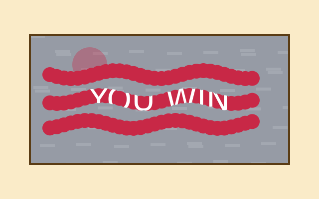

After f.erase(), everything you draw removes what is under it instead of painting. Here a grey "foil" picture covers a prize. Wavy scratch marks erase the foil, so the prize shows through the holes. Strength 255 removes the foil completely. A smaller number, like 90, only thins it. f.no_erase() goes back to normal painting.

How it works, and how to make it yours

**How it works**

- f.create_graphics(520, 260) makes the foil: a picture drawn once in setup(). It starts see-through, and foil.background() paints it grey.
- foil.erase(90, 90) makes the next shapes remove only about a third of what is under them. That is the thin scratch.
- foil.erase() with no numbers erases at full strength. The loops of foil.circle() calls cut a wavy track, using math.sin() for the wobble.
- foil.no_erase() goes back to normal painting.
- In draw(), the prize is drawn first. f.image(foil, 60, 70) then lays the foil on top. The prize shows wherever the foil was erased.

**Make it yours**

- Change the 90 in foil.erase(90, 90) for a lighter or stronger first scratch.
- Change the 30 in foil.circle(x, ..., 30) to make a wider scratch.
- Add another track: change range(3) to range(4).
- Change the words in f.text("YOU WIN", ...) or the prize colour.
- Change the foil colour in foil.background((150, 155, 165)). Try gold: (212, 175, 55).

Source: [`examples/gallery/compositing/03_scratch_card.py`](../../examples/gallery/compositing/03_scratch_card.py)

### Layers: a sky that stays and a trail that builds up

`with f.layer("name"):` sends everything drawn inside the block to a see-through layer that sits over the canvas. A layer keeps its drawing from one frame to the next. Here the canvas is wiped and redrawn every frame, yet the "trail" layer keeps every dot the ball leaves behind. The "sky" layer is drawn once, in the first frame, and never again. hide_layer() and show_layer() switch it off and on; it keeps its stars while it is hidden.

How it works, and how to make it yours

**How it works**

- f.background() wipes the canvas at the start of each frame, so normal drawing does not last.
- with f.layer("trail"): sends the drawing in the block to a layer with that name. The layer is kept between frames, so each new dot is added to the old ones.
- The "sky" layer is filled only when f.frame_count is 0. After that it just stays.
- f.hide_layer("sky") and f.show_layer("sky") switch the layer off and on. A hidden layer keeps its contents, so the stars come back unchanged.
- The ball itself is drawn on the canvas, under the layers. Its height comes from math.sin() of the frame number.

**Make it yours**

- Change the last 140 in f.fill(255, 140, 60, 140) to make the trail dots more or less solid.
- Change the 0.3 in math.sin(t * 0.3) for a faster or slower wave.
- Change the t % 40 numbers to make the sky blink more or less often.
- Add a third layer with another colour: with f.layer("echo"): drawing a circle at y + 40.
- Add more stars: change range(40) in the sky layer to range(80).

Source: [`examples/gallery/compositing/04_layers.py`](../../examples/gallery/compositing/04_layers.py)

## Fill, stroke and lines

### Fill and stroke

fill is the inside, stroke the outline. no_fill() and no_stroke() switch either off; the stroke is centred on the edge, half outside and half inside.

How it works, and how to make it yours

**How it works**

- Every closed shape has two parts. f.fill() sets the inside colour. f.stroke() sets the outline colour. f.stroke_width() sets how thick the outline is.
- f.no_fill() draws outlines only. f.no_stroke() draws the inside only.
- A style stays until you change it, so each group of shapes sets what it needs.
- The outline is centred on the edge. Half of it is outside the shape and half is inside, so a thick stroke makes a shape look bigger.
- A line has no inside. It uses the stroke only. The loop draws eight lines with widths 1 to 8.

**Make it yours**

- Change the 10 in the tomato square's f.stroke_width(). A thicker stroke eats into the shape.
- Swap the colour names: "gold", "skyblue", "tomato" and "navy" can be any other name.
- Make the lines grow faster: use f.stroke_width(i * 2) in the loop.
- Give the last ellipse an outline: replace f.no_stroke() with f.stroke("black").
- Use a see-through fill: f.fill((255, 215, 0, 100)).

Source: [`examples/gallery/lines/01_fill_and_stroke.py`](../../examples/gallery/lines/01_fill_and_stroke.py)

### Line ends, corners and dashes

stroke_cap sets how a line ends, stroke_join how corners look, and stroke_dash draws dashed outlines. They are style, like fill: saved_state puts them back.

How it works, and how to make it yours

**How it works**

- f.stroke_cap() sets how a line ends: "butt" stops at the end, "square" goes a little further, and "round" adds a half circle.
- f.stroke_join() sets how a corner looks: "miter" is sharp, "bevel" is cut flat and "round" is smooth. The zigzag() shape uses f.begin_shape(), f.vertex() and f.end_shape().
- f.miter_limit(4) stops a very sharp corner from sticking out too far.
- f.stroke_dash([16, 8]) draws dashes 16 pixels long with 8-pixel gaps. f.no_dash() makes lines solid again.
- Cap, join and dash are style, like fill. f.saved_state() puts them back after each block, so one line does not change the next.

**Make it yours**

- Change the numbers in f.stroke_dash([16, 8]). Try [4, 4] or [30, 10].
- Make the lines thicker or thinner: change f.stroke_width(18) at the top.
- Change f.miter_limit(4) to 1 and watch the sharp corner get cut.
- Change the shape in zigzag(): move the f.vertex() points to make the corners sharper.
- Dash the line at the bottom: add f.stroke_dash([10, 6]) before f.line(380, 370, 560, 370).

Source: [`examples/gallery/lines/02_caps_joins_dashes.py`](../../examples/gallery/lines/02_caps_joins_dashes.py)

### Pixel art with no_smooth

no_smooth() turns off the soft edges, so every pixel is either the shape's colour or not. Draw big and blocky with scale() and it looks like a retro game. smooth() switches back: compare the two white circles.

How it works, and how to make it yours

**How it works**

- INVADER is a list of text rows. An "X" is a filled square and a "." is an empty one.
- Two loops, over rows and then over the letters in each row, call f.rect(col, row, 1, 1) for every "X". Each square is just 1 unit big.
- f.scale(30) makes one unit 30 pixels. f.translate(100, 80) moves the origin first. f.saved_state() puts both back afterwards.
- f.no_smooth() in setup() turns off anti-aliasing, so the edges stay hard and blocky.
- f.smooth() turns it back on. The second white circle is soft at the edge, and the first is jagged.

**Make it yours**

- Change the "X" and "." characters in INVADER to draw your own picture. Keep every row the same length.
- Change the 30 in f.scale(30) to make the picture bigger or smaller.
- Change f.fill("lime") to another colour name.
- Add a second picture: copy the loops and use another list of rows and another f.translate().
- Remove f.no_smooth() from setup() and see how the pixels get soft.

Source: [`examples/gallery/lines/03_pixel_art.py`](../../examples/gallery/lines/03_pixel_art.py)

## Curves

### Curves

bezier_vertex bends toward two control points; curve_vertex draws a smooth curve through the points (the first and last only steer it); curve_tightness straightens it. bezier and curve draw one curve in a single call; bezier_point and bezier_tangent find places and directions along it.

How it works, and how to make it yours

**How it works**

- f.bezier_vertex(x1, y1, x2, y2, x3, y3) inside f.begin_shape() ... f.end_shape() draws a curve that bends towards two control points. The grey lines show them. f.quadratic_vertex() uses one.
- f.curve_vertex() draws a smooth curve that passes through each point. The first and last points only steer the ends.
- f.curve_tightness() changes the same points from loose (0) to straight (close to 1).
- f.bezier() and f.curve() draw a whole curve in one call.
- f.bezier_point() gives the position at a place t along the curve, from 0 to 1. f.bezier_tangent() gives its direction. The example uses both to turn small arrowheads along the curve.

**Make it yours**

- Move the control points of the first f.bezier_vertex() and watch the bend.
- Change the points list: move a point, or add one more. Both curves follow.
- Try another value in the (0, "tomato") pair, such as 0.5.
- Change range(7) and t = i / 6 to range(13) and i / 12 for more arrowheads.
- Change the numbers in f.bezier(400, 330, ...). Keep the arrowhead code in step if you do.

Source: [`examples/gallery/curves/01_curves.py`](../../examples/gallery/curves/01_curves.py)

## Text

### Text

f.text_size() sets the size in pixels, and f.text() places a message by its top-left corner. f.text_width() measures a message, which is how the first line is centred.

How it works, and how to make it yours

**How it works**

- f.text(message, x, y) draws words with their top-left corner at (x, y). It uses the current fill colour.
- f.text_size() sets the size in pixels. It stays the same until you change it, so the example sets 40 for the heading and 18 for the notes.
- f.text_width(message) tells you how wide a message is. Centring is (f.width - width) / 2.
- f.text() turns a number into text for you, so f.text(3.14159, 40, 200) works.
- The color= option sets the colour for one call only, as in the frame counter. f.frame_count is the number of frames drawn so far.

**Make it yours**

- Change the message, or change 40 in f.text_size(40), and watch the centring keep up.
- Change the heading colour: f.fill("black") can be any colour name, such as "navy".
- Centre the grey lines too. Use f.text_width() on each one, in the same way as the heading.
- Show a changing number: f.text(f.mouse_x, 40, 280) follows the mouse.
- Write a line several times: for i in range(5): f.text("Hi", 40, 280 + i * 20).

Source: [`examples/gallery/text/01_text.py`](../../examples/gallery/text/01_text.py)

### Aligning text

f.text_align() says which point of the text the (x, y) you give is. Each red cross is the (x, y) passed to f.text(), so you can see where the words land. f.text_ascent() and f.text_descent() measure how far letters reach above and below the baseline.

How it works, and how to make it yours

**How it works**

- f.text_align(horizontal, vertical) takes two words. The first is "left", "center" or "right". The second is "top", "center", "baseline" or "bottom".
- The point (x, y) stays put and the text moves around it. That is why every red cross is a fixed anchor.
- The baseline is the line the letters sit on. Letters like g and y hang below it.
- The two loops step through every pair of words, so you see all twelve ways in one picture.
- f.text_ascent() and f.text_descent() give the height above and below the baseline for the current size. The line at the bottom prints both numbers.

**Make it yours**

- Change the words in the two lists: use "center" in both, or leave one out.
- Change f.text_size(20) to something bigger and see how each alignment copes.
- Move the grid: change 70 and 250 in the x line, or 50 and 80 in the y line.
- Write a label against the right edge: f.text_align("right", "top") and then f.text("end", f.width, 0).
- Change the size on the last line, f.text_size(14), and watch the ascent and descent numbers grow.

Source: [`examples/gallery/text/02_align.py`](../../examples/gallery/text/02_align.py)

### Text in boxes and columns

f.text_box() wraps text inside a box and gives back whatever did not fit. That leftover text flows on into the second box, so the story runs across two columns.

How it works, and how to make it yours

**How it works**

- f.text_box(message, x, y, width, height) breaks the words into lines that fit the width, and stops when the height is full.
- It returns the part it could not show, as text. Pass that to the next f.text_box() call, and the story carries on.
- If the leftover is empty, everything fitted. The example checks "if rest:" to show a warning.
- A "\n" in the message starts a new line. The heading uses one.
- f.text_leading() sets the distance between lines. f.text_leading(None) goes back to automatic, which is 1.25 times the text size.

**Make it yours**

- Change the box width, 256, or the height, 216, and see where the story breaks.
- Make the text bigger: change f.text_size(15), and watch more of it spill out of the second box.
- Change the line gap: use f.text_leading(22) for the story, instead of None.
- Add a third column: draw another f.rect(), then pass rest to a third f.text_box().
- Write your own words in STORY.

Source: [`examples/gallery/text/03_text_box.py`](../../examples/gallery/text/03_text_box.py)

### Fonts and styles

The first four lines use the four built-in styles. The fifth uses a font loaded from a file. The last line goes back to the built-in font.

How it works, and how to make it yours

**How it works**

- f.text_style() picks one of four styles: "normal", "bold", "italic" or "bold_italic".
- f.load_font() reads a font file from disk and gives you a font to use. The path is relative to the example.
- f.text_font(font, size=28) switches to that font, and can set the size in the same call.
- f.text_font(None) goes back to the built-in family. The style you set before is remembered.
- A font setting stays until you change it. That is why the example resets it at the end.

**Make it yours**

- Change a line of text, or its size: f.text_size(32) sets the size for the four style lines.
- Change the colour of one line with f.fill() just before it.
- Draw the four styles in a loop over ["normal", "bold", "italic", "bold_italic"].
- Change the size of the loaded font: the 28 in f.text_font(mono, size=28).
- Load a font file of your own and use it in place of "fonts/DejaVuSansMono.ttf".

Source: [`examples/gallery/text/04_fonts.py`](../../examples/gallery/text/04_fonts.py)

### Letters as shapes

f.text_path() gives the outlines of a word as a path. Here the word CUT is cut out of a panel, the word EDGE shows only its edge, and the word FILL is filled with a gradient.

How it works, and how to make it yours

**How it works**

- f.text_path(message, x, y) returns a path set exactly as f.text() would set it. It has no colour yet, so you choose one when you draw it.
- panel.difference(word) cuts the letters out of the panel. The stripes behind show through the holes.
- f.clip() keeps the stripes inside the panel shape. f.push() and f.pop() end the clip afterwards.
- expand_stroke(4, join="miter") turns the outline of the letters into a thin shape you can fill. Only the edge is left.
- f.linear_gradient() makes a fill that changes colour along a line. f.draw_path() draws the letters with it.

**Make it yours**

- Change the words: "CUT", "EDGE" and "FILL" can be any text.
- Change the gradient colours in the list ["deeppink", "orange", "gold"].
- Make the edge thicker: change the 4 in expand_stroke(4, ...), or try join="round".
- Cut a different shape from the panel: use f.path().circle(320, 105, 70) in place of word.
- Change the stripes: use other colours in the f.fill() line, or change 40 for wider stripes.

Source: [`examples/gallery/text/05_text_path.py`](../../examples/gallery/text/05_text_path.py)

### Spacing and ligatures

f.text_tracking() adds space after every letter, or takes it away. f.text_features() turns font features on or off by name. The notes on the left say what each line shows.

How it works, and how to make it yours

**How it works**

- f.text_tracking(n) adds n pixels after each letter. A negative number pulls the letters closer.
- f.text_width() counts the extra space too. The red line is as wide as the widest word.
- f.text_features(liga=False) turns off ligatures. A ligature joins letters, like f and i, into one shape.
- f.text_features(salt=True) picks the font's alternate letters. Look at the a.
- f.text_features() with nothing in the brackets goes back to the font's own choices.
- The label() helper uses f.push() and f.pop() so its own settings do not leak into the sample.

**Make it yours**

- Change the list [-3, 0, 4, 12] to other tracking values, and the word in f.text("Spacing", ...).
- Try wide tracking on a short heading in capitals. It often looks smart.
- Change the sample words for ligatures. Try "fi", "fl" and "ff" in your own text.
- Turn the ligatures off with f.text_features(liga=False) and look at "fi" and "fl": the letters part.
- Print a width: f.text(f.text_width("Spacing"), 24, 380).

Source: [`examples/gallery/text/06_tracking_and_features.py`](../../examples/gallery/text/06_tracking_and_features.py)

### Mixed styles in one text

A FormattedString holds runs of text. Each run can have its own size, style and colour. It can be drawn, wrapped into columns, or turned into outlines.

How it works, and how to make it yours

**How it works**

- f.FormattedString() starts an empty text. .append(text, size=, style=, color=) adds a run, and you can chain the calls.
- A setting you leave out follows the drawing state. The sentence uses the f.text_size() and f.fill() set in draw().
- f.text() draws a FormattedString in one go, and f.text_box() wraps it into a box.
- f.text_box() returns what did not fit, still styled. The second box carries on in the same styles.
- f.text_path() turns a FormattedString into outlines, so "Out" and "line" at different sizes become one shape.

**Make it yours**

- Change the colours in INK and RED. They are plain (red, green, blue) numbers.
- Add a run to the heading: heading.append("!", size=44, style="italic", color=INK).
- Make the BIG word bigger: change size=40 in that append() call.
- Change the box width, 280, in both f.text_box() calls and watch the lines re-wrap.
- Fill the outline with f.linear_gradient() instead of the flat colour.

Source: [`examples/gallery/text/07_formatted.py`](../../examples/gallery/text/07_formatted.py)

### Variable font axes

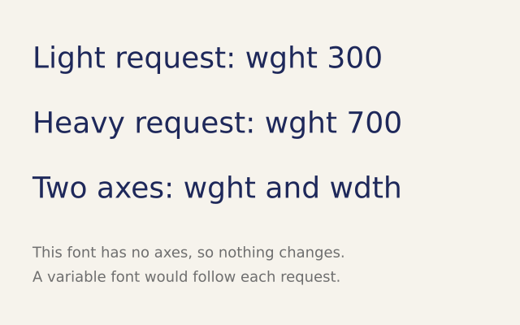

Some fonts have axes, such as weight and width, that you can slide between values. This example asks for different weights. The built-in font has no axes, so all the lines look the same.

How it works, and how to make it yours

**How it works**

- f.font_variations(wght=700) sets axes of a variable font by name. wght is weight and wdth is width.
- An axis the font does not have is ignored. That makes the call safe to leave in a sketch.
- You can set more than one axis at once, as in f.font_variations(wght=700, wdth=75).
- f.font_variations() with nothing in the brackets goes back to the font's own defaults.
- f.load_font() loads a font file. With a variable font, the weight really changes.

**Make it yours**

- Change the words and the size, f.text_size(36). The weights will not change, but the layout will.
- Change the numbers: wght=100 is thin and wght=900 is very heavy, in fonts that allow them.
- Load a variable font file with f.load_font(), then call f.text_font() with it before the lines.
- Animate it: f.font_variations(wght=300 + f.frame_count % 400) in draw(). It moves with a variable font.
- Try another axis name, such as slnt or opsz. The call is safe to try.

Source: [`examples/gallery/text/08_variations.py`](../../examples/gallery/text/08_variations.py)

### Words made of dots

f.text_to_points() walks along the outline of a word and gives back a point every few pixels. Draw a small circle at each point and the word is made of beads.

How it works, and how to make it yours

**How it works**

- f.text_to_points(message, x, y, spacing) returns a list of (x, y) points along the letters.
- A smaller spacing gives more points. "DOTS" uses 9 and "closer" uses 4.
- The loop draws f.circle() at each point. The colour changes with the point number i, so it shifts along the word.
- It follows f.text_path(), so it works with any font, size, style and alignment you have set.
- f.current_font() tells you which font is in use. font.family(), font.style() and font.contains() say what it is and whether it has the letters you need.

**Make it yours**

- Change the words, or the spacing numbers 9 and 4.
- Change the dot size: the last number in f.circle(x, y, 7).
- Draw squares instead: use f.rect(x, y, 6, 6) in the loop.
- Make the dots jiggle: add f.random(-2, 2) to x and y.
- Colour by position: use f.map_range(x, 0, f.width, 0, 255) for a colour channel.

Source: [`examples/gallery/text/09_text_dots.py`](../../examples/gallery/text/09_text_dots.py)

### Letters from other fonts

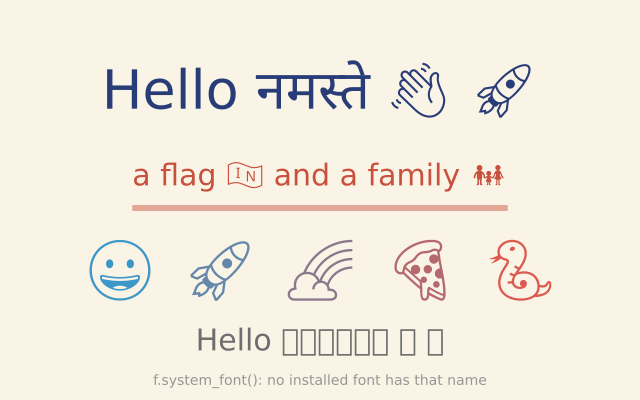

No font has every letter. When the font you use lacks one, funground draws it from another font and keeps the line together. One greeting mixes English, Hindi and emoji, with no extra code.

How it works, and how to make it yours

**How it works**

- When a letter is missing, funground borrows it from another font. Size and baseline stay the same.
- The emoji have one colour: the colour of the fill. Each one in the row gets its own fill.
- f.text_width() measures the whole line, borrowed letters included. The bar shows that width.
- f.text_fallback(None) turns the help off. The missing letters then show as empty boxes.
- f.system_font() looks for an installed font by its family name. It raises FileNotFoundError if there is none, so setup() catches that.

**Make it yours**

- Change GREETING to your own words. Try another language or more emoji.
- Change the emoji in the row of five, or the colours in f.color().
- Change the size of the first line: the 54 in f.text_size(54).
- Move the switched-off line: change the 340 in f.text(GREETING, 320, 340), and compare the two greetings.
- Ask for a font you have installed: put its family name in f.system_font() in setup().

Source: [`examples/gallery/text/10_fallback.py`](../../examples/gallery/text/10_fallback.py)

## Animation and time

### Bounce

Change a variable a little in every draw() and you have motion. Flip the speed at the edges and the circle bounces.

How it works, and how to make it yours

**How it works**

- x and speed are variables outside draw(), so they keep their values from one frame to the next. global lets draw() change them.
- Each frame, x += speed moves the circle a few pixels. f.background() wipes the last frame first, so it looks as if one circle moves.
- At either edge the sketch sets speed = -speed. A positive speed becomes negative, so the circle turns round.
- f.width gives the window's width, so the right edge is found for you.
- f.fill() sets the colour and f.circle() draws the circle at x.

**Make it yours**

- Change speed = 7 to a smaller or bigger number. Try a negative one.
- Change the colour in f.fill("tomato") to another colour name.
- Change the 80 in f.circle() to make the ball bigger or smaller. Then change the 40 in the edge check to half the new size, so it still touches the edge.
- Add a y and a vertical speed, move both in draw(), and flip each at its own edges.
- Draw a second ball that starts at a different place with a different speed.

Source: [`examples/gallery/animation/01_bounce.py`](../../examples/gallery/animation/01_bounce.py)

### Time-based motion

f.delta_time is the number of seconds the last frame took. Moving by speed * delta_time keeps the same speed on a fast or a slow computer. *(Uses real time, so the picture varies from run to run.)*

How it works, and how to make it yours

**How it works**

- f.delta_time is the time the last frame took, in seconds. At 60 frames a second it is about 0.017.
- x += 150 * f.delta_time adds 150 pixels for every second. A slow computer takes bigger steps less often and the circle still covers the same distance.
- Moving by a fixed number of pixels in each frame would be faster on a fast computer. This way is fair on every computer.
- When x passes f.width, the sketch sets x back to 0 and the circle starts again.
- f.background(), f.fill() and f.circle() draw each frame from scratch.

**Make it yours**

- Change 150 to another speed, in pixels per second.
- Change the colour in f.fill("seagreen").
- Make the circle go up and down as well. Use math.sin(f.millis() / 500) in the y value, with import math at the top.
- Add a second circle that moves at 300 pixels per second.
- Make the circle grow as it crosses: use 20 + x / 10 as its size.

Source: [`examples/gallery/animation/02_time_based.py`](../../examples/gallery/animation/02_time_based.py)

### A clock

hour(), minute() and second() read the computer's clock. day(), month() and year() give the date. millis() counts milliseconds since the sketch started. frame_rate() says how many frames a second it is really drawing. *(Uses real time, so the picture varies from run to run.)*

How it works, and how to make it yours

**How it works**

- f.hour(), f.minute() and f.second() give the time as whole numbers. f.day(), f.month() and f.year() give the date.
- hand() draws one hand. It moves the origin to the middle of the clock with f.translate() and turns with f.rotate(). Then it draws a line along the x axis.
- An angle of 0 points right, but a clock starts at 12. So hand() turns by angle - 90.
- The hour hand turns 30 degrees an hour, the minute and second hands 6 degrees a step. The hour hand also adds half a degree for each minute, so it creeps round.
- f.saved_state() keeps each hand's turn and stroke from leaking into the next one.
- f.millis() and f.frame_rate() are written at the bottom, with an f-string.

**Make it yours**

- Change the hand colours, widths and lengths in the three hand() calls.
- Add tick marks. Loop 12 times, rotate 30 degrees each time, and draw a short line at the edge.
- Make a stopwatch hand: hand(f.millis() / 1000 * 6, 140, 2, "navy") turns once a minute from the start.
- Show the time in 12-hour form: use f.hour() % 12 in the f-string.
- Move the clock and the text to new places by changing the 200 and 400 values.

Source: [`examples/gallery/animation/03_clock.py`](../../examples/gallery/animation/03_clock.py)

### Pause, step and quit

no_loop() stops draw() being called every frame, though it still runs once. Press keys to run, pause, take one step or quit.

How it works, and how to make it yours

**How it works**

- f.no_loop() in setup() means the sketch starts paused. draw() runs once and then waits.
- key_pressed() runs once each time a key goes down. f.key says which key it was.
- Space calls f.loop() to carry on, or f.no_loop() to stop again. f.is_looping() says which it is doing now, and the text shows it.
- The "s" key calls f.redraw(), which runs draw() exactly one more time. That is a single step.
- The "q" key calls f.exit() and the sketch ends.
- angle goes up by 6 in each draw(), and f.rotate() turns the square by it.

**Make it yours**

- Change angle += 6 to a smaller or bigger step.
- Change the colours in f.fill() and f.stroke().
- Swap f.rect(-80, -80, 160, 160) for f.circle(0, 0, 160) or f.ellipse(0, 0, 200, 100). The shape is centred on (0, 0), so it turns about its middle.
- Add a key: in key_pressed(), add elif f.key == "r": and set angle = 0. Put angle in the global line of key_pressed() first.
- Start running instead of paused: delete the f.no_loop() line in setup().

Source: [`examples/gallery/animation/04_pause.py`](../../examples/gallery/animation/04_pause.py)

### Record an animation as a GIF

f.save_gif("spinner.gif", 2) records the next 2 seconds and writes them as a GIF that loops for ever. The animation turns once in 60 frames, so the GIF loops without a jump.

How it works, and how to make it yours

**How it works**

- f.size(240, 240, fps=30) sets the window and the frame rate. Each GIF frame is shown for 1 divided by the frame rate.
- f.save_gif("spinner.gif", 2) records the next 2 seconds of the sketch. Call it once. Here it is on the first frame, so the test is f.frame_count == 0.
- 2 seconds at 30 frames a second is 60 frames. The dots turn 6 degrees a frame, so 60 frames is a full turn. The last frame joins up with the first, and there is no jump.
- Eight dots sit 45 degrees apart on a circle. f.hsb() gives each its own hue.
- f.save_movie("spinner.mp4", 2) does the same for an MP4, but it needs the free program ffmpeg.

**Make it yours**

- Change the 80 in the dot position to a bigger or smaller circle.
- Change the 24 to make the dots bigger or smaller.
- Use 12 dots: change range(8) to range(12), and 45 to 30 and i * 45 to i * 30, so they stay evenly spaced.
- Make the dots turn the other way: use - f.frame_count * 6 in the angle.
- Change the saved name in f.save_gif(), and try f.save_movie() if you have ffmpeg.

Source: [`examples/gallery/animation/05_record_a_gif.py`](../../examples/gallery/animation/05_record_a_gif.py)

## Motion

### Movers with vectors

A Vector holds an x and a y together: a position, a velocity or a force. Six gold dots fall, bounce and drift in the wind, each with a little arrow that shows where it is going.

How it works, and how to make it yours

**How it works**

- f.Vector(x, y) holds two numbers. Each mover has a position and a velocity, both vectors.
- Each frame, forces add to the velocity and the velocity adds to the position. velocity.add(gravity).add(wind) does the first. position.add(velocity) does the second.
- Methods like add() and limit() change the vector itself. limit(12) stops the speed passing 12.
- Operators such as position + velocity * 6 make new vectors, so the old ones stay as they are.
- At the floor and the sides the sketch flips the velocity with * -1. f.constrain() keeps the dot inside the window.
- f.Vector.from_angle() makes the first velocity. velocity.heading() gives the direction, and f.rotate() uses it to turn the arrow heads.

**Make it yours**

- Change the gravity: f.Vector(0, 0.3). Try a bigger y, or a negative one to fall upwards.
- Change the wind: f.Vector(0.05, 0). Make it bigger, or give it a y part.
- Change the 0.9 in the floor bounce: closer to 1 bounces higher, smaller bounces lower.
- Change range(6) to add more movers, and the 95 spacing so they still fit.
- Change f.random_seed(3) to another number to start them differently.

Source: [`examples/gallery/motion/01_movers.py`](../../examples/gallery/motion/01_movers.py)

## Transforms

### Rotating squares

Five squares spin at different sizes. Each one is moved to its own spot, turned, then drawn at the origin.

How it works, and how to make it yours

**How it works**

- f.translate() moves the origin, the point (0, 0), to a new place. Everything drawn afterwards is measured from there.
- f.rotate() turns everything drawn afterwards, in degrees. f.frame_count * 3 makes it spin.
- f.scale() grows or shrinks what comes next. Here each square is a little bigger than the last.
- The square is drawn with f.rect(-25, -25, 50, 50), so its middle is at the origin and it spins on its middle.
- f.push() saves the current transform and style. f.pop() brings them back, so each square starts fresh.

**Make it yours**

- Change the 3 in f.frame_count * 3: a bigger number spins faster, a negative one spins back.
- Change 18 in i * 18 to make the squares start at different angles.
- Draw an oblong, f.rect(-25, -25, 50, 25), and see that it still spins around the origin.
- Spin around a corner: draw f.rect(0, 0, 50, 50) instead of f.rect(-25, -25, 50, 50).
- Make more squares: change range(5) to range(8), and the 120 in f.translate() to 75.

Source: [`examples/gallery/transforms/01_rotating_squares.py`](../../examples/gallery/transforms/01_rotating_squares.py)

### saved_state and angles

Two rings of twelve shapes. The gold bars are placed with rotate(). The blue dots are placed with sine and cosine. The text at the bottom turns a maths answer back into degrees.

How it works, and how to make it yours

**How it works**

- with f.saved_state(): is f.push() and f.pop() in one block. Whatever the block changes is undone at the end.
- Inside the block, f.translate() and f.rotate() turn each bar around the centre (200, 200). The blue ring is then not affected.
- f.rotate() takes degrees. Python's math.sin and math.cos want radians, so f.radians() converts.
- The blue ring uses x = centre + radius * cos(angle) and y = centre + radius * sin(angle). It is the same kind of ring, made another way.
- f.degrees() goes the other way, so atan2 gives 45 degrees for the point (1, 1).

**Make it yours**

- Change the 30 in range(0, 360, 30) to 20 or 45 and see how many bars you get.
- Change the radius 100 in the blue ring, or the bar length 80.
- Make the bars turn: use f.rotate(angle + f.frame_count) in draw().
- Colour each bar differently: put f.fill(f.color(angle % 255, 100, 200)) inside the block.
- Draw the blue dots with a smaller step and a smaller circle for a smoother ring.

Source: [`examples/gallery/transforms/02_saved_state.py`](../../examples/gallery/transforms/02_saved_state.py)

### Shear and matrices

Three chequerboards: one leaning to the right, one climbing to the right, and one rotated and stretched with a single matrix. A red circle ignores the transform.

How it works, and how to make it yours

**How it works**

- f.shear_x() slants everything drawn afterwards sideways. f.shear_y() slants it up and down. Both take degrees.
- f.apply_matrix() multiplies in any transform at once. The third board turns and stretches in one go.
- Its six numbers are a, b, c and d, which turn and stretch, then the two that move the board.
- f.reset_matrix() forgets every transform inside the block, so the circle uses plain window coordinates.
- Each board sits in a with f.saved_state(): block, so one board's transform does not touch the next.

**Make it yours**

- Change the 25 in f.shear_x(25): try 45, or a negative number.
- Change the 1.4 in f.apply_matrix(): it is the sideways stretch. 1.0 means no stretch.
- Change the angle in math.radians(20) to 45 and see the third board turn.
- Make the board bigger: checker(12, 8) in place of checker() draws a 12 by 12 board of 8 pixel cells.
- Add a fourth board that uses f.shear_x() and f.shear_y() together.

Source: [`examples/gallery/transforms/03_shear_and_matrices.py`](../../examples/gallery/transforms/03_shear_and_matrices.py)

## Paths and clipping

### A star from vertices

A five-pointed star is built from ten corners, and an open zig-zag is drawn beside it. The star is filled and the zig-zag is only a line.

How it works, and how to make it yours

**How it works**

- f.begin_shape() starts a shape. Each f.vertex(x, y) adds a corner. f.end_shape() finishes it.
- f.end_shape(close=True) joins the last corner back to the first. A closed shape is filled and stroked. An open one is only stroked.
- The star() function alternates between a big radius and a small one. That makes the points and the dents.
- Each corner is found with cos and sin of an angle. math.pi * i / points steps round half a turn per two corners.
- f.no_fill() makes the zig-zag a plain line, and f.stroke() sets its colour.

**Make it yours**

- Change the last number in star(200, 200, 140, 60, 5): try 7 for a seven-pointed star.
- Change the inner radius, 60: a bigger number gives fatter points.
- Change the colours in f.fill("gold") and f.stroke("darkorange"), or the f.stroke_width(4).
- Change the zig-zag's f.end_shape() to f.end_shape(close=True) and watch it join up.
- Draw a second star with a different size at another place: star(480, 80, 50, 20, 5).

Source: [`examples/gallery/paths/01_star.py`](../../examples/gallery/paths/01_star.py)

### Reusable paths and clipping

A leaf shape is built once and drawn six times, turned a little each time. On the right, a row of circles is clipped so it only shows inside a tall window.

How it works, and how to make it yours

**How it works**

- f.path() starts a path. .move_to(), .line_to() and .close() build a shape from straight lines.
- f.draw_path(path) draws it with the current fill and stroke. You build it once and draw it many times.
- f.translate() and f.rotate() inside the loop place each copy. The path itself does not change.
- f.clip(path) keeps later drawing inside the path. The circles that spill past the window are hidden.
- The clip ends with the with f.saved_state(): block, so the window outline is drawn afterwards, with no clipping.

**Make it yours**

- Change the range(6) in the leaf loop, or the 15 in f.rotate(i * 15).
- Change the leaf: move the points in .line_to(24, 0), for a fatter or thinner leaf.
- Make the window a different shape: add another .line_to() before .close().
- Change the circle size, 90, or the step, 20, in the clipped loop.
- Clip with a circle: use f.path().circle(510, 200, 120) in place of window.

Source: [`examples/gallery/paths/02_path_and_clip.py`](../../examples/gallery/paths/02_path_and_clip.py)

### Clipping on and off

Stripes are clipped so they only show inside a tall window. A red circle on the left ignores the clip, and a gold circle on the right obeys it.

How it works, and how to make it yours

**How it works**

- f.clip(path) keeps later drawing inside the path. Anything outside it is hidden.
- f.no_clip() switches the clipping off. It lasts until the end of its with f.saved_state(): block.
- When that block ends, the clip that was there before comes back. The gold circle is clipped again.
- Blocks can sit inside blocks. The inner one holds the exception, and the outer one holds the clip.
- f.fill() with four numbers, such as (255, 99, 71, 200), is a see-through colour. The last number is the see-through amount.

**Make it yours**

- Move the tomato circle: change 160 in f.circle(160, 200, 160) and see where the clip cuts.
- Change the porthole: edit the four corners in the path at the top.
- Change the stripe colours or width: "navy", "skyblue" and the 40 in the loop.
- Remove the inner block: take out f.no_clip() and see the circle get cut.
- Change the last number in the fill colour, 200, to 100 for a fainter circle.

Source: [`examples/gallery/paths/03_no_clip.py`](../../examples/gallery/paths/03_no_clip.py)

### Shapes with holes

A square frame and a wheel. Each is one shape with a hole cut out of the middle.

How it works, and how to make it yours

**How it works**

- f.begin_shape() starts a shape and f.vertex() lists the corners of the outside edge.
- f.begin_contour() starts a hole. List the corners of the hole, then call f.end_contour().
- funground makes the hole cut out whichever way round you list the corners, so you do not have to think about direction.
- f.end_shape(close=True) finishes the whole shape. The fill and stroke follow both outlines.
- ring_of_points() makes the corners of a ring with cos and sin. A hole of 6 corners is a hexagon.

**Make it yours**

- Change the 6 in ring_of_points(460, 180, 60, 6): 3 makes a triangle hole and 40 a round one.
- Change the wheel's hole radius, 60, to make a thicker or thinner rim.
- Make the square's hole bigger or smaller: move the corners in the second list.
- Add a second hole: put another f.begin_contour() and f.end_contour() pair before f.end_shape().
- Change the colours: f.fill("skyblue") and f.stroke("navy").

Source: [`examples/gallery/paths/04_holes.py`](../../examples/gallery/paths/04_holes.py)

### Combining shapes

Two shapes can be joined, overlapped, cut and mixed with union, intersection, difference and xor. Each one gives back a new path. The bottom panel shows remove_overlap, which turns a crossing outline into one clean edge.

How it works, and how to make it yours

**How it works**

- f.path() starts an empty path. Its methods .circle() and .polygon() add a ring and a star outline to it.
- Four path methods combine two paths: union, intersection, difference and xor. Each gives back a new path and leaves the old ones alone.
- The example writes them as the operators | & - and ^. They mean the same as the four methods, in that order.
- f.draw_path() draws a path with the current fill and stroke. Combined paths are real shapes, so they can have holes.
- star_points() takes every second corner of a pentagon. The outline crosses itself, and path.remove_overlap() turns it into one clean edge.
- f.push(), f.translate() and f.pop() slide the clean copy to the right. The path itself does not change.

**Make it yours**

- Move the star: change cx + 14 in two_shapes() to cx + 40 and watch each result change.
- Swap the two paths in the difference: star - ring is not the same as ring - star.
- Replace the ring with f.path().rect(...) or f.path().ellipse(...).
- Cut a hole in a result with a third shape: (ring | star) - f.path().circle(x, y, 15).
- Fill a result with f.linear_gradient() instead of a flat colour.

Source: [`examples/gallery/paths/05_booleans.py`](../../examples/gallery/paths/05_booleans.py)

### Outlines, tests and moving paths

Three thick lines are turned into shapes with a gradient. A grid of dots tests which points are inside a shape. A ring of petals is made by turning and shrinking one path.

How it works, and how to make it yours

**How it works**

- path.expand_stroke() turns a thick line into a shape you can fill, so it can take a gradient. The options are width, cap, join and dash.
- f.linear_gradient() fills a shape with colours that change along a line.
- path.contains(x, y) says whether a point is inside the shape. The dots are green when it does.
- path.bounds() gives the box around the shape as (x, y, width, height). The red rectangle is drawn from it.
- path.rotate(), path.translate() and path.scale() give back a moved copy. The petals are one path changed twelve times.

**Make it yours**

- Change the width= numbers in jobs, such as width=18 for the wave.
- Change the dash list [22, 10]: the first number is the dash and the second is the gap.
- Move the shape in blob().translate(330, 170) and watch the green dots follow it.
- Change the step of the petals: i * 30 and the range(12) for more or fewer.
- Change the gradient colours in ["tomato", "slateblue"].

Source: [`examples/gallery/paths/06_outlines.py`](../../examples/gallery/paths/06_outlines.py)

## Randomness and noise

### Confetti

160 dots of confetti land in random places. Dots near the middle are tomato red and the rest are sky blue. The picture is the same every frame because the random seed is fixed.

How it works, and how to make it yours

**How it works**

- f.random(high) gives a random number from 0 up to high. f.random(low, high) gives one between low and high.
- f.random_seed(7) makes the "random" numbers repeat. Without it, the confetti would jump about every frame.
- f.constrain(value, low, high) keeps a number in range. Dots that start off-screen are pulled back.
- f.distance(x1, y1, x2, y2) measures between two points. Here it asks how far each dot is from the middle.
- The result picks the colour: tomato inside 120 pixels, sky blue outside.

**Make it yours**

- Change the seed 7 to any other number for a new picture. Take the line out and it changes every frame.
- Change range(160) for more or fewer dots.
- Change the 120, the distance for tomato, to make a bigger or smaller patch.
- Change the dot size: f.random(6, 18) in f.circle().
- Make it move by taking out f.random_seed(7), or by using f.random_seed(f.frame_count // 30).

Source: [`examples/gallery/randomness/01_confetti.py`](../../examples/gallery/randomness/01_confetti.py)

### Bell-curve randomness and random choices

400 dots cluster around the middle of the window, each in a colour picked at random from a list. Most dots land near the centre and a few land far away.

How it works, and how to make it yours

**How it works**

- f.random_gaussian(mean, sd) gives numbers that cluster around the mean. The sd says how far they spread.
- Heights in a class work this way: most people are near the middle, a few are very tall or short.
- x uses a spread of 90 and y uses 50, so the cloud is wider than it is tall.
- f.random_choice(PALETTE) picks one item from the list, with the same chance for each.
- f.random_seed(11) makes both repeat exactly, so the picture is the same each frame.

**Make it yours**

- Change the 90 and 50 spreads. A small number gives a tight cluster.
- Change PALETTE: add colour names, or use fewer for a simpler look.
- Change the seed 11 for a different cloud.
- Change range(400) for more dots, and the size 8 in f.circle() to make them smaller.
- Colour by distance instead of by choice: use f.distance(x, y, 320, 200) to decide the fill.

Source: [`examples/gallery/randomness/02_gaussian_and_choice.py`](../../examples/gallery/randomness/02_gaussian_and_choice.py)

### Noise: smooth randomness

Noise is randomness that changes smoothly, like hills instead of static. The left grid shows 2-D noise. The blue hills scroll over time. The red line has less detail.

How it works, and how to make it yours

**How it works**

- f.noise(x) gives a number from 0 to 1 that changes smoothly as x changes.
- f.noise(x, y) makes a smooth 2-D pattern. Each tile of the grid takes its shade from it.
- Small steps in x, such as x * 0.01, give gentle hills. Bigger steps give a rougher line.
- f.noise_seed(2026) picks the pattern. The same seed gives the same values.
- f.noise_detail(1) turns the rough extra layers off, so the red line is smoother. f.noise_detail(4) puts them back.
- Adding f.frame_count * 0.02 to x makes the blue hills scroll.

**Make it yours**

- Change the seed 2026 for a new landscape.
- Change the 0.01 in x * 0.01: smaller is smoother, bigger is rougher.
- Change the scroll speed: the 0.02 in f.frame_count * 0.02.
- Change f.noise_detail(1) to 8 and look at the red line become jagged.
- Use noise for colour: f.fill(f.noise(x * 0.01) * 255) in the landscape loop.

Source: [`examples/gallery/randomness/03_noise.py`](../../examples/gallery/randomness/03_noise.py)

## Useful maths

### Mapping and blending numbers

map_range re-scales a number from one range to another; lerp finds a point part of the way between two numbers; norm says how far along a range a number is; mag measures an arrow.

How it works, and how to make it yours

**How it works**

- f.map_range(value, in_low, in_high, out_low, out_high) moves a number from one range to another. Here 0 to 11 becomes 40 to 600 for the x, and 230 to 30 for the shade.
- f.lerp(a, b, t) finds the number part of the way from a to b. At t = 0 it gives a, at 1 it gives b, and at 0.5 it gives the middle. It is used for both x and y along the line.
- f.norm(value, low, high) says how far along a range a number is, from 0 to 1. The circles turn green once they pass the half way mark.
- f.mag(dx, dy) measures the length of an arrow from its two sides. It gives the length of the line.

**Make it yours**

- Change range(12) to range(20), and both 11s in the first loop to 19, for more circles.
- Swap 230 and 30 in the shade line, so the circles go from dark to light.
- Change the 0.5 in the f.norm() test to move where the colour switches.
- Change range(9) and i / 8 to range(17) and i / 16 for more circles on the line.
- Move the line's end point and watch the length in the text change.

Source: [`examples/gallery/maths/01_map_and_lerp.py`](../../examples/gallery/maths/01_map_and_lerp.py)

## Interaction

### Follow the mouse

A circle sits under the mouse. It turns red while a button is held, and the up and down arrow keys make it bigger or smaller.

How it works, and how to make it yours

**How it works**

- f.mouse_x and f.mouse_y are where the mouse is now. The circle is drawn there in every frame.
- f.is_mouse_pressed is True while a mouse button is held. The fill is chosen from it.
- f.key_down("up") is True for as long as that key is held. Every frame it is held, size grows by 2, so the change is smooth.
- max(10, size - 2) stops the circle getting smaller than 10.
- f.background() wipes the window at the start of each frame, so only one circle shows.

**Make it yours**

- Change the 2 in size += 2 to make the circle grow faster.
- Change the two colours in the f.fill() line.
- Use f.key_down("left") and f.key_down("right") to change something else, such as the circle's colour.
- Leave a trail: delete the f.background() line and the f.text() line. The circles now pile up.
- Draw a second circle at (f.width - f.mouse_x, f.height - f.mouse_y). It moves the opposite way.

Source: [`examples/gallery/interaction/01_follow_the_mouse.py`](../../examples/gallery/interaction/01_follow_the_mouse.py)

### A paint program

Drag the mouse to paint. The wheel changes the brush, the keys r, g and b pick a colour, and c clears the page. A right click drops a dot.

How it works, and how to make it yours

**How it works**

- Callbacks are functions with special names, such as mouse_dragged(). You define them, and funground calls them when something happens.
- f.background("white") is in setup(), so it runs once. draw() never wipes the canvas, and the paint stays.
- mouse_dragged() draws a line from f.pmouse_x, f.pmouse_y (where the mouse was last frame) to f.mouse_x, f.mouse_y (where it is now). That joins the strokes up smoothly.
- mouse_pressed() checks f.mouse_button and draws a dot on a right click. mouse_wheel(delta) changes the brush size, and f.constrain() keeps it between 1 and 40.
- key_pressed() uses f.key to clear or to pick a colour. key_typed() prints the key to the console.
- draw() redraws the strip at the bottom each frame, so the words stay up to date.

**Make it yours**

- Add colours: put "y": "gold" in the dictionary in key_pressed().
- Change the brush limits: 1 and 40 in f.constrain().
- Change the starting colour (colour = "navy") or the starting brush (brush = 8).
- Make the right click drop a bigger dot: change brush * 3 to brush * 6 in mouse_pressed().
- Delete the print line in key_typed() if you do not want the messages in the console.

Source: [`examples/gallery/interaction/02_paint.py`](../../examples/gallery/interaction/02_paint.py)

### Move with the keyboard

The arrow keys move a circle. The space bar changes its colour. The words at the bottom say which key came up last.

How it works, and how to make it yours

**How it works**

- There are two ways to read the keyboard. For smooth movement, ask in every frame whether a key is held: f.key_down("left").
- For one-off actions, define key_pressed(). It runs once for each press, and f.key says which key it was. Here the space bar switches the colour.
- key_released() runs when a key comes back up, and the sketch writes the key into message.
- Each held key changes x or y by speed. f.constrain() then keeps the circle inside the window.
- draw() wipes with f.background() and draws the circle at x, y every frame.

**Make it yours**

- Change speed = 4 for a faster or slower circle.
- Add the letter keys: write if f.key_down("a") or f.key_down("left"): to move with either.
- Change the two colours in key_pressed(), or add a third.
- Make a key change the size. Use f.key == "b" in key_pressed() and a size variable in f.circle().
- Add a second circle that moves with w, a, s and d.

Source: [`examples/gallery/interaction/03_keyboard_mover.py`](../../examples/gallery/interaction/03_keyboard_mover.py)

### The window: cursor, size and full screen

The pointer is a hand over the button and crosshairs everywhere else. Press f for full screen, 1, 2 or 3 to change the window's size, and h to hide the pointer.

How it works, and how to make it yours

**How it works**

- f.cursor() picks the mouse pointer: "arrow", "cross", "hand", "move", "text" or "wait". f.no_cursor() hides it.
- over_button() compares f.mouse_x and f.mouse_y with the button's box. draw() uses it to pick the cursor and the colour.
- f.full_screen() makes the window fill the screen. f.width and f.height then become the screen's size.
- f.resize_canvas() changes the size when you press 1, 2 or 3. The sizes are in the SIZES dictionary.
- Everything is placed with f.width and f.height, so the drawing fits whatever the size is.

**Make it yours**

- Add a size: put "4": (300, 600) in SIZES. Press 4 to try it.
- Change "hand" to "move" or "wait" to see other pointers.
- Change the size of the button: the 90 and 30 are half its width and height. Change them in over_button() and in f.rect() together.
- Make a second button lower down and give it its own over test.
- Change the colours in f.background() and f.fill().

Source: [`examples/gallery/interaction/04_window.py`](../../examples/gallery/interaction/04_window.py)

### Sliders, a checkbox and a button

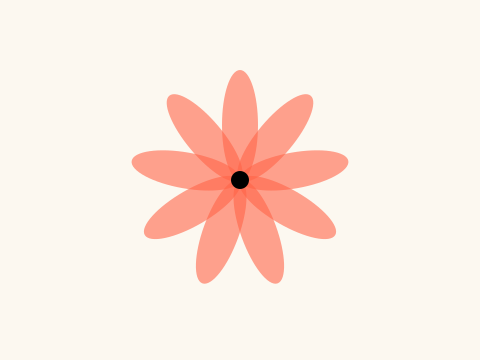

A slider, a checkbox and a button sit in a panel below the canvas. The sliders set the number and the length of the petals, the checkbox makes the flower spin, and the button picks the next colour.

How it works, and how to make it yours

**How it works**

- f.create_slider(), f.create_checkbox() and f.create_button() each make one control. Make them in setup() and keep each in a variable.
- In draw(), ask a control for its value. petals.value() gives the slider's number and spin.checked() says if the box is ticked.
- next_colour.clicked() is true if the button was clicked since it was last asked, so a click moves one step along COLOURS (two quick clicks between frames count as one).
- The petals are drawn with a loop. Each one is turned 360 / count degrees from the last, using f.rotate() between f.push() and f.pop().
- f.translate() at the start moves the middle of the flower to the middle of the canvas.

**Make it yours**

- Add a colour: put another (red, green, blue) group in COLOURS.
- Change the slider ranges. In f.create_slider(3, 24, 9) the numbers are lowest, highest and start.
- Add a third slider for the size of the middle circle, and use its value() in f.circle(0, 0, 18).
- Change the 1.5 in turn += 1.5 for a faster or slower spin.
- Change the 150 in f.fill(red, green, blue, 150) to make the petals more or less see-through.

Source: [`examples/gallery/interaction/05_controls.py`](../../examples/gallery/interaction/05_controls.py)

## Saving your work

### Saving your work

A tomato circle is drawn and saved twice, as my_picture.png and my_picture.pdf. A PDF, or an SVG, is made of shapes, so it stays sharp at any size.

How it works, and how to make it yours

**How it works**

- f.save("my_picture.png") writes the frame when it is finished. The file goes in the folder the sketch runs from.
- The file ending says the format. .png makes a picture of pixels. .pdf and .svg make a picture of shapes.
- The save is inside if f.frame_count == 0, so it happens once, on the first frame. Without that test, it would save again in every frame.
- f.background(), f.fill() and f.circle() make the drawing. f.text() writes on it.

**Make it yours**

- Change the names in f.save() to your own. Keep the endings.
- Save an SVG as well: f.save("my_picture.svg").
- Change the picture: use other shapes, colours and words before the save.
- Save a different frame: change 0 in f.frame_count == 0 to 30. Then make something change with f.frame_count, so the saved frame is different.
- Change the colour in f.fill("tomato") before you save.

Source: [`examples/gallery/saving/01_save_a_picture.py`](../../examples/gallery/saving/01_save_a_picture.py)

### A picture with a transparent background

f.clear() makes every pixel transparent. A PNG saved afterwards keeps the transparency, so the shape can go on any background later. The window shows transparent as black.

How it works, and how to make it yours

**How it works**

- f.clear() makes the whole canvas see-through. f.background() would paint it a solid colour.
- f.fill(), f.stroke() and f.stroke_width() set the look of the circle, and f.circle() draws it.
- f.save("sticker.png") writes the frame. A PNG can hold transparency. Pixels the circle did not cover stay see-through.
- The save runs once, on the first frame, because of f.frame_count == 0.
- To see it, open sticker.png in a program that shows transparency, or place it on a coloured page.

**Make it yours**

- Change the colours in f.fill() and f.stroke().
- Make a different sticker: draw a few shapes, or some text, in place of the circle.
- Make part of it half see-through: use f.fill(255, 99, 71, 128). The last number is the alpha.
- Change the size: f.circle(320, 200, 260) has a diameter of 260.
- Change the file name in f.save().

Source: [`examples/gallery/saving/02_transparent_png.py`](../../examples/gallery/saving/02_transparent_png.py)

### Saving an animation as frames

Twelve coloured dots go round in a circle. f.save_frames() saves 30 numbered pictures of it, which loop without a jump when they are joined up.

How it works, and how to make it yours

**How it works**

- f.save_frames("frames/####.png", 30) saves this frame and the next 29. The #### is replaced by the frame number: frames/0001.png, frames/0002.png and so on.
- It is called once, on the first frame, by the test f.frame_count == 0.
- The twelve dots are 30 degrees apart. The animation turns by 30 degrees in 30 frames, so the last frame leads straight back to the first.
- The colour and the size depend only on the angle, so they join up too. f.hsb() makes the colour.
- A program such as ffmpeg can join the pictures into a video or a GIF. Chapter 13 of the guide shows how.

**Make it yours**

- Change the 140 in the dot position to make a bigger or smaller circle.
- Change the size of the dots: the 30 in f.circle() is the middle size.
- Change the 30 in f.save_frames() to save fewer or more pictures.
- Change the 80 in f.hsb() to make the colours paler or stronger.
- Change the folder: "pics/####.png".

Source: [`examples/gallery/saving/03_save_frames.py`](../../examples/gallery/saving/03_save_frames.py)

### A poster file

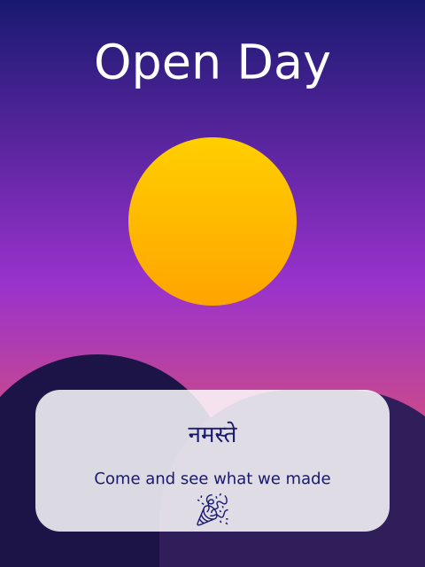

This script draws a poster and saves it as poster.pdf and poster.svg, and again as poster_final.pdf and poster_final.svg. The files carry more than a picture.

How it works, and how to make it yours

**How it works**

- The poster has four layers, made with f.layer("name"). The "notes" layer is hidden with f.hide_layer(), so it is in the files but switched off.
- The words are real text, with English, Hindi and an emoji. funground's fallback fonts draw the Hindi and the emoji.
- The PDF opens in Acrobat or Illustrator, with the layers in the layers panel. The SVG opens in Inkscape or Illustrator, where the layers are Inkscape layers. The text can be selected and changed.
- To edit the text, the font must be installed on your computer. For Hindi in Illustrator, switch on the World-Ready Composer in its Type settings. Guide chapter 13 has more on fonts.
- Save two copies for a handoff. poster.pdf and poster.svg have live text, for you to edit. poster_final.pdf and poster_final.svg use text="shapes". Every letter is a shape, so they look right without the font. The layers are still layers, but the letters cannot be edited.
- The gallery picture shows the poster. The hidden notes are not in it.

**Make it yours**

- Change the headline "Open Day" and the other words.
- Change the gradient colours in the "background" layer.
- Hide another layer: f.hide_layer("artwork") after drawing it.
- Add a layer of your own with a new with f.layer("stars"): block.
- Save a copy with a different name, such as f.save("poster2.svg", text="shapes").

Source: [`examples/gallery/saving/04_poster_file.py`](../../examples/gallery/saving/04_poster_file.py)

## Documents and pages

### A booklet with three pages

A script can make a document. Three pages are drawn, and f.save("booklet.pdf") writes them into one PDF. The gallery picture shows the last page, which is on its side.

How it works, and how to make it yours

**How it works**

- f.new_page() ends one page and starts the next. A size name such as "A5" sets the page size.
- Colours and text settings carry over to the next page, so page 2 does not set its size again.
- f.page_size("A5", landscape=True) gives the width and height as numbers. They go straight into f.new_page(*...) for the last page. The * unpacks the pair into two values.
- f.linear_gradient() fills the cover and the last page with a smooth blend of colours.
- f.text_box() wraps a long line of text inside a box, and f.text_align() places it.
- f.save("booklet.pdf") writes every page into one PDF. f.page_count() says how many there are, and f.show() shows the last page in a window.

**Make it yours**

- Change "A5" to "A4" or "A6" in the first f.new_page() call.
- Change the texts, the title and the colours on the three pages.
- Add a fourth page. Call f.new_page() and draw on it before f.save().
- Make the last page upright. Replace the page_size line with a plain f.new_page().
- Draw more on page 2. Use f.width and f.height to place shapes, so they fit if you change the size.

Source: [`examples/gallery/documents/01_booklet.py`](../../examples/gallery/documents/01_booklet.py)

### A flip book saved as a GIF

Every page of a script is one frame of a GIF. Eight pages show a ball bouncing across, and f.save("flip_book.gif") writes them in order. The gallery picture shows the last page.

How it works, and how to make it yours

**How it works**

- f.size(320, 240) sets the size of every page. All the pages must be the same size.
- f.frame_duration(0.15) says how long each page is shown, in seconds.
- The loop draws one page for each step. f.new_page() starts each new page after the first.
- across goes from 0 to 1 over the pages. It sets the ball's x, and height sets how high the ball is. height is 0 at both ends and 1 in the middle, which makes the bounce.
- The shadow gets smaller as the ball rises, so f.ellipse() uses 40 - 20 * height.
- f.save("flip_book.gif") writes every page, and the GIF loops for ever. An MP4 works the same way with f.save("flip_book.mp4"), but it needs the free program ffmpeg.

**Make it yours**

- Change STEPS = 8 to a bigger number for a smoother flip book. Try 16.
- Change 0.15 in f.frame_duration() to speed it up or slow it down.
- Change 140 in the ball's y value to make it bounce higher or lower.
- Change the colours in f.background() and f.fill().
- Make the ball grow as it rises: use 40 + 20 * height as its size.

Source: [`examples/gallery/documents/02_flip_book.py`](../../examples/gallery/documents/02_flip_book.py)

## Pictures and images

### Loading and drawing an image

f.load_image() reads a picture file and gives you a picture. f.image() draws it at its own size, smaller, turned and half see-through.

How it works, and how to make it yours

**How it works**

- f.load_image("data/photo.jpg") reads PNG, JPEG, GIF, BMP and TGA files. A relative path is looked for next to this file. It runs once, outside draw(), so the file is read only once.
- f.image(photo, x, y) draws the picture at its own size, with its top-left corner at (x, y).
- Give a width and a height and the picture is stretched to fit.
- A picture follows f.translate(), f.rotate() and f.opacity() like any other drawing. The smaller copy is turned inside f.saved_state(), so the turn stays inside it.
- The red stripe shows that the last copy, with f.opacity(128), is half see-through.

**Make it yours**

- Put your own picture in the data folder and change "data/photo.jpg" to its name.
- Change the 160 and 120 in the turned copy to make it bigger. Keep 4 by 3 so it is not squashed.
- Change the -10 in f.rotate() to turn it another way.
- Change the 128 in f.opacity() from 0 (gone) to 255 (solid).
- Draw the photo again at several places with a loop.

Source: [`examples/gallery/images/01_load_image.py`](../../examples/gallery/images/01_load_image.py)

### Tinting a picture and drawing part of it

The same photo is drawn three times with a tint, and then three small parts of it are drawn bigger. A tint colours every picture drawn after it.

How it works, and how to make it yours

**How it works**

- f.tint() multiplies each pixel's red, green and blue by the tint, and its alpha too. f.tint(255, 170, 120) keeps all the red and takes some green and blue away, which looks warm.
- f.tint(255, 120) is white at about half strength, so the picture is half see-through.
- f.no_tint() stops the tint. Without it, every later picture would be tinted too.
- f.image(photo, x, y, w, h, sx, sy, sw, sh) draws only part. The last four numbers are the left, top, width and height of the part, in the photo's own pixels.
- The part is drawn into the box x, y, w, h, so a small part fills a bigger box.

**Make it yours**

- Change the three numbers in a tint. Try f.tint(100, 255, 100) for green.
- Use a colour name, as the last picture does: f.tint("gold") or f.tint("skyblue").
- Change the numbers in a part, such as 130, 160, 100, 75, to pick out a different bit.
- Make a part smaller, such as 50 by 38, to zoom in more.
- Draw a part into a tall, thin box and see how it stretches.

Source: [`examples/gallery/images/02_tint_and_parts.py`](../../examples/gallery/images/02_tint_and_parts.py)

### Reading and writing single pixels

Five small tricks work on single pixels. A tile is built with f.set() and read with f.get(), colours are swapped over, and a band of the canvas turns grey.

How it works, and how to make it yours

**How it works**

- f.set(x, y, colour) makes one pixel a colour. f.get(x, y) reads one back as a colour, with .red, .green and .blue.
- f.get(x, y, w, h) with a size gives a picture, which is a copy of that part of the canvas.
- f.load_pixels() copies the canvas into the list f.pixels. It holds four numbers for each pixel (red, green, blue, alpha), row by row.
- The loops change the numbers in the list. f.update_pixels() writes them back to the canvas. A picture made with f.create_graphics() has its own load_pixels() and update_pixels(), used on the scene copy.
- f.create_graphics(w, h) makes an empty picture to draw on. The tile and the scene use it.
- A Python loop over every pixel is slow, so the example keeps the areas small.

**Make it yours**

- Change the 14 and 12 in make_tile() to change its colours.
- Change what the swap does: in the loop, set pixels[i + 1] = 0 to remove the green.
- Change the grey band: the range(350, 400) says which rows. Try range(0, 400) to grey everything.
- Change the wave: use 18 * math.sin(x / 30) with other numbers for a bigger or tighter wave.
- Change probe_x and probe_y to read the colour from another place.

Source: [`examples/gallery/images/03_pixels.py`](../../examples/gallery/images/03_pixels.py)

### Changing pictures: copy, resize, mask and filters

One photo is copied, shrunk and put through a set of filters. A mask lets a round hole show the photo. The big photo is never changed, only copies of it.

How it works, and how to make it yours

**How it works**

- picture.copy() makes a new picture. Changing the copy does not touch the first.
- picture.resize(w, h) changes the size of a picture.
- A picture's filter(kind) changes every pixel. The kinds are "threshold", "gray", "invert", "blur", "posterize", "erode", "dilate" and "opaque". Some take a value, such as pic.filter("blur", 3).
- picture.mask(other) lets the other picture decide what shows through. Its alpha is what counts, so a black circle drawn on a see-through picture makes a round hole.
- f.filter() does the same to the whole canvas. Here it is used once, then f.get() picks the result up as a new picture.
- filtered() and put() are helper functions, so each cell of the grid is one short line.

**Make it yours**

- Change the 3 in filtered("blur", 3) to blur more or less.
- Change the 4 in "posterize" to 2 or 8.
- Try a different filter in a cell, such as "invert" in place of "gray".
- Change the circle size in masked(): 100 is its diameter.
- Use a different shape for the mask: draw hole.rect(...) in place of hole.circle(...).

Source: [`examples/gallery/images/04_filters.py`](../../examples/gallery/images/04_filters.py)

### Loading an SVG drawing

f.load_svg() reads an SVG file and gives you a picture. It is made of shapes, not pixels, so it stays sharp when it is large. f.svg_paths() gives the same shapes as paths.

How it works, and how to make it yours

**How it works**

- f.load_svg("data/badge.svg") works like f.load_image(). A relative path is looked for next to this file.
- f.image() draws the badge small, large and turned. It follows f.translate() and f.rotate().
- f.svg_paths() gives one path for each shape in the file. The first, the round plate, is kept in plate.
- A path can be changed with .translate() and .scale() and combined with other paths. plate - inner cuts the middle out and leaves a ring.
- f.clip(ring) means anything drawn afterwards only shows inside the ring. The tomato stripes are clipped to it.
- f.saved_state() puts the clip and the transforms away again.

**Make it yours**

- Use your own SVG: put it in the data folder and change both file names.
- Change 0.6 in the inner scale to make the ring thicker or thinner.
- Change the stripe colour in f.stroke("tomato").
- Change the 14 in range(-160, 320, 14) to space the stripes closer or wider.
- Draw the badge many times in a loop, with a different size each time.

Source: [`examples/gallery/images/05_svg.py`](../../examples/gallery/images/05_svg.py)

## Sound

### Sound: play a tune and watch it

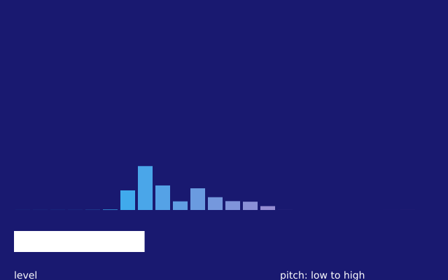

A tune plays over and over, and you see it. Each bar is one range of pitch, low notes on the left and high notes on the right. The wide bar below shows how loud it is. With no sound device, the sketch still runs, in silence. *(Uses real time, so the picture varies from run to run.)*

How it works, and how to make it yours

**How it works**

- f.load_sound("data/tune.wav") reads a sound file. The path is found next to this file.
- In setup(), tune.set_volume() sets how loud it is, and tune.loop() plays it again and again.
- tune.spectrum(BANDS) gives a list of 24 numbers from 0 to 1, one for each range of pitch. The for loop draws one bar for each number. A stronger range gives a taller bar.
- f.lerp_color() mixes deepskyblue into hotpink, a little more for each bar along the row.
- tune.level() gives one number from 0 to 1 for how loud the sound is now. It sets the width of the white bar. The min(1, ...) stops the bar from growing past its box.

**Make it yours**

- Change BANDS to 48 for thinner bars, or to 8 for fat ones. The bar width follows.
- Change the two colours in f.lerp_color(), or the background colour.
- Change the 1.5 in tune.level() * 1.5 to make the white bar more or less sensitive.
- Draw circles instead of bars: use f.circle(20 + i * bar_width + bar_width / 2, 200, 120 * strength).
- Play another sound. Put your own .wav file next to this one and change the name in f.load_sound().

Source: [`examples/gallery/sound/01_visualiser.py`](../../examples/gallery/sound/01_visualiser.py)

### Making sound: write a tune, then watch it play

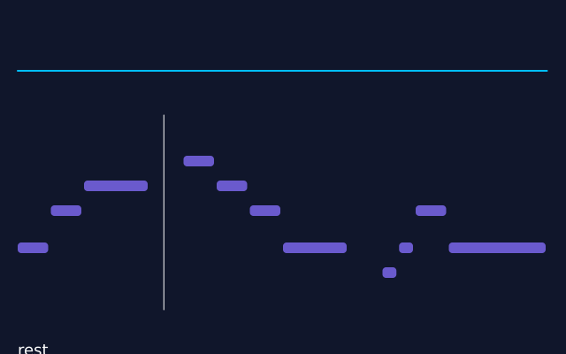

A tune is written as a short list in the code. The same list makes the sound and draws the bars. The top shows the wave itself. A soft chord plays underneath. The text at the bottom names the note that is sounding. With no sound device, the sketch still runs, in silence. *(Uses real time, so the picture varies from run to run.)*

How it works, and how to make it yours

**How it works**

- TUNE is a list of (note, beats) pairs. The code joins it into text such as "E4:1 G4:1 A4:2". A note is a name like "E4", a dash is a rest, and :2 means two beats.
- f.melody(text, tempo=TEMPO) turns that text into a sound. sound.reverb(0.2) puts it in a small room.
- tune.samples() gives the wave as a list of numbers. The loop in draw() draws the few that are around the place where tune.current_time() says the sound is now.
- f.mix() adds three quiet, long notes into one chord. f.note() and f.tone() make them. Each is quiet, so the sum stays below the loudest a sound can be.
- The bars use the same TUNE list. A note is gold while tune.current_time() is inside it.
- tune.pitch() gives the pitch that is sounding, and f.frequency_to_note() turns it into a name.

**Make it yours**

- Change TEMPO to play the tune slower or faster.
- Change the notes in TUNE, or add ("C5", 2) at the end. The sound and the bars both follow.
- Change the chord. Try "F3" and "A3" in place of "E3" and "G3" in f.mix().
- Change 0.2 in .reverb(0.2) to 0.6 for a bigger room.
- Use a sharper voice: f.melody(text, tempo=TEMPO, wave="square").

Source: [`examples/gallery/sound/02_write_a_tune.py`](../../examples/gallery/sound/02_write_a_tune.py)

### Making sound: a sargam phrase over a drone

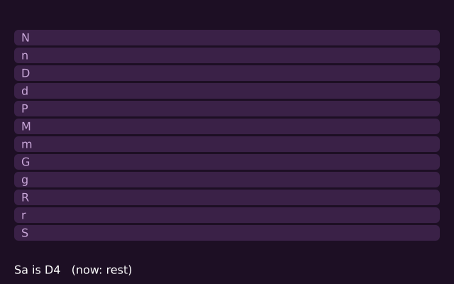

A short phrase in sargam (note names used in Indian music) plays over a drone. A ladder has one row for each swara, with Sa at the bottom. The row for the swara you hear lights up, and a pink line follows the voice up and down. *(Uses real time, so the picture varies from run to run.)*

How it works, and how to make it yours

**How it works**

- Sa is the home note, the one the music is built on. Here it is D4. A swara is a note named from Sa: S r R g G m M P d D n N. A small letter is komal (flat), and a capital M is tivra (sharp).
- f.melody(PHRASE, sa=SA, tuning="just") reads swaras instead of note names. A ' after a swara is the octave above, and a comma is the octave below. "just" tuning uses pure ratios from Sa.
- A drone is a steady background that holds Sa and Pa. This one imitates a tanpura, the stringed instrument that plays it. f.pluck() makes plucked strings, f.sequence() joins them one after another, and sound.reverb() gives them a room to ring in.
- The hum is made from numbers: f.create_sound() turns a list of three added sine waves into a sound.
- phrase.pitch() gives the pitch now. swara_height() uses a % 12 to fold it into one octave, so the voice always lands on a row of the ladder.
- The pink line takes the middle of the last five readings, so it is calm, and it breaks at rests.

**Make it yours**

- Change SA to "C4" or "A3". The whole phrase and the drone move to that key.
- Change PHRASE. S is Sa, and R, G, m, P, D, N are the other swaras. Add :2 to make one last longer.
- Change TEMPO to sing it faster or slower.
- Change tuning="just" to tuning="equal" and listen for the small differences.
- Change the first string of the drone: use "m," in place of "P," in strings. A drone for some ragas has Ma there.

Source: [`examples/gallery/sound/03_sargam_over_a_drone.py`](../../examples/gallery/sound/03_sargam_over_a_drone.py)

### Sound: a tuner that listens

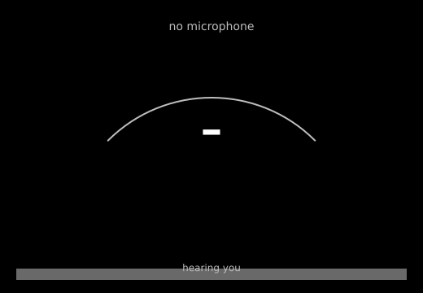

Sing or play one note into your microphone. The big letters show its name, like A4. The needle shows whether you are a little flat (left) or sharp (right), and it turns green when you are in tune. The bar at the bottom is how loud you are, so you can see it hears you. Nothing is recorded or played back. With no microphone, the sketch still runs and waits. *(Uses real time, so the picture varies from run to run.)*

How it works, and how to make it yours

**How it works**

- f.microphone() makes the microphone, and mic.start() begins listening. f.microphones() lists the ones the computer has, and the first is named at the top.
- mic.pitch() gives the pitch of the one note it hears, in hertz, or None when it is quiet. mic.level() says how loud it is, from 0 to 1. Laptop microphones can be very quiet, so the bar at the bottom uses decibels (loudness()) and still moves for a soft voice.
- f.frequency_to_note() turns the pitch into a name. cents_off() then measures how far the pitch is from that note. A cent is one hundredth of a semitone, so 50 cents is halfway to the next note.
- The needle moves a third of the way to its target each frame, which smooths the shaking.
- f.arc() draws the dial, and sin() and cos() put the needle at the right angle. 50 cents is 45 degrees.
- A note needs 20 quiet frames before the name goes back to "-", so a short gap does not wipe it.

**Make it yours**

- Change the 5 in abs(needle) < 5 to 10 and the tuner is easier to please.
- Change the 0.3 in needle += (target - needle) * 0.3. A smaller number is calmer, a bigger one is quicker.
- Change quiet_frames > 20 to hold the name for longer or shorter.
- Change the colours: "limegreen" and "tomato" in draw(). Change the -70 and 50 in loudness() if the bar moves too much or too little.
- Change f.text_size(80) to make the note name bigger or smaller.

Source: [`examples/gallery/sound/04_tuner.py`](../../examples/gallery/sound/04_tuner.py)

## Music

### Music: tap along to the beat

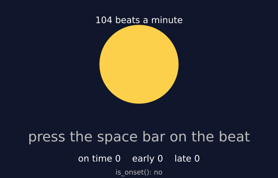

A tune plays over and over. The circle lights up on each beat. Press the space bar in time with it. Each press is scored: on time, a little early, or a little late. With no sound device, the tune is silent but still keeps time. *(Uses real time, so the picture varies from run to run.)*

How it works, and how to make it yours

**How it works**

- f.melody(..., tempo=TEMPO) makes the tune. The last note is followed by a short rest, so the tune is exactly 16 beats long and the loop keeps the beat.
- tune.beats() lists the time of every beat in seconds. It is found by listening to the sound itself. tune.tempo() gives the speed that was heard.
- Each frame, tune.current_time() minus the last beat is how long ago the beat was. The glow fades over a quarter of a second, and f.lerp_color() sets the colour.
- key_pressed() runs when a key goes down, and f.key says which. distance_to_beat() finds the nearest beat. It also tries the beats of the loop before and after.
- A press within ON_TIME seconds of a beat is on time. Before it is early, after it is late. A dictionary keeps the three counts.
- tune.is_onset() says whether a new note begins right now. It is shown at the bottom.

**Make it yours**

- Change TEMPO to 70 for a slow beat, or 140 for a fast one.
- Make the game stricter. Change ON_TIME from 0.07 to 0.04.
- Change the notes in the f.melody() text. Keep the total length and the final rest.
- Make the circle a square: swap f.circle() for f.rect() and move its corner.
- Count a streak. Add a global called streak, add 1 when name is "on time" in key_pressed(), and set it to 0 otherwise.

Source: [`examples/gallery/music/01_tap_along.py`](../../examples/gallery/music/01_tap_along.py)

### Music: see a chord

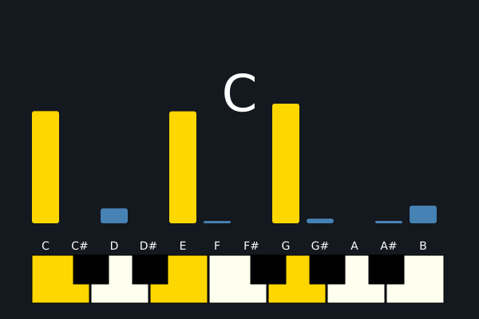

Chords play one after another. The twelve bars show how strong each note name is right now. The chord's name is at the top, and the notes of the chord are lit on a small keyboard. With no sound device, the chords stay silent and the bars stay flat. *(Uses real time, so the picture varies from run to run.)*

How it works, and how to make it yours

**How it works**

- PROGRESSION is a list of chord names. f.chord_notes("Am") lists the note names in a chord. voicing() adds octave numbers to them, going up from octave 3.
- Each chord is f.mix() of f.note() sounds. The notes are quiet, so the sum does not clip. f.sequence() puts the chords one after another, and sound.reverb(0.2) adds a little room.
- song.chroma() gives 12 numbers for C, C#, D ... B. Each says how strong that note name is now, in any octave. The bars are those twelve numbers.
- shown[i] moves a third of the way to the new number each frame, so the bars glide.
- song.chord() names the chord that fits what is sounding. It gives nothing between chords, so the sketch keeps the last name.
- The keys are rectangles. White ones are drawn first and black ones on top. The notes of the chord are gold or orange.

**Make it yours**

- Change PROGRESSION. Try "Em", "A7" or "Cmaj7".
- Change SECONDS to make the chords shorter or longer.
- Change "triangle" in make_chord() to "sine" or "square". The bars show the new sound.
- Change the colours: "gold" and "steelblue" in draw().
- Change the 0.3 in the bars' smoothing. A smaller number glides more slowly.

Source: [`examples/gallery/music/02_see_a_chord.py`](../../examples/gallery/music/02_see_a_chord.py)

### Music: sing with the drone

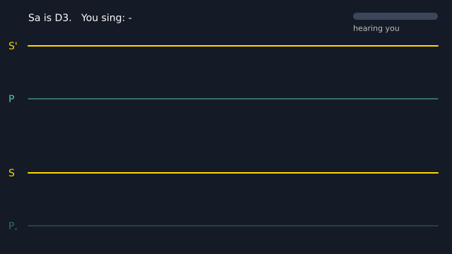

A drone plays, and you sing along. The microphone hears you, and your pitch is drawn as a line that moves to the left. The bright lines are Sa and Pa. Try to hold your voice on them. With no microphone, the drone still plays and the line waits. *(Uses real time, so the picture varies from run to run.)*

How it works, and how to make it yours

**How it works**

- Sa is the home note of Indian music, and the drone holds it. SA = "D3" is a comfortable Sa for many voices. f.drone(SA, 7) makes a sound like a tanpura: plucked strings that play Pa, Sa, Sa, Sa and ring on. Pa is the fifth note above Sa.
- Reverb makes the strings warmer, but it adds a tail, and the loop would pause. room() folds the tail back onto the start, so the loop has no gap.
- mic.pitch() gives your pitch in hertz, or None when you are quiet. The code turns it into cents above Sa: 100 cents is one semitone, so Pa is 700 and the next Sa up is 1200.
- GUIDES holds the lines to sing to. y_for() turns cents into a height on the screen.
- line keeps the last 280 readings. A None is a gap, where the line breaks.
- f.frequency_to_note(hz, sa=SA) names the swara you sing, for example "P" or "G". The small bar at the top right shows how loud the microphone hears you, in decibels (loudness()), so you can see it hears you even if your microphone is quiet.

**Make it yours**

- Change SA to "C3" or "A3" to suit your voice. The lines move with it.
- Add a guide line for Ga, the third swara. Add (400, "G", "tomato") to GUIDES.
- Change the drone for a raga without Pa. Use f.drone(SA, 7, pattern="m S' S' S"), with Ma on the first string.
- Change 0.4 in room(f.drone(...), 0.4) to 0 for a dry drone, or to 0.7 for a big room.
- Change the pink line's colour and f.stroke_width(). Change the -70 and 50 in loudness() if the bar moves too much or too little.

Source: [`examples/gallery/music/03_sing_with_the_drone.py`](../../examples/gallery/music/03_sing_with_the_drone.py)

### Music: hear a raga

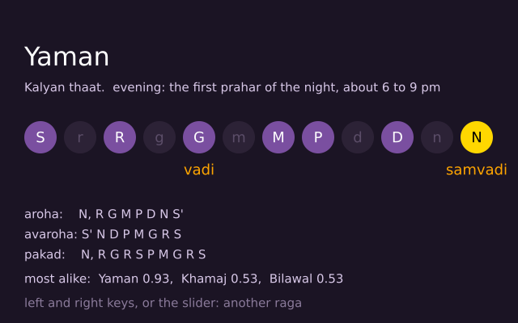

Pick a raga with the slider or the left and right keys. Its aroha (the way up) and avaroha (the way down) play over a drone, and each swara lights up as it sounds. The text gives its thaat, vadi, samvadi, pakad and time of day, and the three ragas with the most similar swaras. *(Uses real time, so the picture varies from run to run.)*

How it works, and how to make it yours

**How it works**

- f.ragas() lists the names funground knows. f.raga(name) gives one raga, with .thaat, .swaras, .aroha, .avaroha, .vadi, .samvadi, .time and .pakad.
- f.drone() makes a steady background note, and f.melody() turns a string of swara names into a tune. Sa is the home note and "-" is a rest.
- The tune and the drone each use .reverb() and .loop(). The room() helper adds the echo's tail back onto the start, so the loop has no gap.
- Every frame, tune.current_time() divided by the length of a beat says which swara is sounding. That one is drawn in gold.
- f.create_slider() picks the raga, and choose() builds a new tune when the slider moves.
- f.match_ragas() takes how often each of the 12 swaras is used. It gives back the ragas whose swaras are most alike, best first.

**Make it yours**

- Change SA from "C#4" to another note, such as "D4". The whole tune and its lights move to that key.
- Change TEMPO to make the tune slower or faster.
- Change tuning="just" to tuning="equal" in f.melody() and listen for the small differences.
- Play the pakad instead: build the tune from raga.pakad.split() instead of the aroha and avaroha.
- Change the background colour to fit raga.time, for example a dark blue for night ragas and a warm one for morning.

Source: [`examples/gallery/music/04_hear_a_raga.py`](../../examples/gallery/music/04_hear_a_raga.py)

### Music: a tala goes round

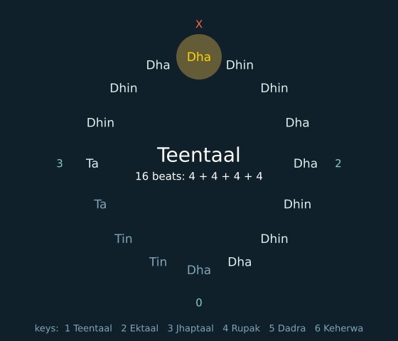

A tala is a cycle of beats that comes round again and again. Here the bols sit round a circle, and the beat playing now glows. The sam, beat 1, is marked X, and a wave is marked 0. Keys 1 to 6 pick a tala. *(Uses real time, so the picture varies from run to run.)*

How it works, and how to make it yours

**How it works**

- A tala is a repeating pattern of beats. The beats fall in groups called vibhags. You clap at the start of some groups (tali) and wave at the start of others (khali). Beat 1 is the sam, where the cycle begins and lands. A bol is the syllable a tabla player says for one beat, and the theka is the whole pattern of bols.
- f.talas() lists the six talas. f.tala_info(name) gives .beats, .vibhag, .tali, .khali, .sam and .bols.
- f.tala(info.name, tempo=TEMPO) makes one cycle with simple drum sounds. choose() stops the old cycle, makes a new one and loops it.
- Each frame, cycle.current_time() divided by the length of a beat says which beat is playing.
- Each bol sits at an angle on the circle, found with math.cos() and math.sin(). The beat that is playing glows gold.
- marks() decides the sign over each beat: X for the sam, 0 for a wave and 2, 3, ... for the other claps. key_pressed() reads the keys 1 to 6.

**Make it yours**

- Change TEMPO. A bigger number is faster.
- Start with another tala: change choose(0) in setup() to choose(2).
- Change the colour of the glow, f.fill(255, 200, 80, 90), or its size, 64.
- Print the bols when a tala is chosen: add print(info.bols) to the end of choose().
- Change the radius 150 of the circle. It is used for both x and y in draw().

Source: [`examples/gallery/music/05_tala.py`](../../examples/gallery/music/05_tala.py)

### Music: see your voice

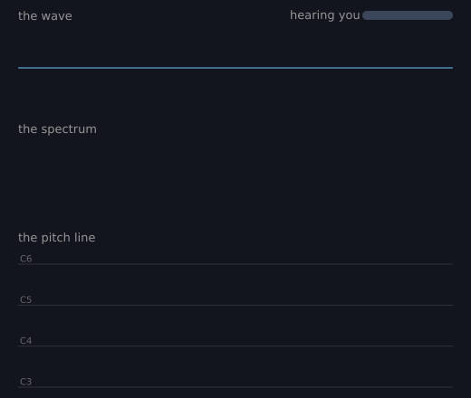

Sing, hum or talk to the microphone and watch three views of the same sound. The top one is the wave, the middle one is the spectrum, and the bottom one is the note you sing, scrolling across. Nothing is recorded or played back. With no microphone, the sketch still runs and shows quiet. *(Uses real time, so the picture varies from run to run.)*

How it works, and how to make it yours

**How it works**

- f.microphone() makes the microphone, and mic.start() in setup() begins listening.
- f.draw_wave(mic, x, y, w, h) draws the wave: how the air moves over the last half second.
- f.draw_spectrum(mic, x, y, w, h, bands=40) draws a bar for each range of pitch, low on the left and high on the right.
- f.draw_pitch_line(mic, x, y, w, h, seconds=6, low="C3", high="C6") draws the note you sing, scrolling across. It leaves a gap when you are quiet.
- These functions draw with the current fill and stroke. So the code sets f.fill() and f.stroke() before each one, to give each view its own colour.
- label() is a small helper that writes a title above each view. The small bar at the top right shows how loud the microphone hears you, in decibels (loudness()), even for a quiet microphone.

**Make it yours**

- Change bands=40 to 80 for finer bars, or to 12 for fat ones.
- Change seconds=6 to 12 to see a longer stretch of your voice.
- Change low="C3" and high="C6" to "C2" and "C5" for a deep voice.
- Change the colours in the f.fill() and f.stroke() lines.
- Make the window taller with f.size(), and give each view more height. Change the -70 and 50 in loudness() if the bar moves too much or too little.

Source: [`examples/gallery/music/06_see_your_voice.py`](../../examples/gallery/music/06_see_your_voice.py)

### Music: a song's fingerprint

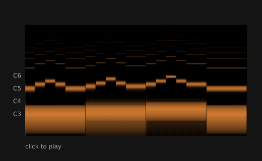

A short song is turned into a picture. Time goes across, pitch goes up, and the louder a pitch is, the brighter it is. Each note is a bright dash, and the low bass notes run along the bottom. Click to play the song, and a line shows where it is. The picture is also saved as fingerprint.png. With no sound device, the song plays silently.

How it works, and how to make it yours

**How it works**

- f.melody() makes the tune, and makes the bass again with wave="sine" and volume=0.35. f.mix() adds the two into one song. The bass is quiet, so the sum does not clip.
- f.spectrogram(song, WIDTH, HEIGHT) turns the whole sound into a picture. Its brightest colour is the fill colour at that moment, so setup() calls f.fill() first.
- fingerprint.save("fingerprint.png") writes the picture, and f.image() draws it.
- The picture runs from 40 Hz to 16,000 Hz. pitch_height() uses a log to find where a note name sits, so the side labels C3, C4, C5 and C6 are in the right place.
- mouse_pressed() calls song.play(). While song.is_playing(), the line sits at song.current_time() / song.duration() of the way across.

**Make it yours**

- Change the notes in LEAD or BASS.
- Change TEMPO. A faster song makes a shorter, tighter picture.
- Change f.fill(255, 150, 60) to another colour. The whole picture changes colour.
- Change wave="sine" to wave="square" in the bass. Square waves have many more lines above each note.
- Make the picture bigger: raise WIDTH and HEIGHT, and the size in f.size().

Source: [`examples/gallery/music/07_a_songs_fingerprint.py`](../../examples/gallery/music/07_a_songs_fingerprint.py)

### Music: draw a wave and hear it

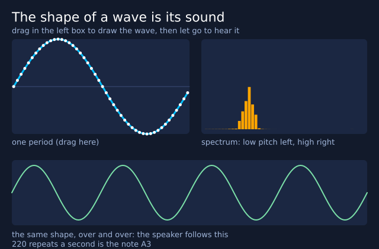

Every sound is a wave, and the shape of the wave decides how it sounds. Drag the mouse inside the left box to draw one repeat of a wave, and let go to hear it. The right box is the spectrum: a bar for each pitch. A smooth wave has one tall bar, and a jagged wave has many. Four buttons give you a sine, a square, a saw and a soft wave to start from. *(Uses real time, so the picture varies from run to run.)*

How it works, and how to make it yours

**How it works**

- shape is a list of N=48 heights, from -1 to 1. mouse_pressed(), mouse_dragged() and mouse_released() change them. paint() moves the point nearest the mouse. The drag code fills the points the mouse jumped over, so a fast drag leaves no gaps.
- rebuild() makes one second of sound from the shape. For each of the 44,100 numbers, it works out where that moment falls in the shape and blends two neighbouring points. PITCH = 220 repeats a second is the note A3.
- f.create_sound(numbers) turns the list into a sound, and sound.loop() plays it. The sketch removes the average first, so the wave does not sit above zero.
- f.draw_spectrum(sound, ...) draws the bars on the right.
- f.create_button() makes the four buttons. button.clicked() is true on the frame it is pressed, and preset() builds the shape.
- f.begin_shape(), f.vertex() and f.end_shape() draw the shape, and the same shape again four times at the bottom. That repeated wave is what the speaker follows.

**Make it yours**

- Change PITCH to 330 or 440 for a higher note.
- Change set_volume(0.8) in rebuild() to play it quieter.
- Add a triangle wave. In preset(), before the else, add elif name == "triangle": and out.append(4 * abs(p - 0.5) - 1). Then add "triangle" to the list of names in setup().
- Change the colours: "deepskyblue" and "orange".
- Draw a wave with sharp corners and compare its spectrum with a smooth one.

Source: [`examples/gallery/music/08_draw_a_wave.py`](../../examples/gallery/music/08_draw_a_wave.py)

### Music: compose and save

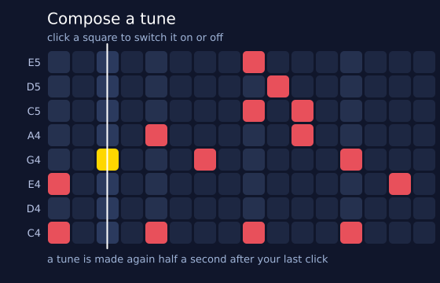

Click the squares to write a tune. Time goes across, with 16 beats. Pitch goes up. The rows are the five notes of a pentatonic scale, which always sounds right. Tick "sargam" to use the swaras S R G m P D N S' instead. The tune loops on its own, and a white line sweeps along it. "save WAV" writes my_tune.wav, and "save poster" writes a PDF of the grid. *(Uses real time, so the picture varies from run to run.)*

How it works, and how to make it yours

**How it works**

- cells[row][beat] is a grid of True and False. mouse_pressed() turns a mouse position into a row and a beat, and flips that square.
- rebuild() turns the grid into text for f.melody(): "-" for an empty beat, and a chord such as "[C4 E4]" for squares in the same column. In sargam mode, it adds sa=SA, tuning="just". Sa is the home note, and a swara is a note named from it.
- A soft low pulse on every fourth beat comes from f.tone() and f.sequence(). f.mix() adds the pulse to the notes. room() adds a little reverb, then folds its tail back onto the start, so the loop has no gap.
- A tune is made again 30 frames after your last click, so quick clicking does not rebuild it every time.
- f.create_button() and f.create_checkbox() make the controls. tune.is_playing() and tune.current_time() / STEP find the beat that is sounding.
- tune.save("my_tune.wav") writes the sound. f.save("grid_poster.pdf") writes the picture, after drawing the grid again on white.

**Make it yours**

- Change STEP. A smaller number is a faster tune.
- Change PENTATONIC to another scale. Try ["A3", "C4", "D4", "E4", "G4", "A4", "C5", "D5"].
- Change SA to "D4" and tick "sargam" to hear the swaras on a new Sa.
- Change START to write a different starting tune. Each pair is (beat, row).
- Change beat % 4 to beat % 2 for a faster pulse.

Source: [`examples/gallery/music/09_compose_and_save.py`](../../examples/gallery/music/09_compose_and_save.py)

### Music: ear training

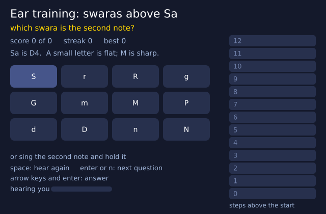

The sketch plays two notes. The first is your starting note. The second is a mystery, higher than the first. Say how far up it is: click a button, press a key, or sing the second note. In "swara" mode the starting note is Sa and you name the swara. In "interval" mode the starting note changes, and you name the gap, like a minor 3rd. Space plays the notes again, and Enter or N asks the next question.

How it works, and how to make it yours

**How it works**

- Sa is the home note, and a swara is a note named from it. SWARAS lists them by steps above Sa: S r R g G m M P d D n N. A small letter is komal (flat), and a capital M is tivra (sharp).
- new_question() uses f.random_choice() to pick a step, never the same one twice in a row, and builds the question. play_question() plays it with f.melody(), such as "S:2 G:3 -:1", and sound.reverb(0.15).
- mouse_pressed() checks the button rectangles. key_pressed() reads the swara letters, the arrow keys and Enter. Each calls answer(), which scores it.
- Singing is read with mic.pitch(). sung_steps() turns the pitch into steps above the start and folds it into one octave with % 12. listen() takes the middle of the last five readings, and HOLD steady frames count as an answer.
- The microphone waits until the notes have finished (f.millis() and quiet_until), so it does not hear the question. The small bar at the bottom left shows how loud the microphone hears you, in decibels (loudness()), so you can see it hears you even if it is quiet.
- f.create_slider() picks the mode. The ladder on the right shows the right answer.

**Make it yours**

- Change HOLD to 10 to make singing an answer quicker.
- Change SA to "C4". Sa moves, and so do both notes.
- Add notes to STARTS, such as "A3" and "B3", for more starting notes in interval mode.
- Make it easier: in new_question(), change range(low, low + 12) to range(low, low + 8).
- Change tempo=90 in play_question() to slow the notes down. Change the -70 and 50 in loudness() if the bar moves too much or too little.

Source: [`examples/gallery/music/10_ear_training.py`](../../examples/gallery/music/10_ear_training.py)

### Music: a piano roll of a tune you wrote

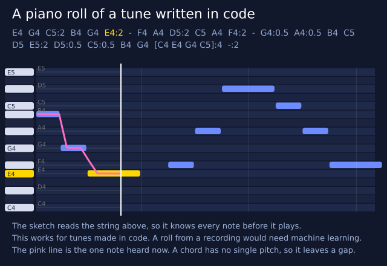

The tune is a string of notes, shown at the top. The sketch reads the string itself and draws each note as a bar. Time goes across, and higher notes sit higher up. The roll scrolls past a fixed line as the tune plays, and each note lights up while it sounds. Tick the box to draw the pitch that the sound itself gives, on top. *(Uses real time, so the picture varies from run to run.)*

How it works, and how to make it yours

**How it works**

- MELODY is text. parse() reads it with a regular expression into notes: the token, the start beat, how many beats, and the pitches. A - is a rest, [ ] is a chord, and :2 is two beats.
- pitch_number() uses f.note_to_frequency() to turn a note name into a semitone number, where 69 is A4. The roll's top and bottom come from the lowest and highest note.
- The same MELODY goes to f.melody() to make the sound, so the roll and the sound always agree. That works because the notes were written in code. A roll from a recording would need machine learning.
- now = tune.current_time() is the clock. Each bar's x is HEAD + (start * BEAT - now) * PPS, so the bars slide left past the line at HEAD. The bars are drawn twice, so the start of the next time round is in view.
- f.create_checkbox() makes the box. When it is ticked, f.draw_pitch_line(tune, ...) draws the one note that tune.pitch() hears. A chord has no single pitch, so it leaves a gap.

**Make it yours**

- Change the notes in MELODY. The roll resizes to fit them.
- Change TEMPO to play it faster.
- Change PPS to 120 to zoom in, or to 50 to see more of the tune.
- Change the colours "gold" and "#6c8cff" for the bars.
- Start with the pitch line off: change True to False in f.create_checkbox().

Source: [`examples/gallery/music/11_piano_roll.py`](../../examples/gallery/music/11_piano_roll.py)

## Projects

### Event poster series

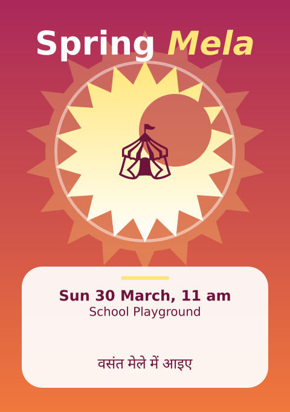

A poster designer. Flip through the events with the buttons or the arrow keys, and type to change the headline. Sliders change the colours, the sun and its rays. Tick boxes to hide the background, the art or the words. Buttons save the posters as PDF and SVG files, with real text.

How it works, and how to make it yours

**How it works**

- EVENTS is a list of dictionaries: words, an emoji, a colour theme and the style settings. The controls change the dictionary of the current event, so what you see is also what is saved.
- Three functions draw the three layers: background_layer(), art_layer() and words_layer(). Each runs inside with f.layer("..."), and a layer keeps what it was given. So a layer is drawn again only when something it shows changes, and draw() stays quick. The three tick boxes call f.hide_layer() and f.show_layer().
- burst() makes a star with f.path().polygon(). art_layer() joins and cuts paths with | (union) and
- (difference), and fills them with f.linear_gradient(). The "shuffle art" button changes the seed for the confetti, and f.random_seed() makes the same seed give the same confetti.
- f.FormattedString() mixes bold, italic and colour in one headline. f.text_box() wraps the details. The Hindi line and the emoji use the built-in fallback fonts. key_typed() adds letters to the headline, and key_pressed() handles Backspace and the arrows. The caret blinks as time passes.
- A poster in an animated sketch is one page, and f.new_page() belongs to scripts. So "save PDF" draws each event in turn, one per frame, and calls f.save("events_1.pdf"), f.save("events_2.pdf") and so on. The saved files keep the layers and real text. "save SVG" writes poster.svg with live text. "save final SVG" writes poster_final.svg with text="shapes": every letter is a shape, for handing over.

**Make it yours**

- Add an event to EVENTS: copy a dictionary, change the words and the four theme colours.
- Change "sun" or "points" in an event to start with a bigger sun or more rays.
- Change the Hindi line in an event to a line in your own language.
- Move the bite out of the sun: change the numbers in circle(...) in art_layer().
- Change MAX_TITLE to allow a longer headline, or CONFETTI for more or less confetti.

Source: [`examples/gallery/projects/01_event_posters.py`](../../examples/gallery/projects/01_event_posters.py)

### Rangoli and mandala generator

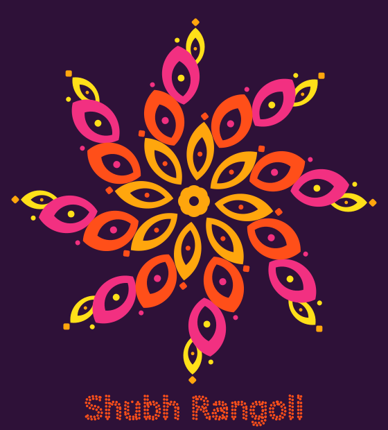

A pattern that is the same all the way round, made from one petal that is turned again and again. The rings turn slowly. Use the controls under the canvas to change the petals, rings and palette, or press "new design". "save" (or the S key) writes rangoli.svg and rangoli.pdf for printing.

How it works, and how to make it yours

**How it works**

- A petal is a lens: two overlapped f.path().circle() shapes joined with & (intersection). Only the part inside both circles is left.
- A smaller lens is cut out of the petal with - (difference), so each petal has a hole. The centre rosette is circles turned with .rotate() and joined with | (union).
- Each ring is a loop. f.push(), f.rotate(), f.translate() and f.pop() put the same petal at each angle around the middle.
- The spin comes from f.frame_count. Rings next to each other turn in opposite directions, and outer rings turn at a different speed.
- f.color_mode("hsb", 360, 100, 100) lets each palette hold simple hue, saturation and brightness numbers.
- f.random_seed(), f.random() and f.random_choice() pick the shapes, so one seed always gives the same design. f.text_to_points() finds dots along the words at the bottom.

**Make it yours**

- Change the 0.25 in draw_pattern(f.frame_count * 0.25): a bigger number spins faster, and 0 holds it still.
- Add your own palette to PALETTES, and raise the palette slider's top value from 4 to 5.
- Put your name in f.text_to_points(), in place of "Shubh Rangoli".
- Change the hole: use a different size in lens(length * 0.6, width * 0.5), or cut out f.path().circle() instead of a lens.
- Draw only outlines: use f.no_fill() and f.stroke() in draw_petal_ring(), press save, and look at rangoli.svg.

Source: [`examples/gallery/projects/02_rangoli.py`](../../examples/gallery/projects/02_rangoli.py)

### Raga explorer

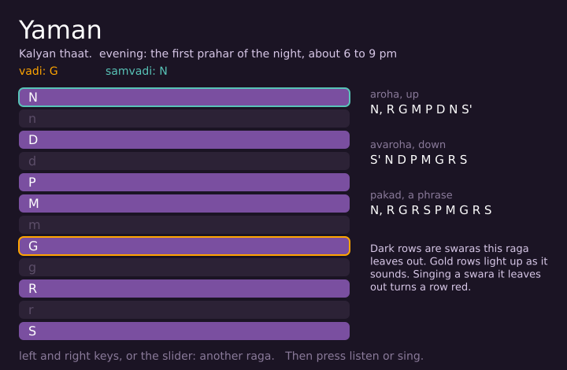

Pick a raga with the slider or the left and right keys. The page shows its thaat (parent scale), its vadi and samvadi (its two most important swaras) and the time of day it belongs to. "listen" plays its aroha (the way up) and avaroha (the way down) over a drone, lighting each swara. "sing" lets you sing it, and then shows which ragas fit your notes best.

How it works, and how to make it yours

**How it works**

- The program is five small parts. Data comes from f.ragas() and f.raga(). Sounds come from make_drone() and make_tune(). Singing is read by listen_to_voice(). Results come from work_out_the_singing(). The drawing is in draw(), show_notes() and show_results().
- A variable called mode (idle, listen, sing, thinking or result) says what the page is doing. update() reads the buttons and the slider and changes the mode. draw() paints what the mode says.
- make_tune() joins raga.aroha and raga.avaroha, with a rest between. A meend, a glide, runs into the last note, written with ~. f.melody(..., sa=SA, tuning="just") plays it. Sa is the home note.
- make_drone() uses f.drone(). A drone is the steady tanpura note under the singer. A raga with no Pa gets Ni on the first string. Each sound is made once and kept in a dictionary.
- The ladder has a row for each swara. A row is dark if the raga leaves that swara out. The vadi and samvadi have a coloured border. The lit row follows tune.current_time().
- When you sing, mic.pitch() is folded into one octave and smoothed. A row turns red for a swara the raga does not use. While you sing, a small bar at the bottom shows how loud the microphone hears you, in decibels (loudness()), so you can see it hears you. On "stop", mic.capture(seconds).swara_histogram(SA) counts the swaras, and f.match_ragas(shares)[:3] gives the closest three ragas. It compares notes only. A raga is also its way of moving between them.

**Make it yours**

- Change TEMPO to make the aroha and avaroha slower or faster.
- Remove the glide. In make_tune(), use tokens = up + ["-"] + down + ["-", "-"].
- Change GATE if your room is noisy or quiet. A bigger number needs a louder voice. The 0.001 is very quiet (-60 dB), because laptop microphones are. Try 0.005 in a noisy room.
- Change the ladder colours, such as "#7a4fa0" for the swaras that the raga uses.
- Change the matches that show. Change [:3] in work_out_the_singing() to [:2] to show two ragas.

Source: [`examples/gallery/projects/03_raga_explorer.py`](../../examples/gallery/projects/03_raga_explorer.py)

### Voice-controlled game

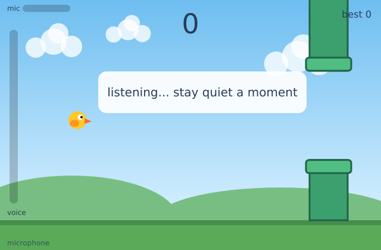

A little bird flies through gates, and your voice is the control. First comes a "set up your voice" screen. It measures the quiet of your room, shows a live bar of how loud you are, and lets you move two marks on it: where the bird starts to lift, and where it reaches full height. A practice bird on the right shows the result, so you can test before you play. Then say "aaah" and the bird goes up. The louder you are, the higher it goes. Fly through the gap in each gate to score. Touch a gate and the game is over. With no microphone, press the space bar to hop the bird up.

How it works, and how to make it yours

**How it works**

- The game has four states: "setup", "ready", "play" and "over". update() moves the game on, and draw() paints it. draw_setup(), draw_scene(), draw_gate(), draw_bird() and draw_meter() do the painting.
- listen() turns the microphone into one number from 0 to 1. Microphones differ a lot, so the game measures loudness in decibels (db()) and compares it with the room. For the first CALIBRATE frames (a second), it listens to the quiet room and keeps the middle reading, the median, as the floor. After that, it smooths mic.level() and measures how many decibels you are above the floor.
- settings() gives the two marks, "starts at" and "full at", from the sliders that f.create_slider() made. Below "starts at" the result is 0, and at "full at" it is 1. f.constrain() keeps it between. The arrow keys move the sliders too, and key_pressed() reads them. update() shows the sliders on the setup screen only: .visible() hides them while you play, and they keep their values.
- The setup screen draws a tall bar of your loudness, the two marks, and a practice bird that eases toward the height your voice gives. The small "mic" bar shows the raw decibels in every state. Loudness controls the bird, not pitch, because mic.pitch() gives nothing for breath or noise.
- The bird eases toward a target height, set by voice. Gates are dictionaries in a list. They slide left, and score goes up when one passes. hits() finds the nearest point of each gate box to the bird. The sounds come from f.pluck(), f.note() and f.tone(), and sound.play() plays them.

**Make it yours**

- Change GAP from 150 to 200 for an easier game, or to 120 for a harder one.
- Change QUIET_DB = 15 and RANGE_DB = 30. They are where the two sliders start, in decibels above the room. A quieter voice needs a smaller QUIET_DB.
- Change SPACING for gates closer together or further apart. Change the 3 in speed = 3 + ... to change the speed.
- Add a third slider in setup(), for how quickly the bird falls: change the 0.14 in update().
- Change the colours of the bird, such as f.fill(255, 200, 40) for the body, or the sounds: try "C6" in sound_point.

Source: [`examples/gallery/projects/04_voice_game.py`](../../examples/gallery/projects/04_voice_game.py)

### Typographic portrait

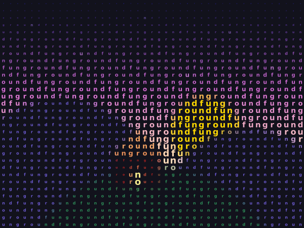

A picture redrawn from letters. The picture is cut into a grid, and each cell gets one letter. A bright cell gets a big letter and a dark cell gets a small one, so the letters draw the picture. Use the controls under the canvas to change the size of the cells, the letters, the colours and the order of light and dark. Press P (or "save PDF") to write portrait.pdf for a big print.

How it works, and how to make it yours

**How it works**

- f.load_image() reads the photo that comes with the gallery. A copy is shrunk with picture.resize() to one pixel for each cell. picture.load_pixels() then gives the red, green and blue of every cell in picture.pixels.
- brightness() turns those three numbers into one number from 0 to 1. The letter's size is that number times the size of the cell. The cell size slider changes how many cells there are.
- The letters come from LETTER_SETS. Cell number n gets piece n of the word, round and round, so "funground" runs along each row. The Devanagari set works because the built-in fonts cover it.
- Nothing changes while you leave the sliders alone, so draw() only paints again when something has changed. The picture is kept on the canvas in between, and that keeps the sketch quick.
- f.save("portrait.pdf") writes every letter as live text in a vector file, which stays sharp at any size. "save SVG" does the same for portrait.svg. A note layer says where the file went.

**Make it yours**

- Change the 1.5 in letter_size() to make the biggest letters bigger or smaller.
- Add your own word to LETTER_SETS. Use short pieces, such as your name split in two or three.
- Put in a different picture: change the name in f.load_image(), and set SIZE to match its shape.
- Make the letters turn with the picture: in paint(), call f.rotate() with a number that depends on the brightness.
- Draw the biggest letters in bold: call f.text_style("bold") when the brightness is above 0.8.

Source: [`examples/gallery/projects/05_typographic_portrait.py`](../../examples/gallery/projects/05_typographic_portrait.py)

### Kinetic type

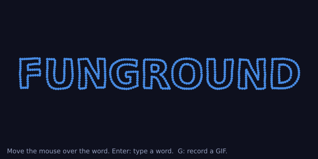

A word made of dots. Move the mouse over it and the dots scatter, then spring back to their places. Press Enter, type a new word, and press Enter again. Two sliders set how hard the mouse pushes and how tight the springs are. Press G (or click "record GIF") to record three seconds as kinetic.gif.

How it works, and how to make it yours

**How it works**

- f.text_to_points() gives a list of points along the letters. Each point becomes a dot: a home place and a position, both f.Vector objects, and a speed (also a Vector).
- Every frame each dot feels two forces. The mouse pushes it away, more strongly the closer the mouse is. A spring pulls it home, harder the further it has gone. The speed is then slowed a little, so the dot settles and does not swing for ever.
- f.noise() moves each home a tiny way as time passes, so the word is never quite still. Dots near each other move alike, because noise gives nearby numbers nearby answers.
- A dot's colour comes from how fast it is moving. f.lerp_color() mixes calm blue with hot orange.
- f.save_gif("kinetic.gif", 3) records the next three seconds. While it records, a ghost mouse sweeps across the word, so the GIF shows a scatter even if your mouse is elsewhere.

**Make it yours**

- Change DAMPING from 0.86 to 0.95 for a bouncier word, or to 0.7 for a stiff one.
- Change REACH, how far from the mouse the dots feel it, from 110 to 200.
- Change the spacing in f.text_to_points(): a smaller number gives more, smaller dots.
- Colour the dots by where they are: use f.hsb() with the x place of the home for the hue.
- Pull the dots toward the mouse and not away: change the sign in push().

Source: [`examples/gallery/projects/06_kinetic_type.py`](../../examples/gallery/projects/06_kinetic_type.py)

### Scratch-card reveal game

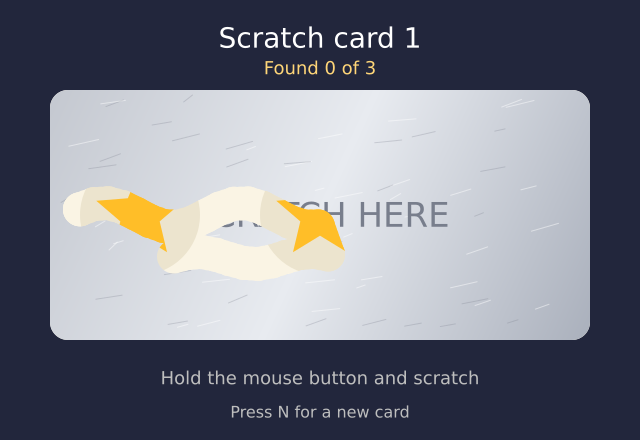

A silver foil hides three symbols. Hold the mouse button down and scratch the foil away. When most of the foil over a symbol is gone, the symbol counts as found, a soft chime plays, and the counter goes up. Find three that match and you win. Press N for a new card. Every card number always hides the same symbols, so card 1 is the same each time. With no sound device the game is simply silent.

How it works, and how to make it yours

**How it works**

- The foil is a layer: `with f.layer("foil"):`. A layer keeps its drawing from frame to frame, so the foil is painted once for each card, and the scratches stay.
- To scratch, the sketch calls f.erase() inside the foil layer and then draws circles along the mouse's path. Drawing now removes the foil and does not paint it, so the card under it shows through. f.no_erase() is not needed: every `with` block starts with painting again.
- The symbols are on the canvas under the layer. f.random_seed(card) and f.random_choice() pick the same three symbols for the same card number. Stars, hearts, moons and diamonds are drawn with f.polygon() and with paths joined by | and -.
- A layer cannot be read back, so the sketch keeps its own list of sample points inside each symbol. A point is cleared when a scratch passes close to it (f.distance()). At 60% cleared, the symbol is found.
- f.pluck() makes the chime, and sound.play() plays it. Three notes rise as you find them. f.melody() plays a little tune for a win.
- f.mouse_x, f.mouse_y and f.is_mouse_pressed give the scratch. f.key reads N in key_pressed().

**Make it yours**

- Change BRUSH from 17 to 30 for a coin-sized scratch, or to 10 for a pin.
- Change the 0.6 in FOUND_AT. A smaller number finds symbols sooner.
- Change WIN_CHANCE for easier or harder cards. 1 means every card wins.
- Add a fifth symbol: write a function like draw_heart() and add its name to KINDS and to draw_symbol().
- Change the notes in CHIMES, or the tune in win_tune.

Source: [`examples/gallery/projects/07_scratch_card.py`](../../examples/gallery/projects/07_scratch_card.py)

### Flow-field print

Hundreds of tiny walkers cross the page, and each one leaves a thin line. A hidden map of noise tells every walker which way to turn, so the lines flow side by side like wind, water or grain in wood. Overlapping lines mix their colours. Use the sliders under the canvas to change the swirl, the number of lines and the colours. Press R for a new pattern. Press P (or the "save PDF" button) to write flow_field.pdf: a print for an A3 sheet, made of lines and not of dots, so it stays sharp at any size.

How it works, and how to make it yours

**How it works**

- A noise field gives an angle at every point: f.noise(x * scale, y * scale) is a number from 0 to 1, and times 720 it becomes a direction. A small scale makes wide, slow swirls. A big scale makes tight ones.
- Each walker holds its place in an f.Vector. Every step, f.Vector.from_angle() makes a short arrow that points the way the field says, and .add() moves the walker along it.
- Each walker draws its short step as a line on the "trails" layer, using `with f.layer("trails"):`. The layer keeps what was drawn, so each frame only adds the new steps, and the canvas under it holds the paper and the frame.
- f.blend_mode("screen") or f.blend_mode("multiply") makes overlapping lines mix their colours. Light lines on dark paper use "screen". Dark lines on light paper use "multiply".
- Every walker also keeps its list of points. To print, the sketch makes a picture the size of an A3 page (f.page_size("A3", landscape=True)) and draws each walker once, as one line made with begin_shape() and vertex(). Joining the steps into one line keeps the PDF small: about one line for each walker, and not one for every step.
- f.noise_seed() and f.random_seed() make each pattern repeatable, and R adds one to the seed.

**Make it yours**

- Change the 720 in angle_at(): 360 makes gentler curves, 1440 makes busier ones.
- Add a palette to PALETTES: a name, a paper colour, three line colours and "screen" or "multiply". Then raise the palette slider's top value.
- Change STEP (the length of each step) and LENGTHS (how many steps a walker takes) for long, smooth lines or short, sharp ones.
- Change the line colour's last number, the 90 in PALETTES, to make the lines fainter or stronger.
- Make walkers start in a circle and not all over the page: use f.Vector.from_angle() in new_walkers().

Source: [`examples/gallery/projects/08_flow_field_print.py`](../../examples/gallery/projects/08_flow_field_print.py)
