# funground Examples Gallery

Every picture below is made by running the example beside it — `python tools/make_gallery.py`
regenerates them. Each example is a complete sketch: copy it into a file and run it.

Browse these examples interactively: `python tools/gallery_browser.py`

## Basics

### Your first sketch

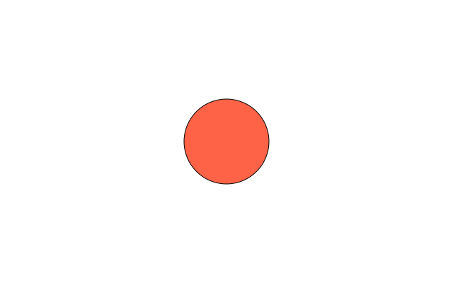

A window, a background and one circle: the three lines every sketch starts from.

Source: [`examples/gallery/basics/01_first_sketch.py`](../../examples/gallery/basics/01_first_sketch.py)

### setup() once, draw() every frame

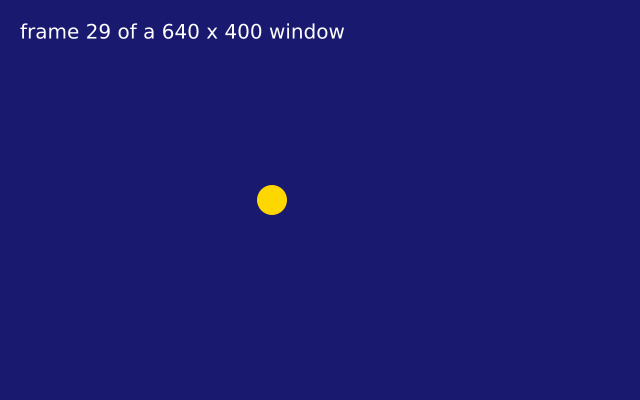

setup() runs once; draw() runs again and again. f.frame_count counts the frames, f.width and f.height are the window size, and f.stop() ends the sketch.

Source: [`examples/gallery/basics/02_setup_and_draw.py`](../../examples/gallery/basics/02_setup_and_draw.py)

### A script: draw once, no draw() needed

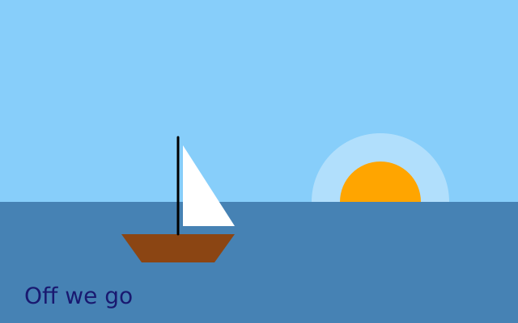

Not every picture moves. A script has no functions: f.size() makes the canvas, the lines after it draw on it, f.save() writes a file at once, and f.show() opens a window to look at it.

Source: [`examples/gallery/basics/03_a_script.py`](../../examples/gallery/basics/03_a_script.py)

## Shapes

### The basic shapes

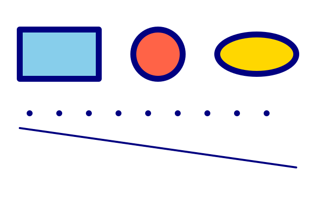

rect is placed by its top-left corner; circle and ellipse by their centre. line joins two points; point is a dot in the stroke colour.

Source: [`examples/gallery/shapes/01_basic_shapes.py`](../../examples/gallery/shapes/01_basic_shapes.py)

### More shapes

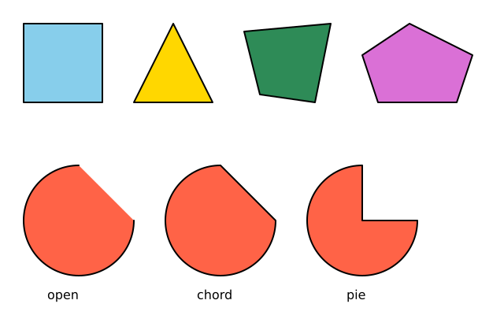

square, triangle, quad and polygon for straight-sided shapes; arc for part of an ellipse, with angles in degrees turning clockwise from the right, in three modes: open, chord and pie.

Source: [`examples/gallery/shapes/02_more_shapes.py`](../../examples/gallery/shapes/02_more_shapes.py)

### Placing shapes by their centre or corners

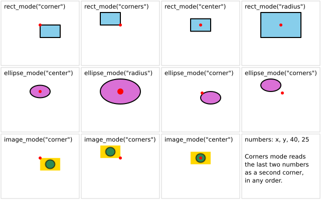

The same four numbers, drawn under each drawing mode. The red dot marks (x, y) in every box. rect_mode and ellipse_mode have four modes each. image_mode has three.

Source: [`examples/gallery/shapes/03_modes.py`](../../examples/gallery/shapes/03_modes.py)

## Colour

### Four ways to say a colour

A name, an (r, g, b) tuple from 0 to 255, a hex string, or an (r, g, b, a) tuple whose last number is the opacity. Overlapping translucent circles mix.

Source: [`examples/gallery/colour/01_colour_forms.py`](../../examples/gallery/colour/01_colour_forms.py)

### Hue-based colour: hsb, hsl and colour objects

f.hsb(hue, saturation, brightness) and f.hsl(hue, saturation, lightness) make colours by hue: 0 red, 120 green, 240 blue, and around again. By default a tuple means red, green, blue. f.color() makes a colour you can read (.hue, .brightness ...), and lerp_color mixes two colours.

Source: [`examples/gallery/colour/02_hsb_and_hsl.py`](../../examples/gallery/colour/02_hsb_and_hsl.py)

### Gradients

f.linear_gradient() blends colours along a line; f.radial_gradient() blends them outward from a centre. Either can be used wherever a colour goes - fill, stroke or background - and it follows f.translate() and f.rotate() like any shape. Saved as PDF or SVG, it stays smooth.

Source: [`examples/gallery/colour/03_gradients.py`](../../examples/gallery/colour/03_gradients.py)

### Colour mode

f.color_mode() changes how a tuple of numbers is read as a colour. In "hsb" mode the three numbers are hue, saturation and brightness. In "rgb" mode with a range of 1, red, green and blue run from 0 to 1 instead of 0 to 255. Names like "tomato" and hex strings like "#FF6347" are not changed. Each mode remembers its own ranges.

Source: [`examples/gallery/colour/04_color_mode.py`](../../examples/gallery/colour/04_color_mode.py)

## Fill, stroke and lines

### Fill and stroke

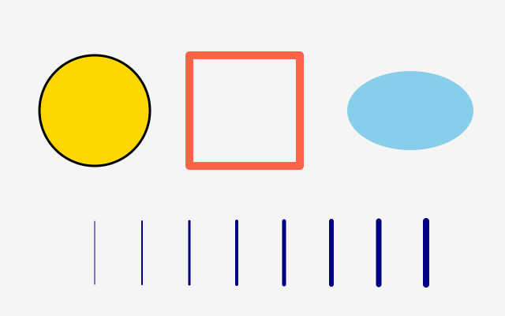

fill is the inside, stroke the outline. no_fill() and no_stroke() switch either off; the stroke is centred on the edge, half outside and half inside.

Source: [`examples/gallery/lines/01_fill_and_stroke.py`](../../examples/gallery/lines/01_fill_and_stroke.py)

### Line ends, corners and dashes

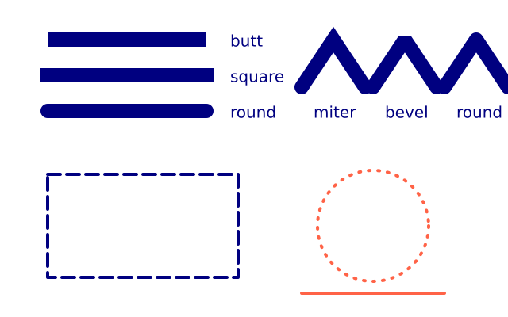

stroke_cap sets how a line ends, stroke_join how corners look, and stroke_dash draws dashed outlines. They are style, like fill: saved_state puts them back.

Source: [`examples/gallery/lines/02_caps_joins_dashes.py`](../../examples/gallery/lines/02_caps_joins_dashes.py)

### Pixel art with no_smooth

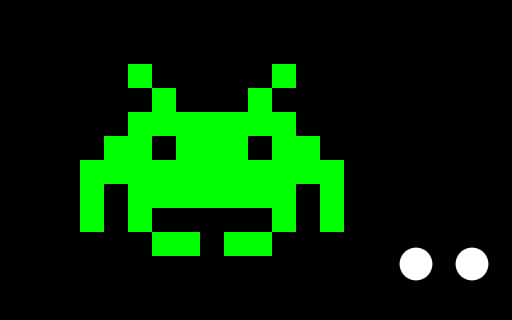

no_smooth() turns off the soft edges, so every pixel is either the shape's colour or not. Draw big and blocky with scale() and it looks like a retro game. smooth() switches back: compare the two white circles.

Source: [`examples/gallery/lines/03_pixel_art.py`](../../examples/gallery/lines/03_pixel_art.py)

## Curves

### Curves

bezier_vertex bends toward two control points; curve_vertex draws a smooth curve through the points (the first and last only steer it); curve_tightness straightens it. bezier and curve draw one curve in a single call; bezier_point and bezier_tangent find places and directions along it.

Source: [`examples/gallery/curves/01_curves.py`](../../examples/gallery/curves/01_curves.py)

## Text

### Text

text_size sets the size in pixels; text is placed by its top-left corner. text_width measures a message, which is how you centre it.

Source: [`examples/gallery/text/01_text.py`](../../examples/gallery/text/01_text.py)

### Aligning text

f.text_align() says which point of the text the (x, y) you give is: left, center or right, then top, center, baseline or bottom. Each red cross below is the (x, y) passed to f.text(). text_ascent() and text_descent() measure how far letters reach above and below the baseline.

Source: [`examples/gallery/text/02_align.py`](../../examples/gallery/text/02_align.py)

### Text in boxes and columns

f.text_box() wraps text inside a box and gives back whatever did not fit, so the rest can flow on into the next box - the way DrawBot's textBox() works. A "\n" inside f.text() starts a new line, and f.text_leading() sets the distance from one line to the next.

Source: [`examples/gallery/text/03_text_box.py`](../../examples/gallery/text/03_text_box.py)

### Fonts and styles

f.text_style() switches between the four built-in styles: normal, bold, italic and bold_italic. f.load_font() reads a font file from disk and f.text_font() switches to it; f.text_font(None) goes back to the built-in family, remembering whatever style was set.

Source: [`examples/gallery/text/04_fonts.py`](../../examples/gallery/text/04_fonts.py)

## Animation and time

### Bounce

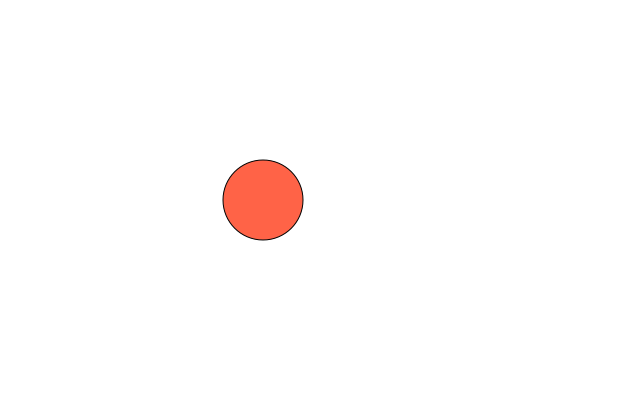

Change a variable a little in every draw() and you have motion; flip the speed at the edges and it bounces.

Source: [`examples/gallery/animation/01_bounce.py`](../../examples/gallery/animation/01_bounce.py)

### Time-based motion

f.delta_time is the number of seconds the last frame took. Moving by speed * delta_time keeps the same speed on a fast or a slow computer. *(Uses real time, so the picture varies from run to run.)*

Source: [`examples/gallery/animation/02_time_based.py`](../../examples/gallery/animation/02_time_based.py)

### A clock

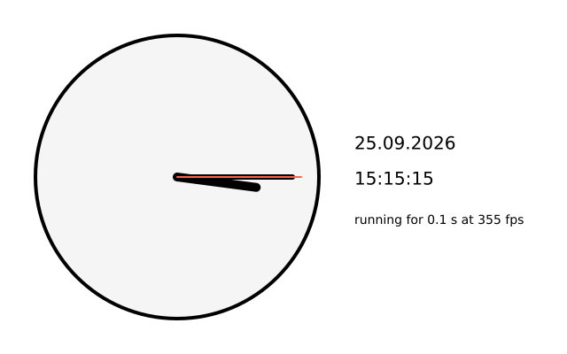

hour(), minute() and second() read the computer's clock; day(), month() and year() the date. millis() counts milliseconds since the sketch started and frame_rate() says how many frames per second it is really drawing. *(Uses real time, so the picture varies from run to run.)*

Source: [`examples/gallery/animation/03_clock.py`](../../examples/gallery/animation/03_clock.py)

### Pause, step and quit

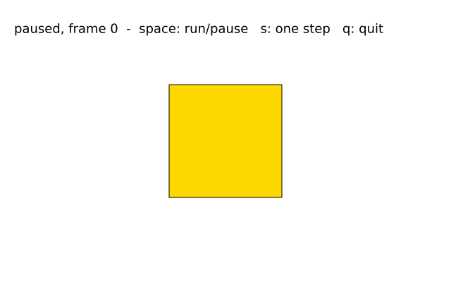

no_loop() stops draw() being called every frame (it still runs once); a key callback can call redraw() to draw one more frame or loop() to carry on. is_looping() says which it is doing, and exit() ends the sketch.

Source: [`examples/gallery/animation/04_pause.py`](../../examples/gallery/animation/04_pause.py)

## Transforms

### Rotating squares

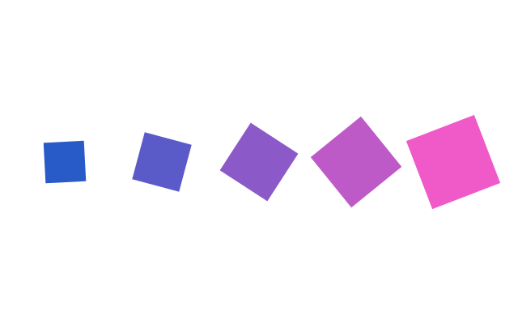

translate moves the origin, rotate turns everything drawn afterwards (in degrees), scale grows it. push() saves the current transform and style, pop() brings them back.

Source: [`examples/gallery/transforms/01_rotating_squares.py`](../../examples/gallery/transforms/01_rotating_squares.py)

### saved_state and angles

with f.saved_state(): is push() and pop() in one block: whatever the block changes is undone at the end. rotate() takes degrees; f.radians() converts for math.sin and math.cos.

Source: [`examples/gallery/transforms/02_saved_state.py`](../../examples/gallery/transforms/02_saved_state.py)

### Shear and matrices

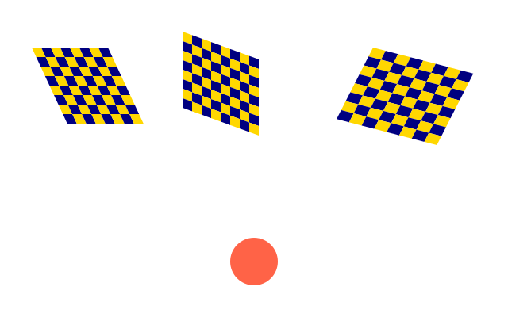

shear_x and shear_y slant everything drawn afterwards; apply_matrix multiplies in any transform at once; reset_matrix forgets all transforms until the end of the saved_state block.

Source: [`examples/gallery/transforms/03_shear_and_matrices.py`](../../examples/gallery/transforms/03_shear_and_matrices.py)

## Paths and clipping

### A star from vertices

begin_shape(), a vertex() for each corner, end_shape(close=True). Closed shapes are filled; open ones are only stroked.

Source: [`examples/gallery/paths/01_star.py`](../../examples/gallery/paths/01_star.py)

### Reusable paths and clipping

f.path() builds a shape you can draw many times with draw_path(). clip(path) keeps later drawing inside the path until the end of the saved_state block.

Source: [`examples/gallery/paths/02_path_and_clip.py`](../../examples/gallery/paths/02_path_and_clip.py)

### Clipping on and off

no_clip() removes clipping until the end of the saved_state block; when the block ends, the clip that was there before comes back.

Source: [`examples/gallery/paths/03_no_clip.py`](../../examples/gallery/paths/03_no_clip.py)

### Shapes with holes

Between begin_contour() and end_contour(), list the corners of a hole. funground makes the hole cut out of the shape whichever way round you draw it.

Source: [`examples/gallery/paths/04_holes.py`](../../examples/gallery/paths/04_holes.py)

## Randomness and noise

### Confetti

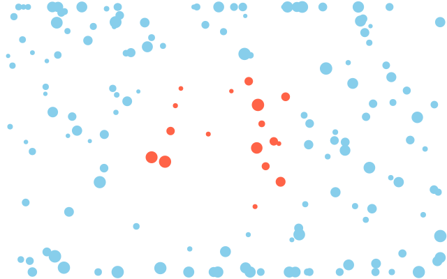

f.random(high) or f.random(low, high) gives a random number; f.random_seed(n) makes the same "random" picture every time. constrain keeps a value in range; distance measures between points.

Source: [`examples/gallery/randomness/01_confetti.py`](../../examples/gallery/randomness/01_confetti.py)

### Bell-curve randomness and random choices

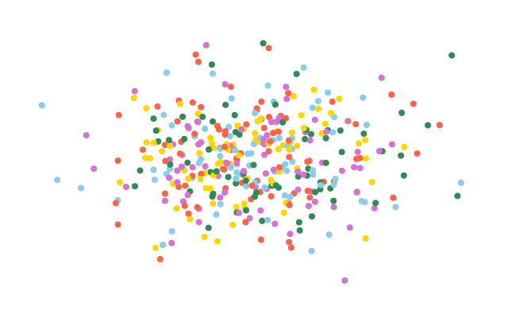

random_gaussian gives numbers that cluster around a middle value, like heights in a class; random_choice picks one item from a list. random_seed makes both repeat exactly.

Source: [`examples/gallery/randomness/02_gaussian_and_choice.py`](../../examples/gallery/randomness/02_gaussian_and_choice.py)

### Noise: smooth randomness

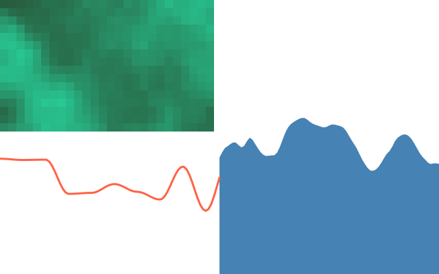

noise(x) gives a value from 0 to 1 that changes smoothly as x changes: hills instead of static. noise(x, y) makes a smooth 2-D pattern. noise_seed(n) picks the pattern; noise_detail sets how rough it is. The same seed gives the same values as p5.js.

Source: [`examples/gallery/randomness/03_noise.py`](../../examples/gallery/randomness/03_noise.py)

## Useful maths

### Mapping and blending numbers

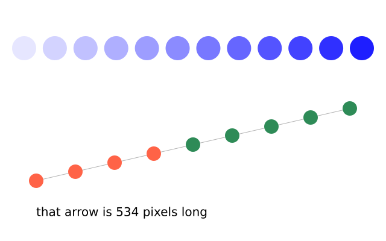

map_range re-scales a number from one range to another; lerp finds a point part of the way between two numbers; norm says how far along a range a number is; mag measures an arrow.

Source: [`examples/gallery/maths/01_map_and_lerp.py`](../../examples/gallery/maths/01_map_and_lerp.py)

## Interaction

### Follow the mouse

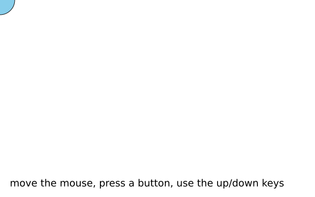

f.mouse_x and f.mouse_y are where the mouse is; f.is_mouse_pressed is True while a button is held; f.key_down("left") is True while that key is held.

Source: [`examples/gallery/interaction/01_follow_the_mouse.py`](../../examples/gallery/interaction/01_follow_the_mouse.py)

### A paint program

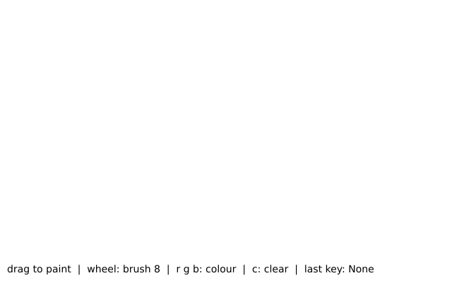

Callbacks are functions you define with special names; funground calls them when something happens. mouse_dragged draws, mouse_wheel changes the brush, key_pressed clears or picks a colour, and pmouse_x/pmouse_y (last frame's mouse) join the strokes up smoothly.

Source: [`examples/gallery/interaction/02_paint.py`](../../examples/gallery/interaction/02_paint.py)

### Move with the keyboard

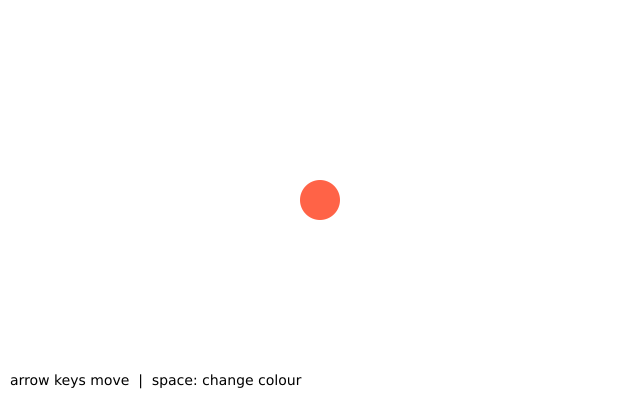

Two ways to read the keyboard. For smooth movement, ask every frame whether a key is held: f.key_down("left"). For one-off actions, define key_pressed(), which runs once per press; f.key says which key it was. key_released() runs when the key comes back up.

Source: [`examples/gallery/interaction/03_keyboard_mover.py`](../../examples/gallery/interaction/03_keyboard_mover.py)

### The window: cursor, size and full screen

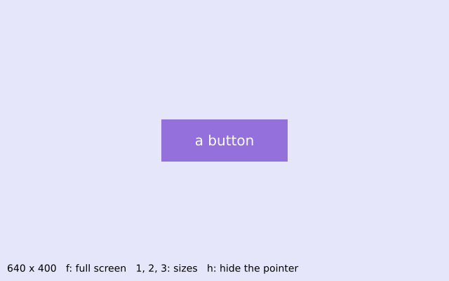

f.cursor() picks the mouse pointer - here a hand over the button, crosshairs elsewhere - and f.no_cursor() hides it. Press f for f.full_screen(), where f.width and f.height become the screen's size, and 1, 2 or 3 for f.resize_canvas(). Everything is placed using f.width and f.height, so the drawing fits whatever the size.

Source: [`examples/gallery/interaction/04_window.py`](../../examples/gallery/interaction/04_window.py)

## Saving your work

### Saving your work

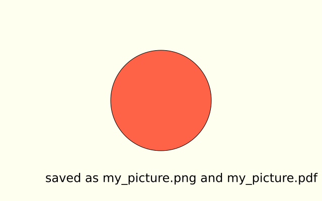

f.save("name.png") writes the frame when it is finished. Use .pdf or .svg for a picture made of shapes that stays sharp at any size.

Source: [`examples/gallery/saving/01_save_a_picture.py`](../../examples/gallery/saving/01_save_a_picture.py)

### A picture with a transparent background

clear() makes every pixel transparent. A PNG saved afterwards keeps the transparency, so the shape can be placed on any background later. (The window shows transparent as black.)

Source: [`examples/gallery/saving/02_transparent_png.py`](../../examples/gallery/saving/02_transparent_png.py)

### Saving an animation as frames

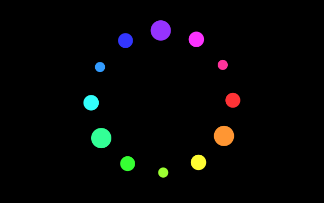

f.save_frames("frames/####.png", 30) saves this frame and the next 29 as numbered pictures: frames/0001.png, frames/0002.png and so on. A program such as ffmpeg can join them into a video or a GIF - see chapter 13 of the guide.

Source: [`examples/gallery/saving/03_save_frames.py`](../../examples/gallery/saving/03_save_frames.py)

## Pictures and images

### Loading and drawing an image

f.load_image() reads a picture file (PNG, JPEG, GIF, BMP, TGA) and gives you a picture. f.image() draws it, at its own size or stretched. It follows f.translate(), f.rotate() and f.opacity() like any other drawing.

Source: [`examples/gallery/images/01_load_image.py`](../../examples/gallery/images/01_load_image.py)

### Tinting a picture and drawing part of it

f.tint() colours every picture drawn after it: the red, green and blue of each pixel are multiplied by the tint, and its alpha too. f.no_tint() stops it. To draw only part of a picture, give image() four more numbers: the left, top, width and height of the part.

Source: [`examples/gallery/images/02_tint_and_parts.py`](../../examples/gallery/images/02_tint_and_parts.py)

### Reading and writing single pixels

f.set() makes one pixel a colour, and f.get() reads one back as a colour. f.load_pixels() copies the whole canvas into the list f.pixels: four numbers for each pixel (red, green, blue, alpha), row by row. Change the list, then f.update_pixels() writes it back. A Python loop over every pixel is slow, so keep the area small.

Source: [`examples/gallery/images/03_pixels.py`](../../examples/gallery/images/03_pixels.py)

### Changing pictures: copy, resize, mask and filters

picture.copy() makes a new picture that you can change without touching the first. picture.resize(w, h) changes the size of a picture. picture.mask(other) lets the other picture decide what shows through. picture.filter(kind) changes every pixel: "threshold", "gray", "invert", "blur", "posterize", "erode", "dilate" or "opaque". Some take a value, like picture.filter("blur", 3). f.filter() does the same to the whole canvas: change what you have drawn so far.

Source: [`examples/gallery/images/04_filters.py`](../../examples/gallery/images/04_filters.py)

## Compositing

### Blend modes, opacity and shadows

f.blend_mode() changes how new drawing mixes with what is already on the canvas: "multiply" darkens like overlapping inks, "screen" lightens like overlapping lights. f.opacity() makes everything after it see-through, and f.shadow() gives it a soft shadow.

Source: [`examples/gallery/compositing/01_blend_opacity_shadow.py`](../../examples/gallery/compositing/01_blend_opacity_shadow.py)

### Off-screen graphics: a trail

f.create_graphics() makes a picture: an off-screen canvas with the same drawing commands as the window. Painting a translucent rectangle over it every frame, instead of clearing it, makes older drawing fade instead of vanish - a comet trail, the same trick Processing's PGraphics is used for. f.image() then places the picture wherever you like, at any size.

Source: [`examples/gallery/compositing/02_graphics.py`](../../examples/gallery/compositing/02_graphics.py)

## Motion

### Movers with vectors

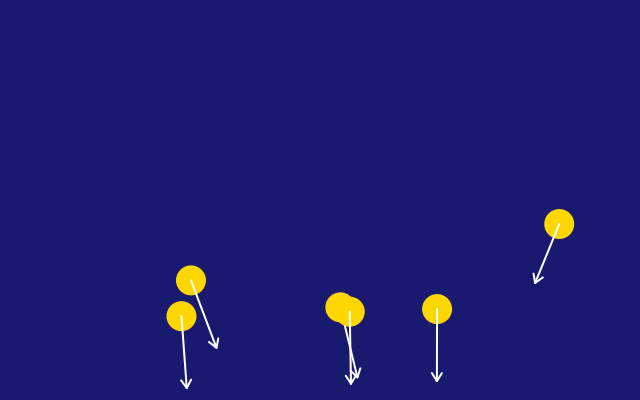

A Vector holds an x and a y together: a position, a velocity, a force. Each frame the forces add to the velocity and the velocity adds to the position, just as in p5.js - methods like add() and limit() change the vector itself. heading() gives the direction, for the arrows.

Source: [`examples/gallery/motion/01_movers.py`](../../examples/gallery/motion/01_movers.py)
