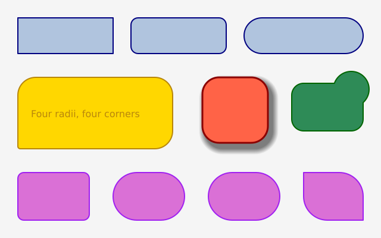
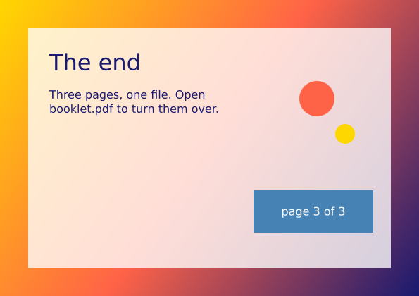

# funground Showcase

A dozen pictures that show what funground can do. Each one is made by the example linked under it.
See the [full gallery](README.md) for every example.

## Gradients

A sunset sky made from a gradient, with a gradient-filled shape on top.

Source: [`examples/gallery/colour/03_gradients.py`](../../examples/gallery/colour/03_gradients.py)

## Blend modes, opacity and shadows

Blend modes, opacity and soft shadows.

Source: [`examples/gallery/compositing/01_blend_opacity_shadow.py`](../../examples/gallery/compositing/01_blend_opacity_shadow.py)

## Rounded corners

Rectangles with rounded corners, each corner its own size.

Source: [`examples/gallery/shapes/04_rounded.py`](../../examples/gallery/shapes/04_rounded.py)

## Curves

Smooth curves drawn through points you choose.

Source: [`examples/gallery/curves/01_curves.py`](../../examples/gallery/curves/01_curves.py)

## Combining shapes

Shapes joined, cut and overlapped with union, intersection, difference and xor.

Source: [`examples/gallery/paths/05_booleans.py`](../../examples/gallery/paths/05_booleans.py)

## Letters as shapes

Letters turned into shapes, then cut, outlined and filled with a gradient.

Source: [`examples/gallery/text/05_text_path.py`](../../examples/gallery/text/05_text_path.py)

## Mixed styles in one text

Bold, italic, coloured and big words together in one piece of text.

Source: [`examples/gallery/text/07_formatted.py`](../../examples/gallery/text/07_formatted.py)

## Noise: smooth randomness

Smooth noise drawn as a picture, a line and a hill.

Source: [`examples/gallery/randomness/03_noise.py`](../../examples/gallery/randomness/03_noise.py)

## Movers with vectors

Little movers pushed about by vectors: this one is animated.

Source: [`examples/gallery/motion/01_movers.py`](../../examples/gallery/motion/01_movers.py)

## Changing pictures: copy, resize, mask and filters

One picture changed by resize, blur, threshold, posterize, masks and more.

Source: [`examples/gallery/images/04_filters.py`](../../examples/gallery/images/04_filters.py)

## Loading an SVG drawing

An SVG drawing loaded and drawn at different sizes and angles.

Source: [`examples/gallery/images/05_svg.py`](../../examples/gallery/images/05_svg.py)

## A booklet with three pages

Three pages saved to one PDF file.

Source: [`examples/gallery/documents/01_booklet.py`](../../examples/gallery/documents/01_booklet.py)
