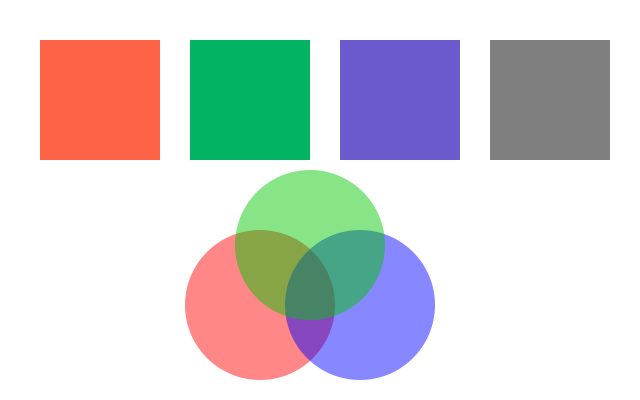
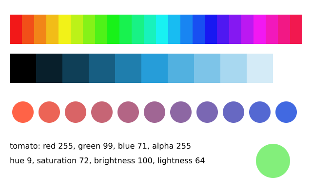
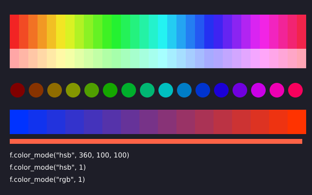

# 4. Colour

Wherever funground wants a colour, you can give it in any of these forms:

| Form | Example | Notes |
|---|---|---|
| A name | `"tomato"`, `"skyblue"`, `"gray50"` | Hundreds of names; capitals and spaces are ignored |
| An `(r, g, b)` tuple | `(255, 99, 71)` | Red, green, blue, each 0–255 |
| Separate numbers | `f.fill(255, 99, 71)` | The same as the tuple. Two, three or four numbers work in `fill`, `stroke` and `background` |
| An `(r, g, b, a)` tuple | `(255, 0, 0, 120)` | The last number is opacity: 0 invisible, 255 solid |
| One number | `128` | A grey: 0 is black, 255 is white |
| Two numbers | `128, 100` or `(128, 100)` | A grey and its opacity |
| Hex | `"#FF6347"`, `"#FF634780"` | As on web pages; the optional last pair is opacity |

```python
import funground as f


def setup():
    f.size(640, 400)


def draw():
    f.background("white")
    f.no_stroke()
    f.fill((255, 0, 0, 120))
    f.circle(260, 305, 150)
    f.fill((0, 0, 255, 120))
    f.circle(360, 305, 150)
    f.fill((0, 200, 0, 120))
    f.circle(310, 245, 150)


f.run()
```



Translucent colours mix where they overlap.

## Colour by hue

By default a **tuple means red, green, blue**. For colour by hue, ask for it by name, or change
the colour mode (see below):

| Function | Makes a colour from |
|---|---|
| `f.hsb(hue, saturation, brightness, alpha=255)` | hue 0–360 (0 red, 120 green, 240 blue), saturation and brightness 0–100 |
| `f.hsl(hue, saturation, lightness, alpha=255)` | hue 0–360, saturation and lightness 0–100 (50 is the pure colour) |

Hue goes round: `f.hsb(370, 80, 90)` is the same as `f.hsb(10, 80, 90)`, so
`f.hsb(f.frame_count, 80, 90)` cycles through the rainbow forever.

## Colours you can read and mix

`f.color(...)` turns any colour into one you can ask about: `.red`, `.green`, `.blue`,
`.alpha` (0–255), `.hue` (0–360), `.saturation`, `.brightness` and `.lightness` (0–100).
`f.lerp_color(c1, c2, t)` mixes two colours: 0 gives `c1`, 1 gives `c2`.

```python
import funground as f


def setup():
    f.size(640, 200)


def draw():
    f.background("white")
    f.no_stroke()
    for i in range(24):
        f.fill(f.hsb(i * 15, 90, 95))
        f.rect(20 + i * 25, 30, 25, 60)
    start, end = f.color("tomato"), f.color("royalblue")
    for i in range(11):
        f.fill(f.lerp_color(start, end, i / 10))
        f.circle(47 + i * 54, 150, 44)


f.run()
```



`f.hsb()` and `f.hsl()` always use these ranges, whatever the colour mode is, so they stay handy
shortcuts: `f.fill(f.hsb(200, 80, 90))` always means the same colour.

## Colour mode

`f.color_mode()` changes how **numbers** are read as a colour. It works like `colorMode()` in p5.

```python
import funground as f


def setup():
    f.size(640, 400)


def draw():
    f.background((30, 30, 40))
    f.no_stroke()

    f.color_mode("hsb", 360, 100, 100)     # hue 0-360, saturation and brightness 0-100
    for i in range(32):
        f.fill((i * 360 / 32, 85, 95))
        f.rect(20 + i * 19, 30, 19, 70)

    f.color_mode("hsb", 1)                 # now every part runs from 0 to 1
    for i in range(16):
        f.fill((i / 16, 1, 0.5 + i / 32))
        f.circle(36 + i * 38, 185, 30)

    f.color_mode("rgb", 1)                 # red, green, blue from 0 to 1
    for i in range(16):
        f.fill((i / 15, 0.2, 1 - i / 15))
        f.rect(20 + i * 38, 225, 38, 50)


f.run()
```



You can give the mode `"rgb"`, `"hsb"` or `"hsl"`, and then:

| Call | Meaning |
|---|---|
| `f.color_mode("hsb")` | switch mode, keep that mode's ranges |
| `f.color_mode("hsb", 1)` | switch mode; all four ranges (three parts and opacity) are 1 |
| `f.color_mode("hsb", 360, 100, 100)` | the three parts; the opacity range stays as it was |
| `f.color_mode("hsb", 360, 100, 100, 255)` | all four ranges |

The starting ranges are `rgb` 255 for every part, and `hsb` and `hsl` 360, 100, 100 with opacity 0
to 1. Each mode remembers its own ranges, so you can switch back and forth. Hue goes round; the
other parts stop at their largest and smallest values. `f.color_mode("rgb", 1)` reads colours
the way DrawBot does.

**Names and hex colours are not affected**: `"tomato"` and `"#FF6347"` mean the same in every
mode. So do colour objects. The mode is part of the saved state, so `f.push()`, `f.pop()` and
`with f.saved_state():` bring it back, and a picture from `f.create_graphics()` has its own.
It stays set from one frame to the next, like `f.fill()`.

A single number is a grey, and two numbers are a grey and its opacity. They are read on the third
range of the mode, so `f.fill(128)` is mid grey in the default mode, and in `"hsb"` mode it is a
brightness of 128 out of 100, which is white. Ranges must be above 0, or you get an error.

## Gradients

A gradient blends colours smoothly. Make one, then use it anywhere a colour goes: in
`f.fill()`, `f.stroke()`, `f.background()`, or `f.text(..., color=...)`.

| Function | Blends |
|---|---|
| `f.linear_gradient(x1, y1, x2, y2, colors)` | along the line from `(x1, y1)` to `(x2, y2)` |
| `f.radial_gradient(x, y, radius, colors)` | outward from the centre `(x, y)` to `radius` |

`colors` is a list of two or more colours. Add `stops=[0, 0.3, 1]`, one number from 0 to 1 per
colour, to say where each colour sits; otherwise they are spread evenly. A colour with a fourth
value fades to transparent.

```python
import funground as f


def setup():
    f.size(640, 200)


def draw():
    f.background(f.linear_gradient(0, 0, 0, 200, ["midnightblue", "coral"]))
    f.no_stroke()
    f.fill(f.radial_gradient(320, 160, 80, ["lightyellow", "gold", (255, 140, 0, 0)]))
    f.circle(320, 160, 160)


f.run()
```


A gradient's positions are measured in the same space as the shapes, so after `f.translate()`
or `f.rotate()` the gradient moves and turns with the shape. Saved as PDF or SVG, a gradient
stays smooth at any zoom.

## See also

- Gallery: [Colour](../gallery/README.md#colour).
- Quick Reference: [3. Colours, fill, stroke and text](../reference/Quick_Reference.md#3-colours-fill-stroke-and-text) and [10. Named colours](../reference/Quick_Reference.md#10-named-colours-and-other-fixed-names).
- Colour not accepted? See [When something goes wrong](errors.md#a-colour-is-not-accepted).

## Try it

1. Paint the background with a colour written as hex, such as `"#2E4057"`, then draw a circle in `(255, 200, 0)`.
2. Draw 12 circles in a row, each one a different hue. Hint: `f.hsb(i * 30, 80, 90)`.
3. Make a sky: a background `f.linear_gradient()` from dark blue at the top to orange at the bottom.

**Next:** [5. Fill, stroke and lines](05_fill_stroke_lines.md)
