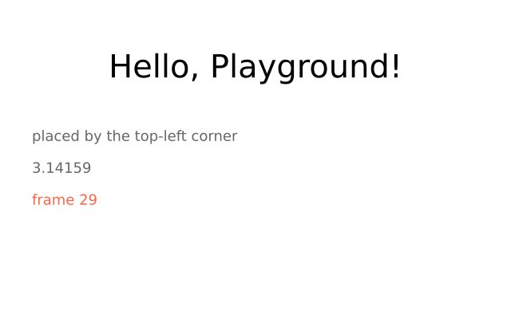
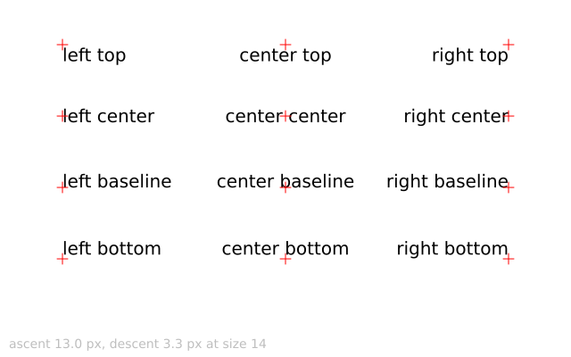
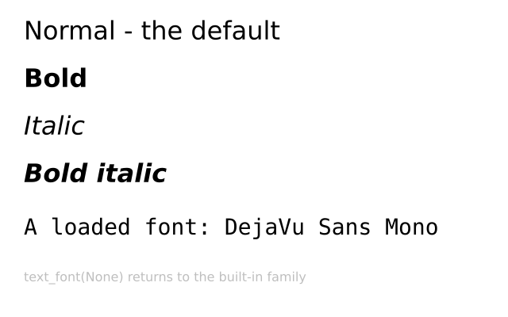
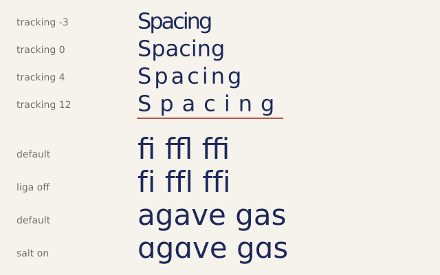
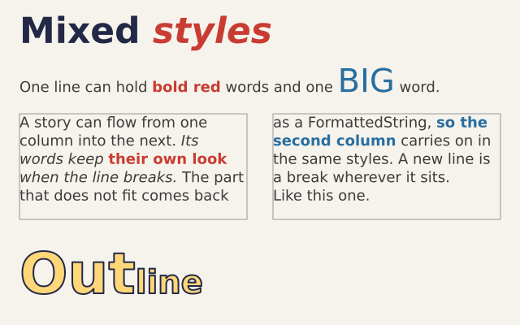
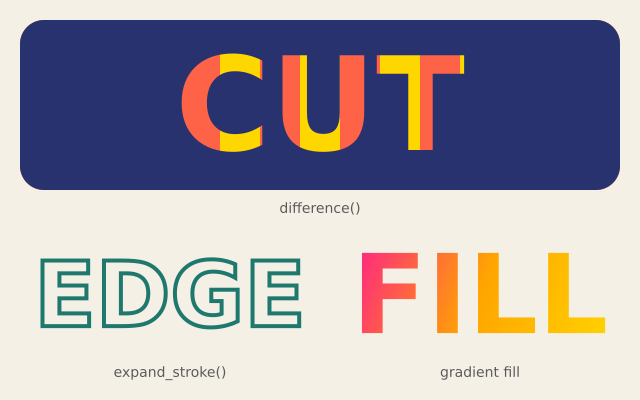
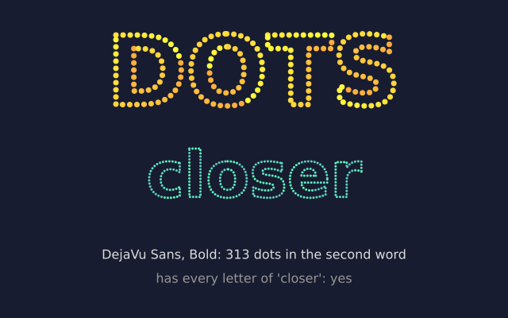

# 6. Text

```python
import funground as f


def setup():
    f.size(640, 400)


def draw():
    f.background("white")
    f.fill("black")
    f.text_size(40)
    message = "Hello, funground!"
    x = (f.width - f.text_width(message)) / 2      # centred
    f.text(message, x, 60)
    f.text_size(18)
    f.text(f"frame {f.frame_count}", 40, 240, color="tomato")


f.run()
```



| Function | What it does |
|---|---|
| `f.text(message, x, y)` | Draws `message` with its **top-left** corner at `(x, y)`. Numbers and other values are turned into text. |
| `f.text(..., color=...)` | A colour for this text only; otherwise the fill colour is used (or the stroke if there is no fill). |
| `f.text_size(n)` | The size of later text, in pixels. |
| `f.text_width(message)` | How wide `message` will be at the current size — use it to centre or right-align text. |

funground draws text with its own built-in font (DejaVu Sans), so text looks the same on every
computer. Letters from many alphabets work, including Greek and Cyrillic.

## Lining text up

`f.text_align()` says which point of the text your `(x, y)` is. The first word is `"left"`,
`"center"` or `"right"`; the second is `"top"`, `"center"`, `"baseline"` or `"bottom"`. The
default is left and top, so without `text_align` the `(x, y)` is the top-left corner.

```python
import funground as f


def setup():
    f.size(640, 200)


def draw():
    f.background("white")
    f.fill("black")
    f.text_size(36)
    f.text_align("center", "center")
    f.text(f"frame {f.frame_count}", f.width / 2, f.height / 2)   # stays centred as it changes


f.run()
```



| Function | What it does |
|---|---|
| `f.text_align(horizontal, vertical)` | Which point of the text `(x, y)` is. Leave out `vertical` to keep the current one. |
| `f.text_ascent()` | How far letters reach above the **baseline**, the line letters sit on. |
| `f.text_descent()` | How far letters such as g and y hang below the baseline. |

The alignment is part of the drawing state, so `with f.saved_state():` restores it.

## Several lines and text boxes

A `"\n"` inside the message starts a new line. `f.text_leading(n)` sets the distance from one
line to the next; `f.text_leading(None)` goes back to the automatic 1.25 × the text size.

For longer text, `f.text_box(message, x, y, width, height)` wraps the words inside a box. It
**returns the text that did not fit**, so you can pour the rest into another box, the way
DrawBot's `textBox()` works:

```py
rest = f.text_box(story, 40, 140, 260, 220)     # first column
rest = f.text_box(rest, 340, 140, 260, 220)     # the rest carries on here
```

`f.text_align()` works inside the box: `"center"` centres each line in the box's width, and
`"bottom"` sits the text on the box's bottom edge.


| Function | What it does |
|---|---|
| `f.text_leading(n)` | Distance between lines, in pixels. `None` means automatic. |
| `f.text_box(message, x, y, width, height)` | Wraps `message` inside the box and returns what did not fit. Leave out `height` for a box that grows downwards. |

## Fonts and styles

Every example so far has used funground's built-in font, DejaVu Sans, which is why text looks
the same on every computer. `f.text_style(style)` picks one of its four real styles: `"normal"`
(the default), `"bold"`, `"italic"`, or `"bold_italic"`.

If you want a font of your own, `f.load_font(path)` reads a `.ttf` or `.otf` file from disk and
gives you back a font. A relative path is looked for next to your sketch file first, then in the
current folder. `f.text_font(font)` switches later text to use it; `f.text_font(None)` goes back
to the built-in family, remembering whichever style you last chose with `f.text_style()`. While a
loaded font is in use, `f.text_style()` has no effect — load the bold or italic file itself
instead, the way you would with any font on your computer.

```python
import funground as f


def setup():
    f.size(640, 200)


def draw():
    f.background("white")
    f.fill("black")
    f.text_size(28)
    f.text_style("bold")
    f.text("Bold, built in", 30, 30)
    f.text_style("italic")
    f.text("Italic, built in", 30, 80)
    f.text_style("normal")               # back to the default built-in style
    f.text("Normal again", 30, 130)


f.run()
```

Loading a font of your own looks like this:

```py
mono = f.load_font("fonts/DejaVuSansMono.ttf")
f.text_font(mono)
f.text("Now in a loaded font", 30, 30)
f.text_font(None)                        # back to the built-in family
```

`f.text_font(font, size=n)` sets the text size at the same time, so you don't need a separate
call to `f.text_size()`.



| Function | What it does |
|---|---|
| `f.text_style(style)` | Choose one of the built-in family's four styles. |
| `f.load_font(path)` | Load a font file; pass the result to `f.text_font()`. |
| `f.text_font(font, size=None)` | Use a loaded font (or a path, or `None` for the built-in family) for later text. |

The font and the style are part of the drawing state, so `with f.saved_state():` restores them,
exactly like `f.fill()` or `f.text_size()`.

When you save a PDF, its text is real text: you can select it, search it and copy it in a PDF
viewer. The PDF carries the letters of each font it uses, so it looks the same on any computer.
Some fonts say they must not be put inside a file. Text in such a font is saved as letter shapes,
so it looks right but cannot be selected. SVG files always save text as letter shapes.

## Spacing, ligatures and variable fonts

`f.text_tracking(pixels)` adds space after every letter. A negative number pulls the letters
together. It is part of the text, so `f.text_width()`, `f.text_align()` and `f.text_box()` all
count it. The last letter gets the space too.

```python
import funground as f


def setup():
    f.size(640, 240)


def draw():
    f.background("white")
    f.fill("black")
    f.text_size(32)
    for i, tracking in enumerate([-2, 0, 6, 14]):
        f.text_tracking(tracking)
        f.text("Spacing", 30, 20 + i * 50)
    f.text_tracking(0)                      # back to normal
    f.text_features(liga=False)             # no ligatures
    f.text("office", 330, 20)
    f.text_features()                       # the font's own choices again
    f.text("office", 330, 70)


f.run()
```

Fonts have extra skills called OpenType features. Each has a four-letter name.
`f.text_features(liga=False)` turns the `liga` feature off. It joins letters such as f, f and i
into one shape. `True` turns a feature on. Each call adds to the ones you set before, and
`f.text_features()` with nothing in the brackets goes back to the font's own choices. DejaVu Sans
has `liga`, `salt` (alternate letters), `dlig`, `hlig`, `case` and a few more. A feature that
the font lacks does nothing.

A variable font has axes you can slide, like weight. `f.font_variations(wght=700)` sets the
`wght` axis. The letters and their spacing both change. An axis the font does not have is
ignored, and so is `f.font_variations()` on a font that is not variable (the built-in font is not),
so it is safe to leave in. With no arguments it goes back to the font's defaults.

```py
font = f.load_font("fonts/MyVariableFont.ttf")      # a variable font of your own
f.text_font(font, 48)
f.font_variations(wght=300)
f.text("Light", 30, 30)
f.font_variations(wght=800, wdth=75)                # two axes at once
f.text("Heavy and narrow", 30, 100)
```

All three settings are part of the drawing state, so `with f.saved_state():` restores them.
They also change `f.text_path()`, and a picture from `f.create_graphics()` has its own.



| Function | What it does |
|---|---|
| `f.text_tracking(pixels)` | Add this much space after every letter; negative tightens. Default 0. |
| `f.text_features(**features)` | Turn OpenType features on or off by name, like `liga=False`. No arguments: the font's defaults. |
| `f.font_variations(**axes)` | Set a variable font's axes by name, like `wght=700`. No arguments: the font's defaults. |

## Mixed styles in one text

Sometimes one line needs more than one look: a bold word, a red word, a big word. A
`f.FormattedString()` holds the text in runs. Each `append()` adds a run, and it can have its own
`size`, `style`, `color`, `font`, `tracking`, `features` and `variations`. A setting you leave
out is not remembered. It follows the drawing state at the moment you draw the text.

```py
import funground as f

line = f.FormattedString()
line.append("Plain, ")
line.append("bold red", style="bold", color="red")
line.append(" and ")
line.append("BIG", size=48)
line.append(" in one line.")


def setup():
    f.size(640, 160)


def draw():
    f.background("white")
    f.fill("black")
    f.text_size(22)                 # the plain runs use this size and colour
    f.text(line, 20, 30)
    f.text_box(line + " It wraps across the runs too.", 20, 90, 300, 60)


f.run()
```

`append()` gives the same FormattedString back, so you can chain calls. `str(line)` is the plain
text, `len(line)` is its length, and `line + other` joins two. A colour is read in the colour mode
at the moment of `append()`.

`f.text(fs, x, y)` and `f.text_box(fs, x, y, w, h)` work like they do for a string, with the
current `f.text_align()` and `f.text_leading()`. The runs on a line sit on one baseline. A line is
as tall as its tallest run: with the automatic leading, that is 1.25 times the largest size on the
line. A `"\n"` in any run starts a new line, and `f.text_box()` breaks lines at spaces, even from
one run to the next, measuring each run with its own settings.

`f.text_box()` returns what did not fit as a FormattedString, and its runs keep their settings,
so the next box carries on in the same styles. `f.text_width(fs)` and `f.text_path(fs, x, y)`
take one too, and so does a picture from `f.create_graphics()`. A plain string works everywhere
as before.



| Function | What it does |
|---|---|
| `f.FormattedString()` | An empty formatted text. |
| `fs.append(text, font=None, size=None, style=None, color=None, tracking=None, features=None, variations=None)` | Add a run with the settings you give. Returns `fs`. `features` and `variations` are dicts, like `{"liga": False}`. |
| `str(fs)`, `len(fs)`, `fs + other` | The plain text, its length, and two joined. |

## Letters as shapes

`f.text_path(message, x, y)` gives you the outlines of the letters as a path. It sets the text
exactly as `f.text()` would: the same font, style, size, alignment and lines. But it draws nothing.
You get a shape, and you choose what to do with it.

```py
import funground as f


def setup():
    f.size(400, 200)


def draw():
    f.background("white")
    f.text_style("bold")
    f.text_size(100)
    f.text_align("center", "center")
    word = f.text_path("CUT", 200, 100)

    panel = f.path().rect(20, 20, 360, 160)
    f.fill("navy")
    f.draw_path(panel.difference(word))      # the letters are holes in the panel


f.run()
```

The path has no colour. You pick one when you draw it, and it can be a gradient. Because it is
a path, everything from chapter 9 works on it: `difference()`, `expand_stroke()`, `f.clip()` and
`translate()`. The path is not moved by `f.translate()` or `f.rotate()` until you draw it, like
any other path.



| Function | What it does |
|---|---|
| `f.text_path(message, x, y)` | The outlines of `f.text(message, x, y)` as a new path. An empty message gives an empty path. |

## Text as points

`f.text_to_points(message, x, y, spacing=5)` walks along the outlines of the letters and gives you
a list of `(x, y)` points, one every `spacing` pixels. It follows `f.text_path()`, so the points
sit exactly on the letters you would see: the same font, style, size, alignment and lines. It draws
nothing. You decide what to draw at each point.

```py
import funground as f


def setup():
    f.size(400, 200)


def draw():
    f.background(20, 24, 40)
    f.text_style("bold")
    f.text_size(110)
    f.text_align("center", "center")
    f.no_stroke()
    f.fill("gold")
    for x, y in f.text_to_points("beads", 200, 100, 8):
        f.circle(x, y, 5)


f.run()
```

A smaller `spacing` gives more points. Each outline starts at its own first point, and the
distance is measured along curves too. The `spacing` must be above 0. An empty message gives `[]`.



## Asking the font

`f.current_font()` gives you the font your text is set in now. It works for the built-in font and
for a font you loaded with `f.load_font()`. You can ask it questions. Asking never changes anything.

```py
import funground as f


def setup():
    f.size(400, 120)


def draw():
    f.background("white")
    font = f.current_font()
    f.fill("black")
    f.text_size(16)
    f.text(font.family() + ", " + font.style(), 20, 20)
    f.text("liga: " + str("liga" in font.features()), 20, 50)
    f.text("has an 'x': " + str(font.contains("x")), 20, 80)


f.run()
```

| Function | What it does |
|---|---|
| `f.text_to_points(message, x, y, spacing=5)` | A list of `(x, y)` points along the outlines of `f.text_path(message, x, y)`, one every `spacing` pixels. `spacing` must be above 0. An empty message gives `[]`. |
| `f.current_font()` | The font text is set in now, as a font object. |
| `font.family()` | The family name, like `"DejaVu Sans"`. |
| `font.style()` | The style name, like `"Bold"`. The built-in normal style is called `"Book"`. |
| `font.variations()` | The axes of a variable font: a dict of tag to `(minimum, default, maximum)`, like `{"wght": (100, 400, 900)}`. `{}` for a font that is not variable. |
| `font.features()` | The OpenType features the font has, as a sorted list of tags like `["kern", "liga"]`. |
| `font.contains(text)` | `True` when the font has a letter for every character of `text`. A space needs a glyph like any letter. A new line `"
"` is ignored, because text turns it into a new line. Other control characters, like a tab, are checked. |

**Next:** [7. Animation and time](07_animation_and_time.md)
