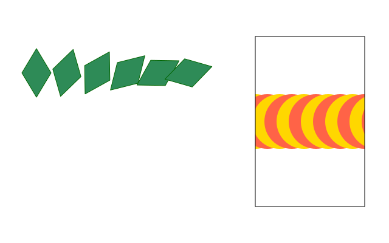
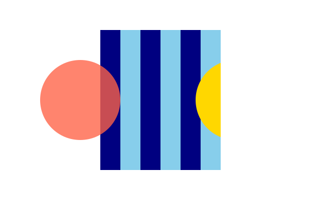
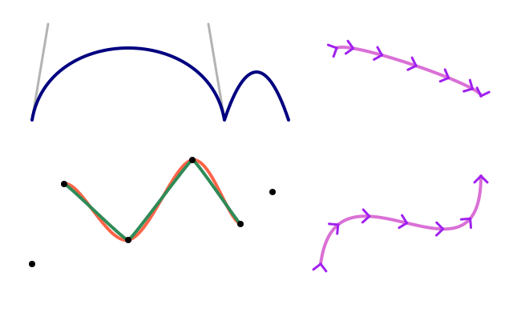
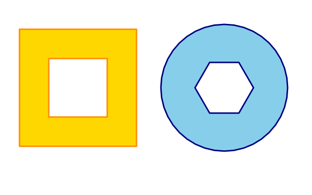
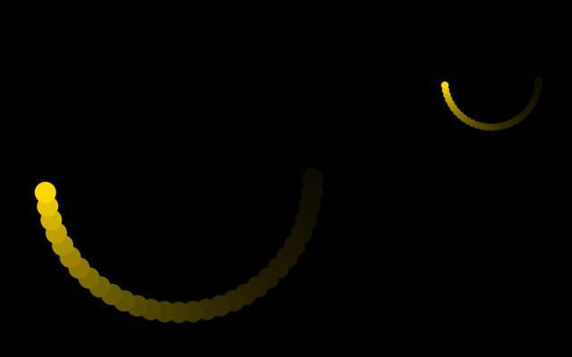
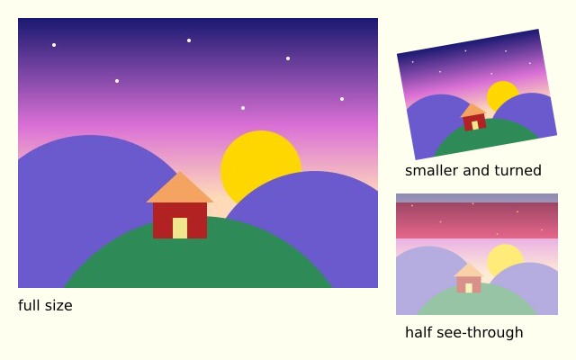

# 9. Paths and clipping

## Shapes from points

List the corners between `f.begin_shape()` and `f.end_shape()`:

```python
import math

import funground as f


def setup():
    f.size(640, 400)


def draw():
    f.background("white")
    f.fill("gold")
    f.stroke("darkorange")
    f.stroke_width(4)
    f.begin_shape()
    for i in range(10):
        r = 140 if i % 2 == 0 else 60
        a = math.pi * i / 5 - math.pi / 2
        f.vertex(200 + r * math.cos(a), 200 + r * math.sin(a))
    f.end_shape(close=True)


f.run()
```


`end_shape(close=True)` joins the last point to the first and fills the shape.
`end_shape()` leaves it **open**: open shapes are only stroked, never filled.

## Reusable paths

`f.path()` builds a shape once so you can draw it many times:

```py
leaf = f.path().move_to(0, -40).line_to(24, 0).line_to(0, 40).line_to(-24, 0).close()
f.draw_path(leaf)
```

`move_to`, `line_to`, `curve_to` and `quad_to` add to the path; `close()` closes it.
`f.draw_path(path)` fills (if closed) and strokes it with the current style, and transforms
apply to it like to any shape.

## Clipping

`f.clip(path)` keeps everything drawn afterwards **inside** the path. It lasts until the end of
the `saved_state` block (or the matching `pop()`), so always clip inside one:

```py
with f.saved_state():
    f.clip(window)
    ...                       # drawn only inside window
```



`f.no_clip()` switches clipping off until the end of its own `saved_state` block; when that block
ends, the clip from outside it comes back.



## Curves

Inside a shape, three kinds of curve follow Processing's names:

| Function | What it does |
|---|---|
| `f.bezier_vertex(cx1, cy1, cx2, cy2, x, y)` | A curve from the previous point to `(x, y)` that bends toward two control points |
| `f.quadratic_vertex(cx, cy, x, y)` | The same with one control point |
| `f.curve_vertex(x, y)` | A smooth curve **through** the points. The first and last points only steer the curve, so give at least four |
| `f.curve_tightness(t)` | 0 (default) for smooth curves, up to 1 for straight lines |

For a single curve there are `f.bezier(x1, y1, cx1, cy1, cx2, cy2, x2, y2)` and
`f.curve(x1, y1, x2, y2, x3, y3, x4, y4)` (from point 2 to point 3). They are open, so they
are drawn as lines, never filled. `f.bezier_point(a, b, c, d, t)` gives one coordinate of a point
along the curve for `t` from 0 to 1 — call it once for x and once for y.



## Holes

List a hole's corners between `f.begin_contour()` and `f.end_contour()`, inside the shape:

```python
import funground as f


def setup():
    f.size(320, 320)


def draw():
    f.background("white")
    f.fill("gold")
    f.begin_shape()
    for x, y in [(40, 40), (280, 40), (280, 280), (40, 280)]:
        f.vertex(x, y)
    f.begin_contour()
    for x, y in [(100, 100), (220, 100), (220, 220), (100, 220)]:
        f.vertex(x, y)
    f.end_contour()
    f.end_shape(close=True)


f.run()
```

funground cuts the hole out whichever way round you list its corners.



## Drawing off-screen

`f.create_graphics(width, height)` makes a **picture**: a canvas of its own, the same size
as you ask for, that starts transparent. It has the same drawing commands as `f.` - fill,
circle, text, push/pop, transforms, clip, everything above - but its own state, its own
transform, and its own pixels, completely separate from the window. Unlike the window,
**nothing about a picture resets between frames**: whatever you drew last time is still
there, so you can build it up gradually.

`f.image(picture, x, y, width=None, height=None)` draws a picture into the window (or into
another picture), at (x, y), stretched to `width` x `height` if you give them (its own size
otherwise). It draws the picture **as it is at that moment** - drawing on the picture
afterwards never changes what was already placed.

A common trick, borrowed from Processing's `PGraphics`: paint a translucent rectangle over
a picture every frame, instead of clearing it, so older drawing fades instead of vanishing:

```python
import math

import funground as f

trail = None


def setup():
    global trail
    f.size(640, 400)
    trail = f.create_graphics(400, 400)


def draw():
    f.background("black")

    trail.no_stroke()
    trail.fill((0, 0, 0, 24))          # translucent: painted over the old trail, it fades
    trail.rect(0, 0, trail.width, trail.height)

    angle = f.radians(f.frame_count * 6)
    x = trail.width / 2 + math.cos(angle) * 150
    y = trail.height / 2 + math.sin(angle) * 150
    trail.fill("gold")
    trail.circle(x, y, 24)

    f.image(trail, 0, 0)                    # full size
    f.image(trail, 480, 20, 140, 140)       # a second, smaller copy: image() can scale


f.run()
```



| Call | What it does |
|---|---|
| `f.create_graphics(w, h)` | A new picture, `w` x `h`, transparent to start. It has the same drawing commands as `f.` |
| `f.image(picture, x, y, w=None, h=None)` | Draw *picture* at (x, y), stretched to `w` x `h` (default: its own size) |

A picture can hold another picture too, but never itself: `f.image(g, ...)` where `g` is
drawing onto itself raises `ValueError`. Save a picture on its own with `g.save(path)`,
exactly like `f.save(path)` for the window.

## Pictures and images

A picture does not have to be drawn by you. `f.load_image(path)` reads an image file and
gives you a picture. It reads PNG, JPEG, GIF, BMP and TGA files. Transparency is kept. A GIF
gives you its first frame.

```py
photo = f.load_image("holiday.jpg")
f.image(photo, 0, 0)
```

**Where files are looked for.** A path like `"holiday.jpg"` is looked for in the folder of
your sketch file first. Then it is looked for in the folder you ran Python from. If it is in
neither place, funground tells you both places it looked.

**Phone photos.** Phones often save a photo sideways and add a note saying "turn this".
funground reads that note for JPEG files and turns the photo the right way up for you.

**Size.** `photo.width` and `photo.height` are the size of the file in pixels. Drawn with
`f.image(photo, x, y)`, the photo covers that many pixels of your canvas. Give a width and a
height to stretch it: `f.image(photo, x, y, 200, 150)`. It follows `f.translate()`,
`f.rotate()`, `f.clip()` and `f.opacity()` like everything else.

**Drawing on it.** A loaded picture is a picture like any other, so `photo.fill("red")` and
`photo.circle(50, 50, 20)` draw on it. The file on your disk never changes.

This sketch makes a small image file first, so that it runs anywhere, and then loads it:

```python
import funground as f

f.size(400, 200)

# Make an image file to load. You would normally bring your own.
stamp = f.create_graphics(60, 60)
stamp.background("gold")
stamp.fill("crimson")
stamp.circle(30, 30, 40)
stamp.save("stamp.png")

loaded = f.load_image("stamp.png")      # found next to this file, or in the current folder


def draw():
    f.background("white")
    f.image(loaded, 20, 20)                     # its own size
    f.image(loaded, 120, 20, 160, 160)          # stretched
    f.opacity(128)
    f.image(loaded, 300, 60)                    # half see-through


f.run()
```



PDF and SVG files keep a loaded picture as pixels, because that is all it has. If you
paint an opaque `photo.background(...)` on it first, it becomes a normal drawing again.
SVG files cannot be loaded as images yet; funground tells you so.

| Call | What it does |
|---|---|
| `f.load_image(path)` | Read an image file and return a picture. |
| `photo.width`, `photo.height` | The image's size in pixels. |

**Next:** [10. Interaction](10_interaction.md)
