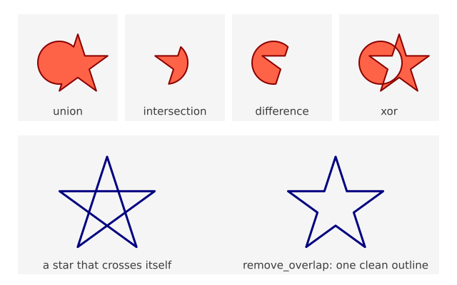
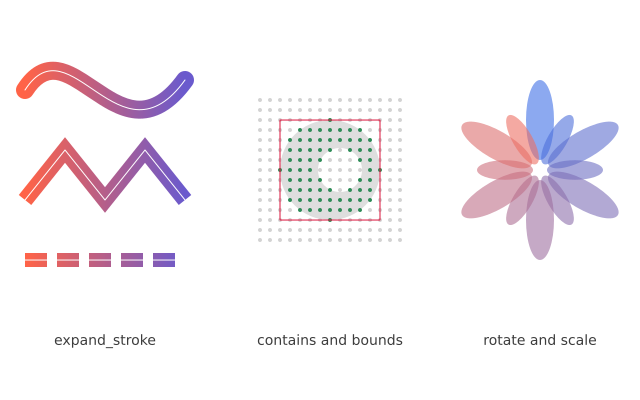
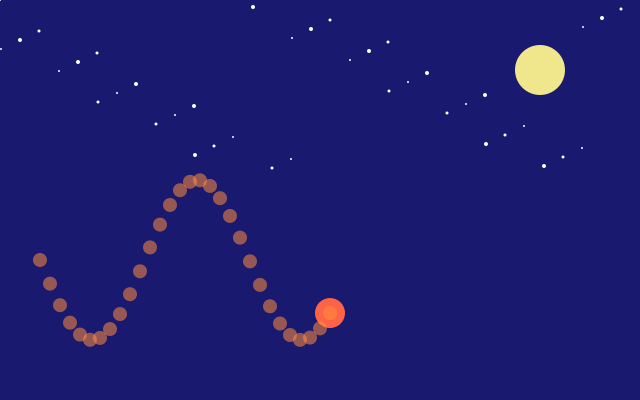
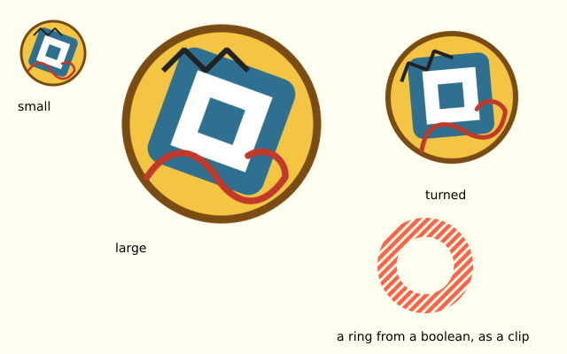
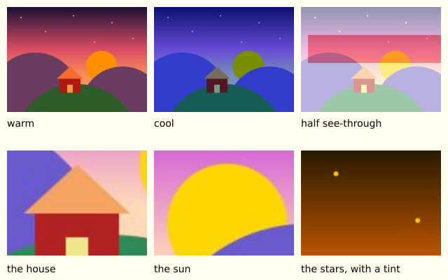
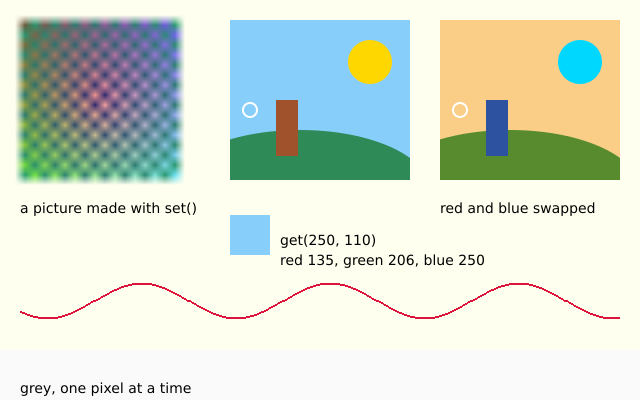
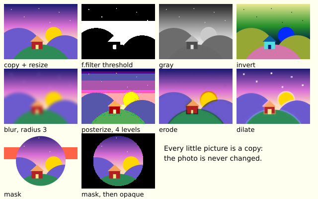

# 9. Paths, clipping and pictures

This chapter has two halves. The first is about shapes: paths, clipping, curves and holes. The second is about pictures: loading images and SVG drawings, tinting, pixels and filters.

## Shapes from points

List the corners between `f.begin_shape()` and `f.end_shape()`:

```python
import math

import funground as f


def setup():
    f.size(640, 400)


def draw():
    f.background("white")
    f.fill("gold")
    f.stroke("darkorange")
    f.stroke_width(4)
    f.begin_shape()
    for i in range(10):
        r = 140 if i % 2 == 0 else 60
        a = math.pi * i / 5 - math.pi / 2
        f.vertex(200 + r * math.cos(a), 200 + r * math.sin(a))
    f.end_shape(close=True)


f.run()
```


`end_shape(close=True)` joins the last point to the first and fills the shape.
`end_shape()` leaves it **open**: open shapes are only stroked, never filled.

## Reusable paths

`f.path()` builds a shape once so you can draw it many times:

```py
leaf = f.path().move_to(0, -40).line_to(24, 0).line_to(0, 40).line_to(-24, 0).close()
f.draw_path(leaf)
```

`move_to`, `line_to`, `curve_to` and `quad_to` add to the path; `close()` closes it.
`f.draw_path(path)` fills (if closed) and strokes it with the current style, and transforms
apply to it like to any shape.

## Combining shapes

A path can also be built from ready-made shapes. Each call adds a closed shape and gives the
path back, so calls chain: `rect(x, y, w, h)` (x, y is the top-left corner), `ellipse(x, y, w, h)`
and `circle(x, y, d)` (x, y is the centre), and `polygon(points)` (a list of `(x, y)` corners).

Two paths can be joined, overlapped, cut and mixed. Each call gives back a **new** path. The two
you started with do not change.

```py
ring = f.path().circle(100, 100, 120)
star = f.path().polygon([(150, 40), (190, 160), (90, 90), (210, 90), (110, 160)])

f.draw_path(ring | star)      # union: everything either one covers
f.draw_path(ring & star)      # intersection: only where both cover
f.draw_path(ring - star)      # difference: the ring, minus the star
f.draw_path(ring ^ star)      # xor: where exactly one of them covers
```

The same four are also methods: `ring.union(star)`, `ring.intersection(star)`,
`ring.difference(star)` and `ring.xor(star)`.

Only closed shapes take part. A shape that is still open is left out. Curves stay curves, and a
result you can draw, clip with, or combine again. If nothing is left, you get an empty path and
nothing is drawn.

`path.remove_overlap()` gives a path that covers the same area, with one clean outline and no
crossing lines inside. Draw it with a stroke to see the difference.



## Outlines, tests and moving paths

A path can also give you an outline, answer questions and move. Each of these gives back a **new**
path or a plain value. The path you started with does not change.

```py
line = f.path().move_to(20, 60).curve_to(60, 0, 100, 120, 180, 50)

band = line.expand_stroke(16, cap="butt", dash=[20, 8])   # the shape a thick dashed line would paint
f.draw_path(band)

print(band.bounds())             # (x, y, width, height) of the exact extent, or None if empty
print(band.contains(100, 60))    # True when the point is inside the filled shape

f.draw_path(band.translate(0, 80))               # moved down by 80
f.draw_path(band.scale(0.5))                     # scaled about the origin (0, 0)
f.draw_path(band.rotate(30, 100, 60))            # turned clockwise by 30 degrees about (100, 60)
twin = band.copy()                               # an independent copy
```

`expand_stroke(width, cap="round", join="round", miter_limit=10, dash=None)` uses the same names
as `stroke_cap` and `stroke_join`. It works on open lines too. The result is a closed shape, so
you can fill it with a gradient, cut it with a boolean, or test it with `contains`. `bounds()`
measures the curves themselves, not their control points. `contains` follows the non-zero rule,
so the middle of a pentagram counts as inside.



## Clipping

`f.clip(path)` keeps everything drawn afterwards **inside** the path. It lasts until the end of
the `saved_state` block (or the matching `pop()`), so always clip inside one:

```py
with f.saved_state():
    f.clip(window)
    ...                       # drawn only inside window
```


`f.no_clip()` switches clipping off until the end of its own `saved_state` block; when that block
ends, the clip from outside it comes back.


## Curves

Inside a shape, three kinds of curve follow Processing's names:

| Function | What it does |
|---|---|
| `f.bezier_vertex(cx1, cy1, cx2, cy2, x, y)` | A curve from the previous point to `(x, y)` that bends toward two control points |
| `f.quadratic_vertex(cx, cy, x, y)` | The same with one control point |
| `f.curve_vertex(x, y)` | A smooth curve **through** the points. The first and last points only steer the curve, so give at least four |
| `f.curve_tightness(t)` | 0 (default) for smooth curves, up to 1 for straight lines |

For a single curve there are `f.bezier(x1, y1, cx1, cy1, cx2, cy2, x2, y2)` and
`f.curve(x1, y1, x2, y2, x3, y3, x4, y4)` (from point 2 to point 3). They are open, so they
are drawn as lines, never filled. `f.bezier_point(a, b, c, d, t)` gives one coordinate of a point
along the curve for `t` from 0 to 1 — call it once for x and once for y.


## Holes

List a hole's corners between `f.begin_contour()` and `f.end_contour()`, inside the shape:

```python
import funground as f


def setup():
    f.size(320, 320)


def draw():
    f.background("white")
    f.fill("gold")
    f.begin_shape()
    for x, y in [(40, 40), (280, 40), (280, 280), (40, 280)]:
        f.vertex(x, y)
    f.begin_contour()
    for x, y in [(100, 100), (220, 100), (220, 220), (100, 220)]:
        f.vertex(x, y)
    f.end_contour()
    f.end_shape(close=True)


f.run()
```

funground cuts the hole out whichever way round you list its corners.


## Drawing off-screen

`f.create_graphics(width, height)` makes a **picture**: a canvas of its own, the same size
as you ask for, that starts transparent. It has the same drawing commands as `f.` - fill,
circle, text, push/pop, transforms, clip, everything above - but its own state, its own
transform, and its own pixels, completely separate from the window. Unlike the window,
**nothing about a picture resets between frames**: whatever you drew last time is still
there, so you can build it up gradually.

`f.image(picture, x, y, width=None, height=None)` draws a picture into the window (or into
another picture), at (x, y), stretched to `width` x `height` if you give them (its own size
otherwise). It draws the picture **as it is at that moment** - drawing on the picture
afterwards never changes what was already placed.

A common trick, borrowed from Processing's `PGraphics`: paint a translucent rectangle over
a picture every frame, instead of clearing it, so older drawing fades instead of vanishing:

```python
import math

import funground as f

trail = None


def setup():
    global trail
    f.size(640, 400)
    trail = f.create_graphics(400, 400)


def draw():
    f.background("black")

    trail.no_stroke()
    trail.fill((0, 0, 0, 24))          # translucent: painted over the old trail, it fades
    trail.rect(0, 0, trail.width, trail.height)

    angle = f.radians(f.frame_count * 6)
    x = trail.width / 2 + math.cos(angle) * 150
    y = trail.height / 2 + math.sin(angle) * 150
    trail.fill("gold")
    trail.circle(x, y, 24)

    f.image(trail, 0, 0)                    # full size
    f.image(trail, 480, 20, 140, 140)       # a second, smaller copy: image() can scale


f.run()
```


| Call | What it does |
|---|---|
| `f.create_graphics(w, h)` | A new picture, `w` x `h`, transparent to start. It has the same drawing commands as `f.` |
| `f.image(picture, x, y, w=None, h=None)` | Draw *picture* at (x, y), stretched to `w` x `h` (default: its own size) |

A picture can hold another picture too, but never itself: `f.image(g, ...)` where `g` is
drawing onto itself raises `ValueError`. Save a picture on its own with `g.save(path)`,
exactly like `f.save(path)` for the window.

## Layers

A picture on its own can be a lot of work: you make it, draw on it, then draw it with
`f.image()`. A **layer** does the same job in one line. This is the friendly version of what
p5 users do with `createGraphics`.

`with f.layer("name"):` sends everything you draw inside the block to a layer. The layer is a
see-through picture the same size as the canvas. It is made the first time you use its name.
After each frame, the layers are put over the canvas, in the order you first made them.

A layer **keeps its drawing**. The canvas is wiped by `f.background()` every frame, but a layer
is not. This sketch leaves a trail of dots, while the stars in the sky layer are drawn once:

```python
import funground as f


def setup():
    f.size(640, 400)


def draw():
    f.background("midnightblue")        # the canvas starts afresh each frame

    if f.frame_count == 0:
        with f.layer("sky"):            # drawn once, and it stays
            f.no_stroke()
            f.fill("white")
            f.circle(100, 60, 6)
            f.circle(300, 40, 4)

    with f.layer("trail"):              # one dot a frame, and each one stays
        f.no_stroke()
        f.fill("orange")
        f.circle(40 + f.frame_count * 4, 250, 10)


f.run()
```



| Call | What it does |
|---|---|
| `with f.layer(name):` | Draw inside the block on the layer called `name`. The canvas is drawn under all layers |
| `f.layer(name)` | The layer's picture. `with f.layer("sky") as sky:` gives it to you, for `sky.get()`, filters or `sky.save()` |
| `f.hide_layer(name)` / `f.show_layer(name)` | Stop showing a layer, or show it again. It keeps its drawing while it is hidden |

Some things to know:

- To wipe a layer, call `f.background()` or `f.clear()` inside its block. `f.clear()` makes it
  see-through again.
- Each block starts fresh: colours, transforms and other settings you change inside it are put
  back when the block ends, as if it began with `f.push()` and ended with `f.pop()`. So an
  `f.translate()` in a layer every frame does not add up. What you drew stays.
- Things that are not drawing keep their usual meaning inside the block: `f.width`,
  `f.mouse_x`, `f.frame_count` and `f.random()` all belong to the canvas.
- Layers do not nest. Using `f.layer()` inside another layer block is an error. An unknown name
  in `f.hide_layer()` or `f.show_layer()` is a `ValueError`.
- Each page of a script has its own layers. `f.size()` and `f.new_page()` start with none.
- `f.save("x.png")`, `f.get()` and the picture on screen all include the layers. A PDF or SVG
  draws each layer as shapes, not as a picture.

Layers are also **real layers in a PDF or SVG**. Open the PDF in Acrobat or Illustrator, or the
SVG in Inkscape or Illustrator, and each layer is listed by its name. You can switch it off and
on there, or edit it on its own. A hidden layer is in the file too, but switched off, so the file
looks like the window. A layer that has drawn a very large number of shapes is saved as a picture
inside its layer.

## Pictures and images

A picture does not have to be drawn by you. `f.load_image(path)` reads an image file and
gives you a picture. It reads PNG, JPEG, GIF, BMP and TGA files. Transparency is kept. A GIF
gives you its first frame.

```py
photo = f.load_image("holiday.jpg")
f.image(photo, 0, 0)
```

**Where files are looked for.** A path like `"holiday.jpg"` is looked for in the folder of
your sketch file first. Then it is looked for in the folder you ran Python from. If it is in
neither place, funground tells you both places it looked.

**Phone photos.** Phones often save a photo sideways and add a note saying "turn this".
funground reads that note for JPEG files and turns the photo the right way up for you.

**Size.** `photo.width` and `photo.height` are the size of the file in pixels. Drawn with
`f.image(photo, x, y)`, the photo covers that many pixels of your canvas. Give a width and a
height to stretch it: `f.image(photo, x, y, 200, 150)`. It follows `f.translate()`,
`f.rotate()`, `f.clip()` and `f.opacity()` like everything else.

**Drawing on it.** A loaded picture is a picture like any other, so `photo.fill("red")` and
`photo.circle(50, 50, 20)` draw on it. The file on your disk never changes.

This sketch makes a small image file first, so that it runs anywhere, and then loads it:

```python
import funground as f

f.size(400, 200)

# Make an image file to load. You would normally bring your own.
stamp = f.create_graphics(60, 60)
stamp.background("gold")
stamp.fill("crimson")
stamp.circle(30, 30, 40)
stamp.save("stamp.png")

loaded = f.load_image("stamp.png")      # found next to this file, or in the current folder


def draw():
    f.background("white")
    f.image(loaded, 20, 20)                     # its own size
    f.image(loaded, 120, 20, 160, 160)          # stretched
    f.opacity(128)
    f.image(loaded, 300, 60)                    # half see-through


f.run()
```


PDF and SVG files keep a loaded picture as pixels, because that is all it has. If you
paint an opaque `photo.background(...)` on it first, it becomes a normal drawing again.
SVG files are not images: `f.load_image()` tells you so, and `f.load_svg()` (next) reads them.

| Call | What it does |
|---|---|
| `f.load_image(path)` | Read an image file and return a picture. |
| `photo.width`, `photo.height` | The image's size in pixels. |

### Loading SVG drawings

An SVG file is a drawing made of shapes, not of pixels. `f.load_svg(path)` reads one and
gives you a picture, like `f.load_image()`. The picture is made of the file's shapes, so it
stays sharp when you draw it big, and a PDF or SVG file you save keeps true shapes.

```py
badge = f.load_svg("badge.svg")          # found next to this file, or in the current folder
f.image(badge, 20, 20)                   # its own size
f.image(badge, 200, 20, 320, 320)        # large, and still sharp
```

The picture is as big as the SVG says: its `width` and `height`, or its `viewBox` when
those are missing. The SVG's units count 96 to the inch, so `"2in"` is 192 pixels. A new
picture is see-through, so an SVG with no background stays see-through. You can draw on
the picture like any other.

`f.svg_paths(path)` gives you the shapes themselves: a list of paths, one for each shape,
in the file's own coordinates. Use them for booleans, as clips, or to colour them
yourself.

```py
shapes = f.svg_paths("badge.svg")
plate = shapes[0]                        # the first shape in the file
f.clip(plate)
```

This sketch writes a tiny SVG file into a temporary folder first, so that it runs anywhere:

```python
import os
import tempfile

import funground as f

f.size(400, 200)

# Make an SVG file to load. You would normally bring your own.
svg = """<svg xmlns="http://www.w3.org/2000/svg" width="100" height="100">
  <circle cx="50" cy="50" r="45" fill="gold" stroke="crimson" stroke-width="6"/>
  <path d="M 25 60 Q 50 90 75 60" fill="none" stroke="black" stroke-width="5"
        stroke-linecap="round"/>
</svg>"""
path = os.path.join(tempfile.mkdtemp(), "face.svg")
with open(path, "w") as file:
    file.write(svg)

face = f.load_svg(path)
rings = f.svg_paths(path)                # two shapes: the circle and the smile


def draw():
    f.background("white")
    f.image(face, 20, 50)                     # its own size
    f.image(face, 140, 10, 180, 180)          # large
    f.fill("tomato")
    f.no_stroke()
    f.circle(360, 100, 40)
    f.stroke("black")
    f.no_fill()
    f.draw_path(rings[1].translate(310, 50).scale(0.5))   # a shape from the file, moved and shrunk


f.run()
```



**What is read.** Paths (lines, curves and arcs) and the basic shapes: `rect` (with round
corners), `circle`, `ellipse`, `line`, `polyline` and `polygon`. Groups, `<use>` and
transforms, such as `translate`, `rotate`, `scale` and `matrix`. Fill and stroke colours
(names, hex, `rgb()` and so on) with `opacity`, `fill-opacity` and `stroke-opacity`. Stroke
width, line caps, line joins, the miter limit and dashes. `fill-rule`, both `nonzero` and
`evenodd`. Colours and styles may be written as attributes, in `style="..."` or in a
`<style>` block.

**What is not supported.** A gradient or pattern fill is painted with its first colour.
`<text>`, embedded `<image>`, filters, masks, clip paths, markers and CSS animation are
ignored, with no error. A group's `opacity` is applied to each shape in it, not to the group
as a whole, so shapes that overlap inside a faded group can show through each other.

**Even-odd.** funground fills with the non-zero rule only. A shape with
`fill-rule="evenodd"` is changed into an outline that the non-zero rule fills the same way,
so its holes stay holes. The shape's stroke is drawn from the original outline.

**Mistakes.** A missing file raises `FileNotFoundError` and names both places it looked. A
file that is not SVG raises `ValueError`.

| Call | What it does |
|---|---|
| `f.load_svg(path)` | Read an SVG file and return a picture of its shapes. |
| `f.svg_paths(path)` | Read an SVG file and return its shapes as a list of paths. |

### Tinting a picture

`f.tint(color)` colours every picture you draw with `f.image()` from then on. It takes a
colour in any form that `f.fill()` takes: a name, a hex string, numbers, a grey, and so on,
and it follows `f.color_mode()`. Each pixel's red, green and blue are **multiplied** by the
tint's. White changes nothing. A red tint turns a white picture red. The tint's alpha is
multiplied in too, so `f.tint(255, 128)` draws a picture half see-through. Parts of the
picture that were already see-through stay see-through.

`f.no_tint()` stops it. A tint only changes pictures. Shapes and text are not tinted. It
combines with `f.opacity()` and `f.blend_mode()`. Like `f.fill()`, it is kept by `f.push()`
and `f.pop()`, and it stays set from one frame to the next.

### Drawing part of a picture

Give `f.image()` four more numbers, `sx, sy, sw, sh`, and it draws only that part of the
picture: the rectangle that starts at (`sx`, `sy`) and is `sw` wide and `sh` high, in the
picture's own pixels. The part fills the box given by `x, y, width, height`. Without a
width and a height, the box is as big as the part.

```
f.image(picture, x, y, width, height, sx, sy, sw, sh)
```

You must give all four of `sx, sy, sw, sh` or none of them, and `sw` and `sh` must be above
0. If the part reaches outside the picture, only the inside is drawn, and it stays exactly
where it would have been. `f.image_mode()`, transforms, clips, tint and opacity all work
with parts. A picture made with `f.create_graphics()` can do it too: `g.image(...)`.

This sketch makes its own picture, then shows it tinted and in parts:

```python
import funground as f

f.size(400, 200)

art = f.create_graphics(40, 40)           # a small picture to play with
art.background("white")
art.no_stroke()
art.fill("crimson")
art.circle(20, 20, 24)
art.fill("navy")
art.rect(0, 30, 40, 10)


def draw():
    f.background("ivory")
    f.image(art, 10, 10, 80, 80)               # as it is
    f.tint("gold")                             # a gold tint
    f.image(art, 110, 10, 80, 80)
    f.tint(255, 100)                           # white, but almost see-through
    f.image(art, 210, 10, 80, 80)
    f.no_tint()

    f.image(art, 10, 110, 80, 80, 10, 10, 20, 20)    # a part: the middle, bigger
    f.image(art, 110, 110, 80, 40, 0, 30, 40, 10)    # a part: the navy stripe, stretched
    f.image(art, 210, 110, 80, 80, 20, 0, 60, 40)    # a part that reaches outside: clipped


f.run()
```



| Call | What it does |
|---|---|
| `f.tint(color)` | Multiply the colour (and alpha) of pictures drawn after it. |
| `f.no_tint()` | Stop tinting. |
| `f.image(picture, x, y, width, height, sx, sy, sw, sh)` | Draw only the part `sx, sy, sw, sh` of the picture. |

### Pixels

`f.get(x, y)` tells you the colour of one pixel. It gives back a colour object, the same kind
that `f.color()` makes, so you can use `.red`, `.green`, `.blue` and `.alpha`, or hand it to
`f.fill()`. It sees everything drawn so far, this frame included. Outside the canvas the answer
is transparent black. `x` and `y` are rounded down to whole pixels.

`f.get(x, y, w, h)` copies a whole rectangle into a **new picture**. Parts of the rectangle
outside the canvas are see-through.

`f.set(x, y, color)` makes one pixel exactly that colour. It takes any colour form that
`f.fill()` takes. It ignores the fill, the stroke, the transform, the clip, the tint, the
opacity and the blend mode: what you set is what you get. Outside the canvas it does nothing.
A picture has `g.get()` and `g.set()` too.

On a high-resolution screen, a pixel here is a **logical** pixel, as everywhere in funground.
It may cover several real pixels. `get` reads the top-left real one, and `set` paints all of
them.

To change many pixels, use the list `f.pixels`:

1. `f.load_pixels()` copies the canvas into `f.pixels`. Before that, `f.pixels` is `None`.
2. `f.pixels` is a `bytearray`. Each pixel takes four numbers, from 0 to 255: red, green, blue
   and alpha. They are not premultiplied. The pixels come row by row, from the top left. The
   pixel at (`x`, `y`) starts at index `(y * f.width + x) * 4`.
3. Change the numbers. Nothing on the canvas changes yet.
4. `f.update_pixels()` writes the whole list back. It is the same as calling `f.set()` for
   every pixel. Calling it before `f.load_pixels()` is an error.

Change the numbers in place (`f.pixels[i] = 0`). Do not replace the list with a new one. On a
picture it works the same way: `g.load_pixels()`, `g.pixels`, `g.update_pixels()`.

**Loops over every pixel are slow.** A Python loop that visits each pixel of a 640 by 400
canvas has 256 000 pixels to do, and takes a second or more. Loading and updating the pixels
without a loop is fast (a few hundredths of a second). So keep your loops to small areas, as
the example below does, or work on a small picture.

Pixel writes are raster. A saved PDF or SVG holds them as an image, not as vectors. A picture
that has had pixel writes loses its drawing history, so when it is drawn onto a PDF it is
embedded as an image too.

```python
import funground as f


def setup():
    f.size(400, 200)
    f.no_loop()


def draw():
    f.background("ivory")

    # A small picture, made one pixel at a time.
    tile = f.create_graphics(10, 10)
    for y in range(10):
        for x in range(10):
            tile.set(x, y, (x * 25, y * 25, 150))
    f.image(tile, 10, 10, 100, 100)

    # An eyedropper: read the colour at one point of the canvas.
    f.no_stroke()
    f.fill("tomato")
    f.circle(200, 60, 80)
    picked = f.get(200, 60)
    f.fill(picked)
    f.rect(160, 120, 80, 50)

    # A copy of part of the canvas, with red and blue swapped.
    part = f.get(160, 20, 80, 80)
    part.load_pixels()
    pixels = part.pixels
    for i in range(0, len(pixels), 4):
        pixels[i], pixels[i + 2] = pixels[i + 2], pixels[i]
    part.update_pixels()
    f.image(part, 300, 10)


f.run()
```



| Call | What it does |
|---|---|
| `f.get(x, y)` | The colour at one pixel (a colour object). |
| `f.get(x, y, w, h)` | A new picture copied from a rectangle of the canvas. |
| `f.set(x, y, color)` | Make one pixel exactly that colour. |
| `f.load_pixels()` | Copy the canvas into `f.pixels`. |
| `f.pixels` | Red, green, blue, alpha for every pixel, in a `bytearray`. |
| `f.update_pixels()` | Write `f.pixels` back onto the canvas. |

### Changing pictures: copy, resize, mask and filters

A picture can change itself. These are methods of a picture, written `g.copy()` and so on.

- `g.copy()` gives a **new picture** with the same pixels. Change the copy and the first one stays
  as it was. Use it before you change a picture you want to keep.
- `g.resize(w, h)` changes the picture to `w` by `h` pixels, in place. The pixels are scaled
  smoothly. Give 0 for one side and the other side keeps the shape: `g.resize(100, 0)`. Giving
  0 for both, or a negative number, is an error. After a resize, the picture starts again with
  no transform, no clip and no open `f.push()`.
- `g.mask(other)` multiplies the alpha of `g` by the alpha of `other`. Where `other` is
  see-through, `g` becomes see-through. If `other` has another size, it is scaled to the size
  of `g` first.
- `g.filter(kind)` changes every pixel of `g`. `f.filter(kind)` does the same to the canvas, to
  everything drawn so far. The kinds are:

| Kind | What it does |
|---|---|
| `"threshold"`, value 0 to 1 (default 0.5) | Pixels brighter than the value become white. The others become black. |
| `"gray"` | Every pixel becomes a grey of the same brightness. |
| `"opaque"` | Every pixel becomes fully solid. |
| `"invert"` | Red, green and blue are turned upside down: 255 minus the number. |
| `"blur"`, value = radius in pixels (default 1) | Softens the picture. |
| `"posterize"`, value 2 to 255 | Each colour keeps only that many levels. You must give the value. |
| `"erode"` | Each pixel takes the darkest value of its 3 by 3 neighbours, for each colour. Dark areas grow. |
| `"dilate"` | The same with the brightest value. Bright areas grow. |

Alpha stays as it is, except with `"opaque"`. An unknown kind, or a value out of range, is an
error that tells you what is allowed.

Filters change pixels. They are raster, like `f.set()`: a picture that has been filtered loses
its drawing history, so a saved PDF holds it as an image. A filter is quick: a 400 by 300
picture takes a few hundredths of a second. `"posterize"`, `"erode"` and `"dilate"` are faster
if you install the extras: `pip install funground[extras]`. The result is the same with or
without them.

**Crisp pixels.** When you draw a small picture big, funground blurs it a little by default.
Call `f.no_smooth()` before `f.image()` and the big pixels stay sharp, like pixel art. Call
`f.smooth()` to go back.

This sketch makes a small picture, then shows copies of it with different changes:

```python
import funground as f


def setup():
    f.size(450, 240)
    f.no_loop()


def draw():
    f.background("ivory")

    # The canvas has filter() too. It changes everything drawn so far, so do it early.
    f.fill("blue")
    f.rect(120, 100, 100, 70)
    f.filter("invert")                 # the ivory canvas and the blue box turn into their opposites
    f.fill("white")
    f.text("drawn after the filter", 120, 190)

    # A small picture to work on: a sun over some hills.
    art = f.create_graphics(100, 70)
    art.background("skyblue")
    art.no_stroke()
    art.fill("gold")
    art.circle(70, 22, 26)
    art.fill("seagreen")
    art.circle(30, 85, 80)
    art.circle(90, 80, 60)

    f.image(art, 10, 10)

    gray = art.copy()                  # a copy: art itself stays the same
    gray.filter("gray")
    f.image(gray, 120, 10)

    poster = art.copy()
    poster.filter("posterize", 3)
    f.image(poster, 230, 10)

    soft = art.copy()
    soft.resize(50, 0)                 # 50 wide, and 35 high to keep the shape
    soft.filter("blur", 1)
    f.image(soft, 340, 10, 100, 70)

    # A mask: the picture shows only where the mask is solid.
    hole = f.create_graphics(100, 70)
    hole.fill("black")
    hole.circle(50, 35, 60)
    round_one = art.copy()
    round_one.mask(hole)
    f.fill("tomato")
    f.rect(10, 110, 100, 25)
    f.image(round_one, 10, 100)

    # Pixel art: no_smooth() keeps the enlarged pixels sharp.
    tiny = f.create_graphics(4, 4)
    for i in range(16):
        tiny.set(i % 4, i // 4, (60 * (i % 4), 60 * (i // 4), 160))
    f.no_smooth()
    f.image(tiny, 240, 100, 80, 80)
    f.smooth()


f.run()
```



| Call | What it does |
|---|---|
| `g.copy()` | A new picture with the same pixels. |
| `g.resize(w, h)` | Scale the picture to `w` by `h`. A 0 keeps the shape. |
| `g.mask(other)` | Multiply the alpha of `g` by the alpha of `other`. |
| `g.filter(kind, value)` | Change every pixel of the picture. |
| `f.filter(kind, value)` | Change everything drawn on the canvas so far. |

## See also

- Gallery: [Paths and clipping](../gallery/README.md#paths-and-clipping), [Curves](../gallery/README.md#curves), [Pictures and images](../gallery/README.md#pictures-and-images) and [Blending](../gallery/README.md#blending-opacity-and-shadows) (for pictures and layers).
- Quick Reference: [8. Shapes, paths and clipping](../reference/Quick_Reference.md#8-shapes-paths-and-clipping).
- A file that will not load? See [When something goes wrong](errors.md#a-file-is-not-found).

## Try it

1. Draw a five-point star with `f.begin_shape()` and `f.vertex()`. Then make it a different size by changing two numbers.
2. Cut a circular hole in a rectangle with a path boolean: `f.path().rect(...) - f.path().circle(...)`.
3. Draw stripes, but only inside a circle. Hint: `f.clip()`, inside `with f.saved_state():`.

**Next:** [10. Interaction: mouse, keyboard and controls](10_interaction.md)
