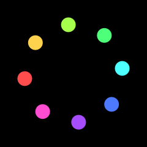

# 13. Saving your work

`f.save("name.png")` writes the current frame to a file when the frame is finished — wherever in
`draw()` you call it.

```python
import funground as f


def setup():
    f.size(640, 400)


def draw():
    f.background("ivory")
    f.fill("tomato")
    f.circle(320, 200, 200)
    if f.frame_count == 0:
        f.save("my_picture.png")
        f.save("my_picture.pdf")


f.run(max_frames=1)
```

| Ending | What you get |
|---|---|
| `.png` | A picture, at your screen's full resolution |
| `.pdf` | A document made of shapes and text: sharp at any size, good for printing |
| `.svg` | Shapes and text for the web or for editing in a drawing program |

A **PNG** holds exactly what is in the window — including everything earlier frames left there.
A **PDF or SVG** holds the shapes drawn in *that one frame*, so for those, draw the whole picture
in the frame you save (start `draw()` with `f.background(...)`).

In a PDF, text is real text: you can select it, search it and copy it, and it looks the same as
in the window. The PDF carries the letters of each font it uses. A font that says it must not be
put inside a file is saved as letter *shapes* instead, so it looks right but cannot be selected.

### Text in an SVG file

In an SVG, text is *live*: Illustrator, Inkscape and web browsers show it as text you can click
and edit. The file names each font by its family, such as "DejaVu Sans", with bold and italic
noted. The program that opens the file draws the text in that font, if the font is installed on
your computer. If it is not, the program picks another font, and the text looks different.

A web browser needs nothing installed: the SVG also carries the letters it uses from each font.
(A font that says it must not be put inside a file is left out. Its text still names the font.)

The program spaces the letters itself, so the spacing can differ a little from funground's window.
Text drawn while erasing, and text shadows, are saved as shapes.

**To edit with the same look, install funground's fonts.** They are DejaVu Sans (in four styles)
and three Noto fonts, in the `fonts` folder inside funground. This prints where that folder is:

```py
import os
import funground

print(os.path.join(os.path.dirname(funground.__file__), "fonts"))
```

Open that folder and install the `.ttf` files the way your computer installs any font. funground
never installs fonts for you. A font you loaded with `f.load_font` needs installing too.

Illustrator shapes Indian scripts, such as Hindi, correctly only with the *World-Ready Paragraph
Composer*. Choose it from the Paragraph panel's menu. Its usual composer breaks joined letters.
Inkscape and browsers need nothing extra.

Each [layer](09_paths_and_clipping.md#layers) is a named layer in a PDF or SVG, which you can
switch on and off in Acrobat, Illustrator or Inkscape. Hidden layers are in the file, switched off.

### The golden rule of SVG handoffs

> **Save two copies. One for you to edit, one to hand over.**
>
> Live text is best for editing, but it needs the font. A client or a developer who does not
> have your font will see a different one. So save a second copy where every letter is a shape.
> It looks the same on every computer. The letters cannot be edited, selected or searched.

```python
import funground as f


def setup():
    f.size(480, 240)


def draw():
    f.background("ivory")
    f.fill("midnightblue")
    f.text_size(60)
    f.text("Open Day", 40, 90)
    if f.frame_count == 0:
        f.save("poster.svg")                       # live text, for editing
        f.save("poster_final.svg", text="shapes")  # letters as shapes, for sharing


f.run(max_frames=1)
```

> The same works for a PDF. Some print shops ask for outlines: use
> `f.save("poster_final.pdf", text="shapes")`. A picture from `f.create_graphics()` takes the same
> option: `g.save("badge.svg", text="shapes")`. Layers stay layers in both copies. A PNG ignores
> `text=`, because it is already pixels. Any value other than `"live"` or `"shapes"` is an error.

## A transparent background

`f.clear()` makes every pixel transparent instead of painting a colour. A PNG saved afterwards
keeps the transparency — handy for stickers, icons and pictures to place on a web page. In the
window, transparent shows as black.


## Saving an animation

`f.save_frames("frames/####.png", 60)` saves this frame and the next 59 as numbered pictures:
`frames/0001.png`, `frames/0002.png`, and so on. The `####` becomes the number.

```python
import funground as f


def setup():
    f.size(640, 200)


def draw():
    f.background("black")
    f.fill("gold")
    f.circle(f.frame_count * 10, 100, 40)
    if f.frame_count == 0:
        f.save_frames("frames/####.png", 60)


f.run()
```


funground can also make a GIF or an MP4 for you: see "GIF and MP4" below. To turn numbered pictures into a video or a GIF yourself, use a program such as [ffmpeg](https://ffmpeg.org):

```
ffmpeg -framerate 30 -i frames/%04d.png my_animation.mp4
ffmpeg -framerate 30 -i frames/%04d.png my_animation.gif
```

`%04d` is ffmpeg's way of writing `####`.

## GIF and MP4

A GIF is a short picture that moves and loops for ever. An MP4 is a video. funground makes both,
in two styles.

**An animated sketch** records itself. `f.save_gif("spinner.gif", 2)` records the next 2 seconds
and writes the file when they are done. Each frame is shown for 1 divided by the frame rate.
`f.save_movie("spinner.mp4", 2)` does the same for an MP4. Call one of them once, for example on
the first frame. The recording starts with the next frame. Only the canvas is recorded, not the
controls below it.

```py
def draw():
    ...
    if f.frame_count == 0:
        f.save_gif("spinner.gif", 2)      # 2 seconds at 30 frames a second: 60 frames
```



**A script** makes a flip book. Every page is one frame. `f.frame_duration(0.2)` says how many
seconds the current page, and the pages after it, are shown. The usual time is 0.1 seconds.
`f.save("flip_book.gif")` writes every page in order. All the pages must be the same size.

```python
import os
import tempfile

import funground as f

f.size(200, 120)
f.frame_duration(0.2)
for step in range(6):
    if step:
        f.new_page()
    f.background("midnightblue")
    f.fill("gold")
    f.circle(30 + step * 28, 60, 30)

folder = tempfile.mkdtemp()
f.save(os.path.join(folder, "flip_book.gif"))
f.show()
```


For an MP4, save to a name that ends in `.mp4`:

```py
f.save("flip_book.mp4")            # a script: every page is a frame
f.save_movie("spinner.mp4", 2)     # an animated sketch: record 2 seconds
```

What you need:

- **A GIF** needs Pillow, a free Python package: `pip install funground[extras]`. If you have
  the program ffmpeg instead, funground uses that.
- **An MP4** needs ffmpeg, a free program. The easy way is `pip install funground[video]`,
  which brings its own copy. If you already have ffmpeg, funground uses it. To install it yourself:
  on Windows, type `winget install ffmpeg`; on a Mac, `brew install ffmpeg`; on Linux,
  `sudo apt install ffmpeg`. Then close and reopen your terminal, so that it can be found.

With neither, funground stops with a message that says what to install. A GIF keeps times of one
hundredth of a second, at least 0.02 seconds, and has at most 256 colours in each frame.
In an animated sketch, `f.save("x.gif")` is an error that points you to `f.save_gif()`.

## Documents and pages

A script (a file with no `draw()`, see chapter 2) can make a document with several pages.
`f.new_page()` ends the page you are on and starts a blank one. Give it a size, `f.new_page(300, 200)`,
or a page name, `f.new_page("A5")`. Use no size to keep the current one. The names are `"A3"`, `"A4"`,
`"A5"`, `"B5"`, `"Letter"`, `"Legal"`, `"Tabloid"` and `"Square"`. Add `"Landscape"` to turn a page
on its side, as in `"A4Landscape"`. `f.page_size("A4")` gives the size as numbers, `(595, 842)`, and
`f.page_count()` says how many pages you have so far.

Colours and other settings carry over to the next page. The transform, the clip and any open
`f.push()` start afresh.

```python
import os
import tempfile

import funground as f

f.new_page("A5")
f.background("ivory")
f.fill("tomato")
f.circle(f.width / 2, 200, 120)

f.new_page()                         # the same size again
f.fill("black")
f.text_box("The second page.", 40, 40, 300)

f.new_page(*f.page_size("A5", landscape=True))
f.background("midnightblue")
print(f.page_count(), "pages")

folder = tempfile.mkdtemp()
f.save(os.path.join(folder, "booklet.pdf"))   # one PDF, every page at its own size
f.save(os.path.join(folder, "booklet.png"))   # booklet_1.png, booklet_2.png, booklet_3.png

f.show()                                     # look at it; the arrow keys turn the pages
```


`f.save("booklet.pdf")` writes every page into one PDF, each page at its own size. A PNG or an
SVG with more than one page is written as one file per page, `booklet_1.png`, `booklet_2.png`, and
so on. With one page, the name is used as it is.

`f.show()` shows the page you are on. With several pages, press the left and right arrow keys to
turn them. The window title says "page 2 of 3". Close the window or press Escape to carry on.

Pages belong to scripts. In an animated sketch, `f.new_page()` is an error.

## Saving without a window

Set the environment variable `FUNGROUND_HEADLESS=1` and funground draws without opening a
window — useful for making many pictures at once. Combine it with `f.run(max_frames=...)`.

## See also

- Gallery: [Saving your work](../gallery/README.md#saving-your-work) and [Documents and pages](../gallery/README.md#documents-and-pages).
- Quick Reference: [6. Saving a picture](../reference/Quick_Reference.md#6-saving-a-picture).
- Save failing? See [When something goes wrong](errors.md#saving-and-recording). Words: [PDF, SVG and live text](glossary.md#p).

## Try it

1. Save your first sketch as a PNG, then as a PDF. Zoom right in on both. What is different?
2. Draw text on a transparent background (`f.clear()`) and save it as a PNG.
3. Make a script with three pages (`f.new_page()`) and save it as one PDF.

**Next:** [14. Coming from p5.js and Processing](14_coming_from_p5_processing.md)
