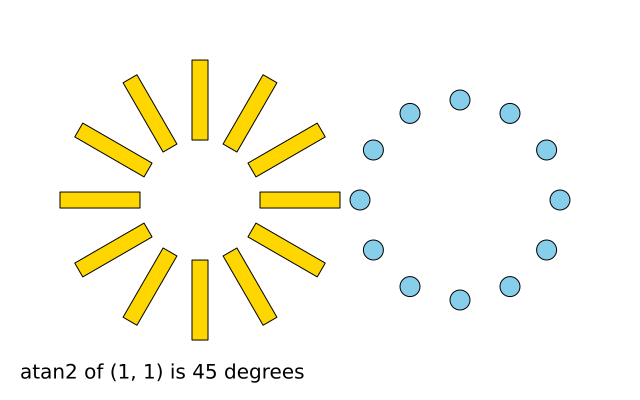
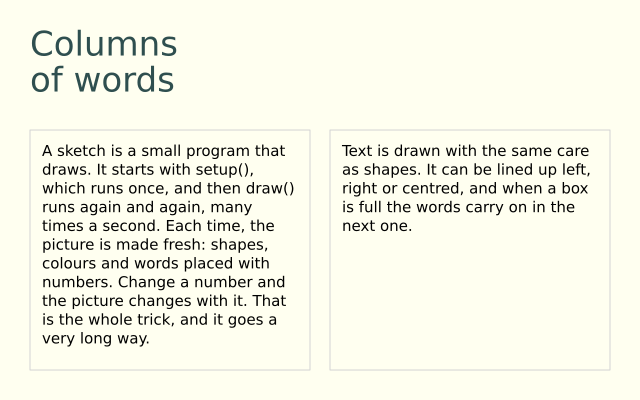
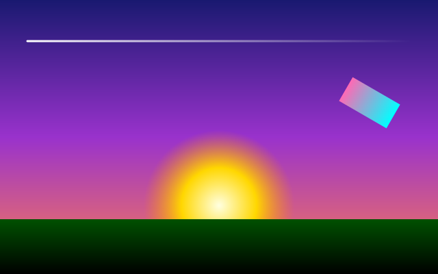
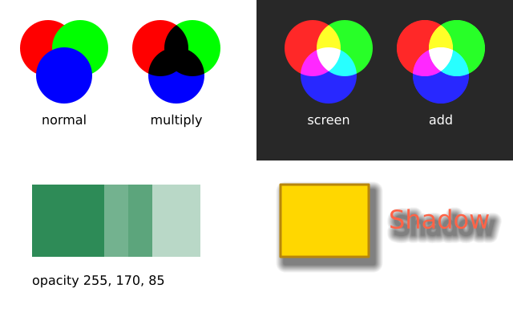

# 15. Coming from DrawBot

DrawBot is further from funground than p5.js or Processing. It draws by running a script once
from top to bottom, in points on a page whose origin is the bottom-left corner, with colours as
floats from 0 to 1. funground draws in pixels from a top-left origin, with colours mostly as
0–255 values or names, either as a script or by calling `setup()` once and `draw()` every frame. This chapter states the big
differences plainly, then goes name by name.

## The drawing loop

A DrawBot script has no loop: it runs once, in order, and whatever it draws stays on the page.
Animation and multi-page documents come from calling `newPage()` again and again — each call adds
a page, and `saveImage(...)` at the end can write them out as a PDF, or as frames of a video or
GIF.

funground has both styles. A DrawBot script ports as a funground **script**: no `draw()`, no
`f.run()`, the same top-to-bottom order. `f.size(w, h)` makes the canvas without opening a window,
`f.save(path)` writes the file at once, and `f.show()` opens a window to look at the result.
When you want movement, write an animated sketch instead, with `setup()`, `draw()` and `f.run()`
(chapter 2). A file is one style or the other.

## Coordinates

**DrawBot's origin is the bottom-left corner, with y pointing up** — "the origin of the drawing
board is at the bottom left," in DrawBot's own words. funground's origin is the **top-left
corner, with y pointing down** (contract C1), the p5/Processing/screen convention. A shape near
the bottom of a DrawBot page is drawn with a **large** y; the same shape near the bottom of a
funground canvas is drawn with y close to `f.height`.

## Colour

DrawBot's `fill()` and `stroke()` take floats from **0.0 to 1.0** per channel, with alpha the
same: `fill(1, 0, 0, .5)` is half-transparent red, `fill(0)` is black, `fill(0, .5)` is grey at
half opacity. There are no colour names.

funground's colours are **0–255** integers, or a name, or a hex string (contract S1), with alpha
also 0–255 (contract S2): `f.fill(255, 0, 0, 128)`, `f.fill("red")`, or `f.fill("#FF000080")`.

## Shapes: `oval` and `rect`

DrawBot's `rect(x, y, w, h)` and `oval(x, y, w, h)` take the **same four numbers**: `x, y` is the
corner of the shape's bounding box, for both of them. funground's `f.rect(x, y, w, h)` also uses
the top-left corner (contract C4), but `f.ellipse(x, y, w, h)` and `f.circle(x, y, d)` are placed
by their **centre** (contract C5) — the p5/Processing convention, not DrawBot's. To place ellipses
the DrawBot way, call `f.ellipse_mode("corner")` once.

```py
oval(100, 100, 80, 80)          # bounding box from (100, 100)
```

```py
f.ellipse(140, 140, 80, 80)     # centre at (140, 140) — same circle, shifted to its middle
```

## Paths: `BezierPath` and `f.path()`

DrawBot builds a path with a `BezierPath` object (`path.moveTo(...)`, `path.lineTo(...)`,
`path.curveTo(...)`, `path.closePath()`) and draws it with `drawPath(path)`. funground's
`f.path()` returns a similar builder (`move_to`, `line_to`, `curve_to`, `close`), drawn with
`f.draw_path(path)` (contract F3). The main difference is points: DrawBot takes an `(x, y)` pair
for each point; funground's builder takes plain `x, y` numbers.

## Saved state

DrawBot recommends `with savedState():` over the older `save()`/`restore()`, to save and restore
the graphics state — transform, colours and more — for one block. funground's `with
f.saved_state():` does exactly the same job (contract F2), alongside `f.push()`/`f.pop()`
(D-013).



## Text

| DrawBot | funground |
|---|---|
| `font(name, size=None)` | `f.text_font(font, size=None)` — funground loads a font *file* with `f.load_font(path)` first; DrawBot names an installed font by its PostScript name |
| `fontSize(n)` | `f.text_size(n)` |
| `text(str, (x, y))` | `f.text(message, x, y)` |
| `textBox(str, (x, y, w, h))` | `f.text_box(message, x, y, w, h)` |

Both `textBox` and `f.text_box` wrap text inside a box and **return the text that did not fit**,
so the rest can flow into a second box (DrawBot: "if the text overflows the rectangle, the
overflowed text is returned"; funground's contract T10 says the same). funground's text anchor
defaults to the top-left of the message (contract T1); DrawBot's `(x, y)` is the box's corner in
its own bottom-left, y-up space, so the two need opposite y arithmetic — see the walk-through
below.



## Gradients

DrawBot's `linearGradient(startPoint, endPoint, colors, locations=None)` and
`radialGradient(startPoint, endPoint, colors, locations=None, startRadius=0, endRadius=100)` blend
between **two circles**, one at each point, each with its own radius — useful for a gradient that
also drifts sideways. funground's `f.linear_gradient(x1, y1, x2, y2, colors, stops=None)` works
the same way as DrawBot's linear one; `f.radial_gradient(x, y, radius, colors, stops=None)` is
simpler — **one** centre, growing out to `radius` (contract S13) — rather than DrawBot's two
circles.



## Blend mode, opacity and shadow

Both have `blendMode(mode)`/`f.blend_mode(mode)` for the same idea — how new drawing mixes with
what's underneath — though the two libraries don't spell every mode name the same way (DrawBot's
`colorDodge`/`colorBurn` are funground's `dodge`/`burn`).

DrawBot's `opacity(value)` (0.0–1.0) is a single, global setting. funground's `f.opacity(0–255)`
(contract S14) multiplies the alpha of fill and stroke **separately**, so a stroke drawn over its
own fill still shows both, rather than the pair being faded as one flattened group.

DrawBot's `shadow(offset, blur=None, color=None)` and funground's
`f.shadow(x_offset, y_offset, blur=5, color=(0, 0, 0, 128))` do the same job — a soft, offset copy
drawn under the shape — with the offset as one `(x, y)` pair in DrawBot and two numbers in
funground. funground's `color` defaults to a dark, half-transparent grey, so `f.shadow(4, 4)` on
its own already draws something.



## Saving

DrawBot's `saveImage(path, **options)` writes the current page (or every page, as a multi-page
PDF or an animation) to a file whose extension picks the format — `pdf`, `png`, `svg`, `gif`,
`mp4`, and several more. funground's `f.save(path)` writes the picture, as `.png`, `.pdf` or
`.svg` (chapter 13). In a script it writes at once, like `saveImage`; `f.save_frames(pattern, count)` writes a numbered sequence of frames, which
you then turn into a video or GIF with a tool such as ffmpeg.

## Pages

DrawBot documents can hold many pages: `newPage(w, h)` starts a new one, and `pages()` returns
them all, so drawing can be organised across several pages of one document. funground doesn't
have multiple pages yet — one canvas per script or sketch — though it is one of the things
Phase 3 may add, alongside `create_graphics` pictures (chapter 9), which already give you more
than one drawing surface within a single run.

## A porting walk-through

An original DrawBot script: a page with a row of translucent circles over a background, each one
a little further along the hue wheel, with a caption at the bottom.

```py
size(400, 200)
fill(0.05, 0.05, 0.08)
rect(0, 0, width(), height())

for i in range(10):
    x = 20 + i * 38
    r, g, b = 1 - i / 9, i / 18, i / 9
    fill(r, g, b, .7)
    oval(x, 70, 36, 36)

fill(1)
fontSize(14)
text("ten circles", (20, 20))

saveImage("~/Desktop/circles.pdf")
```

And the same picture as a funground script, with the y-flip and the 0–1 colours made explicit:

```python
import funground as f

f.size(400, 200)
f.background((13, 13, 20))
for i in range(10):
    x = 20 + i * 38 + 18                        # + 18: DrawBot's x was the oval's left edge
    red, green, blue = 1 - i / 9, i / 18, i / 9
    f.fill((red * 255, green * 255, blue * 255, int(.7 * 255)))
    y = f.height - (70 + 36)                    # DrawBot's y counts up from the bottom
    f.circle(x, y + 18, 36)
f.fill("white")
f.text_size(14)
f.text("ten circles", 20, f.height - 20 - 14)   # y flipped from DrawBot's bottom-left origin

f.save("circles.pdf")                           # written at once, like saveImage
f.show()                                        # look at it; close the window to finish
```

## What is not here yet

DrawBot features funground doesn't have yet include multi-page documents, loading and filtering
images, and video export. They are planned for Phase 3, before funground reaches 1.0, without a
firm date yet. CMYK colour is out of scope for good — see the next line for why.

Some features are left out on purpose. [ADR-003](../design/ADR-003-out-of-scope.md) lists them, with what to use instead.
