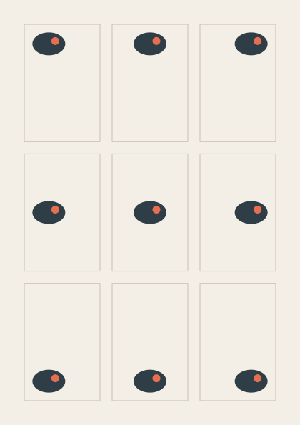
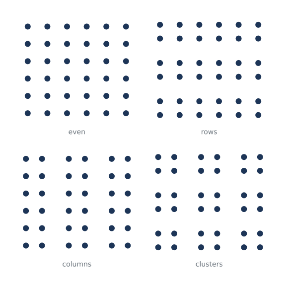
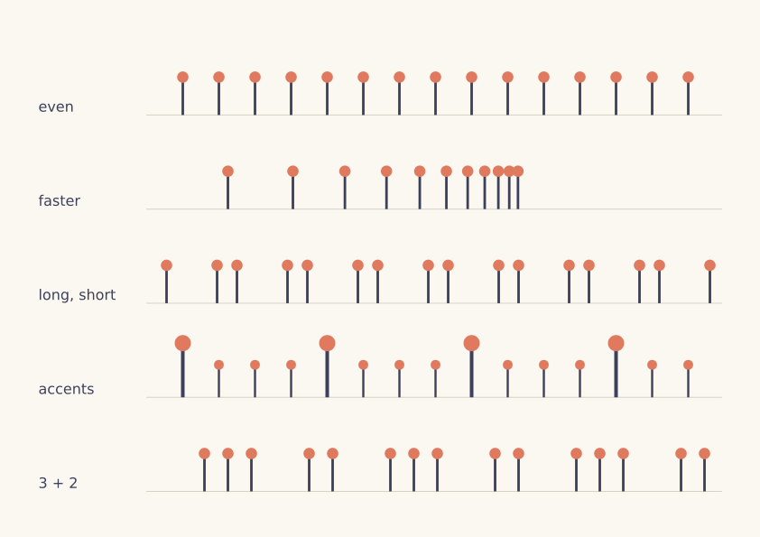
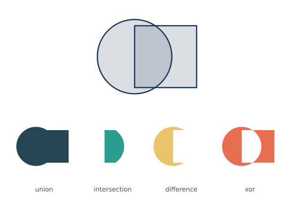
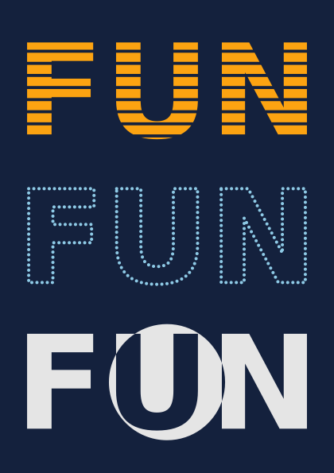
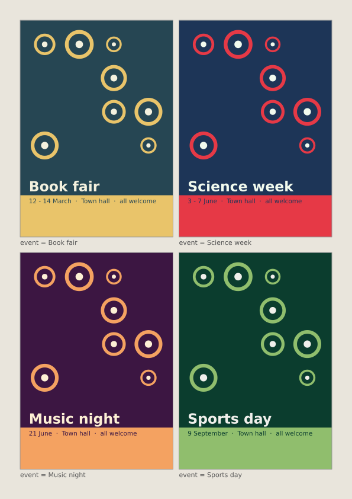

# 19. Studios: the same picture, twice

A studio is a short exercise in seeing. You make something, change one thing, notice what the
change does, choose the version you like and say why. funground has four words for that work.

| Word | What it means | In funground |
|---|---|---|
| **Ground** | The page you compose on: its size, margins and units | `f.size("A5", margin=f.mm(12))`, `f.ground`, `f.ground.content`, `f.area()`, `f.grid()`, `f.mm()`, `f.inch()` |
| **Mark** | A drawing kept as a value, placed as often as you like | `with f.mark() as m:`, `f.mark(path)`, `m.place(x, y, anchor=..., width=...)` |
| **Rules** | The decisions that place, repeat and vary marks | Plain Python: variables, `for`, `if` and functions. There is nothing new to learn |
| **Play** | Trying versions side by side, and keeping the good ones | `f.variations()`, `f.keep()`, `f.random_seed()` |

Each studio below is written **twice**. The first version uses the studio words. The second one,
folded away under it, draws the same picture with funground's older tools only: numbers for the
page, `push()`, `translate()`, `scale()` and `pop()`, and the sums written out. Open it and
compare. The tests check that both versions draw the same picture.

Both versions of every studio are complete programs. The first is also in the
[Examples Gallery](../gallery/README.md#studios), and both are in the examples folder.

## Studio 1: Placement

Where a shape sits in its frame changes how it feels: tucked into a corner, resting on the floor, or
floating in the middle. One small drawing, the pebble, is placed at nine different points of nine
frames.



- `f.grid(3, 3, gutter=f.mm(6))` makes the nine frames. Each cell knows its `col` and `row`.
- `anchor="top-right"` says which point of the pebble lands on the point given. Without it, the
  code must know how far the pebble reaches from its own (0, 0), and those numbers must change
  whenever the pebble does.
- `grid.show()` draws guide lines in the window only, never in a saved file.

The studio version, [`examples/gallery/studios/01_placement.py`](../../examples/gallery/studios/01_placement.py):

```python
import funground as f

f.size("A5", margin=f.mm(12))
f.background("#f3efe6")

with f.mark() as pebble:                    # recorded once, around its own (0, 0)
    f.no_stroke()
    f.fill("#2f3e46")
    f.ellipse(0, 0, 46, 32)
    f.fill("#e76f51")
    f.circle(9, -4, 11)

# One anchor for each cell, in the grid's order: row by row, left to right.
ANCHORS = ["top-left", "top", "top-right",
           "left", "center", "right",
           "bottom-left", "bottom", "bottom-right"]

grid = f.grid(3, 3, gutter=f.mm(6))
for cell in grid:
    f.no_fill()
    f.stroke("#c9c0ae")
    f.stroke_width(1)
    f.rect(cell.left, cell.top, cell.width, cell.height)
    inside = cell.inset(f.mm(4))
    x = inside.left + inside.width * cell.col / 2      # 0, a half or all of the way across
    y = inside.top + inside.height * cell.row / 2
    pebble.place(x, y, anchor=ANCHORS[cell.index])

grid.show()
f.show()
```

<details>
<summary>The same picture without the studio words</summary>

Source: [`examples/studios/01_placement_before.py`](../../examples/studios/01_placement_before.py)

```python
import funground as f

MM = 72 / 25.4                    # one millimetre in points
W, H = 420, 595                   # an A5 page
MARGIN = 12 * MM
GUTTER = 6 * MM
PAD = 4 * MM

f.size(W, H)
f.background("#f3efe6")


def pebble(x, y):
    f.push()
    f.translate(x, y)
    f.no_stroke()
    f.fill("#2f3e46")
    f.ellipse(0, 0, 46, 32)
    f.fill("#e76f51")
    f.circle(9, -4, 11)
    f.pop()


# How far the pebble reaches from its own (0, 0): the ellipse is 46 wide and 32 high.
PEBBLE_LEFT, PEBBLE_TOP, PEBBLE_W, PEBBLE_H = -23, -16, 46, 32

cell_w = (W - 2 * MARGIN - 2 * GUTTER) / 3
cell_h = (H - 2 * MARGIN - 2 * GUTTER) / 3
for row in range(3):
    for col in range(3):
        left = MARGIN + col * (cell_w + GUTTER)
        top = MARGIN + row * (cell_h + GUTTER)
        f.no_fill()
        f.stroke("#c9c0ae")
        f.stroke_width(1)
        f.rect(left, top, cell_w, cell_h)
        # the room the pebble can move in, inside the padding, and how far across and down it goes
        room_w = cell_w - 2 * PAD - PEBBLE_W
        room_h = cell_h - 2 * PAD - PEBBLE_H
        x = left + PAD + room_w * col / 2 - PEBBLE_LEFT
        y = top + PAD + room_h * row / 2 - PEBBLE_TOP
        pebble(x, y)

f.show()
```

</details>

## Studio 2: Proximity

Things that are close together look as if they belong together. Each panel holds the same 36 dots.
Only the spaces between them change.



- Grids nest: `field.grid()` divides a panel into groups, and `group.grid()` divides a group into
  the dots' cells. The gutter between the groups is the space the eye reads.
- `f.inch()` sets the page in inches. Without it, the code keeps its own `INCH = 72`.
- The version without the studio words needs a small function, `span()`, to do the same sum at
  three levels.

The studio version, [`examples/gallery/studios/02_proximity.py`](../../examples/gallery/studios/02_proximity.py):

```python
import funground as f

f.size(f.inch(8), f.inch(8), margin=f.inch(0.5))
f.background("white")

DOT = 12                              # every dot is the same size
GAP = f.inch(0.3)                     # the space between groups
# name, then groups across and down, then dots across and down in each group: always 36 dots
GROUPINGS = [("even", 1, 1, 6, 6), ("rows", 1, 3, 6, 2), ("columns", 3, 1, 2, 6), ("clusters", 3, 3, 2, 2)]

f.text_size(14)
f.text_align("center", "bottom")
for panel, (name, groups_x, groups_y, dots_x, dots_y) in zip(f.grid(2, 2, gutter=f.inch(0.4)), GROUPINGS):
    field = panel.inset(bottom=28)
    f.no_stroke()
    f.fill("#1d3557")
    for group in field.grid(groups_x, groups_y, gutter=GAP):
        for cell in group.grid(dots_x, dots_y):
            f.circle(cell.cx, cell.cy, DOT)
    f.fill("#6c757d")
    f.text(name, panel.cx, panel.bottom)

f.show()
```

<details>
<summary>The same picture without the studio words</summary>

Source: [`examples/studios/02_proximity_before.py`](../../examples/studios/02_proximity_before.py)

```python
import funground as f

INCH = 72
W = H = 8 * INCH
MARGIN = 0.5 * INCH
PANEL_GAP = 0.4 * INCH
CAPTION = 28

f.size(W, H)
f.background("white")

DOT = 12                              # every dot is the same size
GAP = 0.3 * INCH                      # the space between groups
# name, then groups across and down, then dots across and down in each group: always 36 dots
GROUPINGS = [("even", 1, 1, 6, 6), ("rows", 1, 3, 6, 2), ("columns", 3, 1, 2, 6), ("clusters", 3, 3, 2, 2)]


def span(start, length, count, gap):
    """Where each of count cells starts along a length, with gap between them, and the cell size."""
    size = (length - (count - 1) * gap) / count
    return [start + i * (size + gap) for i in range(count)], size


f.text_size(14)
f.text_align("center", "bottom")
panel_xs, panel_w = span(MARGIN, W - 2 * MARGIN, 2, PANEL_GAP)
panel_ys, panel_h = span(MARGIN, H - 2 * MARGIN, 2, PANEL_GAP)
for i, (name, groups_x, groups_y, dots_x, dots_y) in enumerate(GROUPINGS):
    px, py = panel_xs[i % 2], panel_ys[i // 2]
    field_h = panel_h - CAPTION
    f.no_stroke()
    f.fill("#1d3557")
    group_xs, group_w = span(px, panel_w, groups_x, GAP)
    group_ys, group_h = span(py, field_h, groups_y, GAP)
    for gy in group_ys:
        for gx in group_xs:
            dot_xs, dot_w = span(gx, group_w, dots_x, 0)
            dot_ys, dot_h = span(gy, group_h, dots_y, 0)
            for y in dot_ys:
                for x in dot_xs:
                    f.circle(x + dot_w / 2, y + dot_h / 2, DOT)
    f.fill("#6c757d")
    f.text(name, px + panel_w / 2, py + panel_h)

f.show()
```

</details>

## Studio 3: Rhythm

A rhythm is a repeat with a pattern in its spacing or its size. Each row repeats the same beat in
a different pattern.



- `beat.place(x, y, anchor="bottom", scale=size)` stands the beat on its line, and a bigger beat
  grows upwards from it. The other version moves, scales, and then moves back by the stem's length.
- The patterns are ordinary Python functions that return lists of gaps and sizes. They are the same
  in both versions: the studio words do not change the rules.

The studio version, [`examples/gallery/studios/03_rhythm.py`](../../examples/gallery/studios/03_rhythm.py):

```python
import funground as f

f.size("A4", landscape=True, margin=f.mm(15))
f.background("#fbf8f1")

LABEL = 120                         # room on the left of each row for its name

with f.mark() as beat:              # the head at (0, 0), the stem hanging down from it
    f.no_stroke()
    f.fill("#3d405b")
    f.rect(-2, 0, 4, 60)
    f.fill("#e07a5f")
    f.circle(0, 0, 18)


def even():
    return [(40, 0.7)] * 16


def faster():
    gaps, gap = [], 90
    while gap > 8:
        gaps.append((gap, 0.7))
        gap *= 0.8
    return gaps


def long_short():
    return [(56 if i % 2 else 22, 0.7) for i in range(18)]


def accents():
    return [(40, 1.0 if i % 4 == 0 else 0.6) for i in range(16)]


def grouped():
    return [(64 if i % 5 in (0, 3) else 26, 0.7) for i in range(20)]


RHYTHMS = [("even", even()), ("faster", faster()), ("long, short", long_short()),
           ("accents", accents()), ("3 + 2", grouped())]

f.text_size(16)
f.text_align("left", "bottom")
for row, (name, beats) in zip(f.grid(1, 5, gutter=f.mm(4)), RHYTHMS):
    line = row.inset(left=LABEL, bottom=8)
    f.stroke("#d8d2c4")
    f.stroke_width(1)
    f.line(line.left, line.bottom, line.right, line.bottom)
    x = line.left
    for gap, size in beats:
        x += gap
        if x > line.right:
            break
        beat.place(x, line.bottom, anchor="bottom", scale=size)
    f.no_stroke()
    f.fill("#3d405b")
    f.text(name, row.left, line.bottom)

f.show()
```

<details>
<summary>The same picture without the studio words</summary>

Source: [`examples/studios/03_rhythm_before.py`](../../examples/studios/03_rhythm_before.py)

```python
import funground as f

MM = 72 / 25.4
W, H = 842, 595                    # A4, on its side
MARGIN = 15 * MM
GUTTER = 4 * MM
LABEL = 120                        # room on the left of each row for its name
STEM = 60                          # from the head's centre to the bottom of the stem

f.size(W, H)
f.background("#fbf8f1")


def beat(x, y, size):
    """The beat standing on (x, y), scaled by size from that point."""
    f.push()
    f.translate(x, y)
    f.scale(size)
    f.translate(0, -STEM)          # the head is at (0, 0): move it up by the stem
    f.no_stroke()
    f.fill("#3d405b")
    f.rect(-2, 0, 4, STEM)
    f.fill("#e07a5f")
    f.circle(0, 0, 18)
    f.pop()


def even():
    return [(40, 0.7)] * 16


def faster():
    gaps, gap = [], 90
    while gap > 8:
        gaps.append((gap, 0.7))
        gap *= 0.8
    return gaps


def long_short():
    return [(56 if i % 2 else 22, 0.7) for i in range(18)]


def accents():
    return [(40, 1.0 if i % 4 == 0 else 0.6) for i in range(16)]


def grouped():
    return [(64 if i % 5 in (0, 3) else 26, 0.7) for i in range(20)]


RHYTHMS = [("even", even()), ("faster", faster()), ("long, short", long_short()),
           ("accents", accents()), ("3 + 2", grouped())]

f.text_size(16)
f.text_align("left", "bottom")
row_h = (H - 2 * MARGIN - 4 * GUTTER) / 5
for i, (name, beats) in enumerate(RHYTHMS):
    top = MARGIN + i * (row_h + GUTTER)
    left = MARGIN + LABEL
    right = W - MARGIN
    base = top + row_h - 8
    f.stroke("#d8d2c4")
    f.stroke_width(1)
    f.line(left, base, right, base)
    x = left
    for gap, size in beats:
        x += gap
        if x > right:
            break
        beat(x, base, size)
    f.no_stroke()
    f.fill("#3d405b")
    f.text(name, MARGIN, base)

f.show()
```

</details>

## Studio 4: Boolean shapes

A circle and a square, joined, cut and crossed. The path operators `|`, `&`, `-` and `^` were in
funground before the studio words. Marks help to show the results.



- `f.mark(path, fill=..., stroke=None)` gives each result its own colour, once.
- `pair.place(..., anchor="center", height=...)` fits the outlined pair into the top row. Its size
  includes the outline. The other version adds half of the stroke width by hand.
- The four results share one scale, worked out from `union.width`, so they can be compared. There
  is no word for "fit these together", so that sum stays in both versions.

The studio version, [`examples/gallery/studios/04_boolean_shapes.py`](../../examples/gallery/studios/04_boolean_shapes.py):

```python
import funground as f

f.size("A5", landscape=True, margin=f.mm(10))
f.background("white")

circle = f.path().circle(-25, 0, 120)
square = f.path().rect(-25, -50, 100, 100)

with f.mark() as pair:                       # the two shapes, overlapping, as outlines
    f.fill(29, 53, 87, 40)
    f.stroke("#1d3557")
    f.stroke_width(2)
    f.draw_path(circle)
    f.draw_path(square)

RESULTS = [("union", circle | square, "#264653"), ("intersection", circle & square, "#2a9d8f"),
           ("difference", circle - square, "#e9c46a"), ("xor", circle ^ square, "#e76f51")]
marks = [(name, f.mark(shape, fill=colour, stroke=None)) for name, shape, colour in RESULTS]

grid = f.grid(4, 2, gutter=f.mm(6))
top = grid.span(0, 0, cols=4)
pair.place(top.cx, top.cy, anchor="center", height=top.height - 20)

union = marks[0][1]
scale = (grid.cell(0, 1).width - 16) / union.width        # one scale for all four
f.text_size(13)
f.text_align("center", "bottom")
for i, (name, result) in enumerate(marks):
    cell = grid.cell(i, 1)
    result.place(cell.cx, cell.cy - 8, scale=scale)
    f.fill("#495057")
    f.text(name, cell.cx, cell.bottom)

f.show()
```

<details>
<summary>The same picture without the studio words</summary>

Source: [`examples/studios/04_boolean_shapes_before.py`](../../examples/studios/04_boolean_shapes_before.py)

```python
import funground as f

MM = 72 / 25.4
W, H = 595, 420                    # A5, on its side
MARGIN = 10 * MM
GUTTER = 6 * MM
STROKE = 2

f.size(W, H)
f.background("white")

circle = f.path().circle(-25, 0, 120)
square = f.path().rect(-25, -50, 100, 100)
RESULTS = [("union", circle | square, "#264653"), ("intersection", circle & square, "#2a9d8f"),
           ("difference", circle - square, "#e9c46a"), ("xor", circle ^ square, "#e76f51")]

cell_w = (W - 2 * MARGIN - 3 * GUTTER) / 4
cell_h = (H - 2 * MARGIN - GUTTER) / 2

# the pair, fitted into the whole top row: its size from the paths, plus the outline
x, y, w, h = (circle | square).bounds()
x, y, w, h = x - STROKE / 2, y - STROKE / 2, w + STROKE, h + STROKE
k = (cell_h - 20) / h
f.push()
f.translate(W / 2, MARGIN + cell_h / 2)
f.scale(k)
f.translate(-(x + w / 2), -(y + h / 2))
f.fill(29, 53, 87, 40)
f.stroke("#1d3557")
f.stroke_width(STROKE)
f.draw_path(circle)
f.draw_path(square)
f.pop()

ux, uy, uw, uh = RESULTS[0][1].bounds()
scale = (cell_w - 16) / uw                                 # one scale for all four
f.text_size(13)
f.text_align("center", "bottom")
for i, (name, shape, colour) in enumerate(RESULTS):
    cx = MARGIN + i * (cell_w + GUTTER) + cell_w / 2
    top = MARGIN + cell_h + GUTTER
    f.push()
    f.translate(cx, top + cell_h / 2 - 8)
    f.scale(scale)
    f.fill(colour)
    f.no_stroke()
    f.draw_path(shape)
    f.pop()
    f.fill("#495057")
    f.text(name, cx, top + cell_h)

f.show()
```

</details>

## Studio 5: Text as geometry

Letters are shapes. As a path, a word can be cut, traced and crossed like any other shape.



- `f.text_path()` and `f.text_to_points()` give the word's outlines and points, as before.
- Each version becomes a mark and is fitted to its row with `width=` and `height=`. The other
  version needs a `fit()` function, and it must find the size of the dots by itself, because a
  list of points has no `bounds()`.
- The two pictures are almost, not exactly, the same. A mark measures itself to the nearest 1/32
  of a unit, rounding outwards, so the fitted words differ by a fraction of a pixel at their edges.

The studio version, [`examples/gallery/studios/05_text_as_geometry.py`](../../examples/gallery/studios/05_text_as_geometry.py):

```python
import funground as f

f.size("A5", margin=f.mm(12))
f.background("#14213d")

f.text_style("bold")
f.text_size(100)
word = f.text_path("FUN", 0, 0)
x, y, w, h = word.bounds()

stripes = f.path()
for i in range(8):                                   # eight thin bands across the word
    stripes.rect(x - 5, y + h * (i + 0.6) / 8, w + 10, h / 32)
striped = f.mark(word - stripes, fill="#fca311", stroke=None)

ring = f.path().circle(x + w / 2, y + h / 2, h * 1.2)
crossed = f.mark(word ^ ring, fill="#e5e5e5", stroke=None)

with f.mark() as dotted:                             # a dot every 4 units along the outlines
    f.no_stroke()
    f.fill("#8ecae6")
    for px, py in f.text_to_points("FUN", 0, 0, 4):
        f.circle(px, py, 2.5)

for row, version in zip(f.grid(1, 3, gutter=f.mm(8)), [striped, dotted, crossed]):
    version.place(row.cx, row.cy, anchor="center", width=row.width, height=row.height)

f.show()
```

<details>
<summary>The same picture without the studio words</summary>

Source: [`examples/studios/05_text_as_geometry_before.py`](../../examples/studios/05_text_as_geometry_before.py)

```python
import funground as f

MM = 72 / 25.4
W, H = 420, 595                    # an A5 page
MARGIN = 12 * MM
GUTTER = 8 * MM
DOT = 2.5

f.size(W, H)
f.background("#14213d")

f.text_style("bold")
f.text_size(100)
word = f.text_path("FUN", 0, 0)
x, y, w, h = word.bounds()

stripes = f.path()
for i in range(8):                                   # eight thin bands across the word
    stripes.rect(x - 5, y + h * (i + 0.6) / 8, w + 10, h / 32)
striped = word - stripes
ring = f.path().circle(x + w / 2, y + h / 2, h * 1.2)
crossed = word ^ ring
points = f.text_to_points("FUN", 0, 0, 4)

row_w = W - 2 * MARGIN
row_h = (H - 2 * MARGIN - 2 * GUTTER) / 3


def fit(bounds, row):
    """Move and scale so a shape with these bounds is as large as fits in the row, centred."""
    bx, by, bw, bh = bounds
    k = min(row_w / bw, row_h / bh)
    f.translate(MARGIN + row_w / 2, MARGIN + row * (row_h + GUTTER) + row_h / 2)
    f.scale(k)
    f.translate(-(bx + bw / 2), -(by + bh / 2))


f.no_stroke()
f.push()
fit(striped.bounds(), 0)
f.fill("#fca311")
f.draw_path(striped)
f.pop()

xs = [px for px, py in points]
ys = [py for px, py in points]
r = DOT / 2
f.push()
fit((min(xs) - r, min(ys) - r, max(xs) - min(xs) + DOT, max(ys) - min(ys) + DOT), 1)
f.fill("#8ecae6")
for px, py in points:
    f.circle(px, py, DOT)
f.pop()

f.push()
fit(crossed.bounds(), 2)
f.fill("#e5e5e5")
f.draw_path(crossed)
f.pop()

f.show()
```

</details>

## Studio 6: A poster series

One function draws a poster for any event, so the posters look like a family. `f.variations()`
draws all four on one sheet, and pressing K keeps the sheet with a record of how it was made.



- `poster(event)` draws one poster on the whole page, as if it were alone. `f.variations()` shrinks
  each one into a labelled cell, from the same random seed.
- Inside a variation, `f.background()` paints only that poster. The other version must paint the
  paper with `f.rect()`, because there `background()` would cover the whole sheet.
- `f.keep()` saves the picture, a copy of the sketch and a record of the seed and settings in a
  `studio` folder next to the sketch. The other version saves the picture and writes its own short
  note.
- The other version lays out the sheet itself, and works out the poster's grid by hand.

The studio version, [`examples/gallery/studios/06_poster_series.py`](../../examples/gallery/studios/06_poster_series.py):

```python
import funground as f

# event: (paper, ink, accent, date)
EVENTS = {
    "Book fair": ("#264653", "#f4f1de", "#e9c46a", "12 - 14 March"),
    "Science week": ("#1d3557", "#f1faee", "#e63946", "3 - 7 June"),
    "Music night": ("#3c1642", "#fdf0d5", "#f4a261", "21 June"),
    "Sports day": ("#0b3d2e", "#f0efeb", "#90be6d", "9 September"),
}


def spot(colour, ink):
    """A ring with a dot in it, as a mark centred on its own (0, 0)."""
    with f.mark() as m:
        f.no_fill()
        f.stroke(colour)
        f.stroke_width(6)
        f.circle(0, 0, 40)
        f.no_stroke()
        f.fill(ink)
        f.circle(0, 0, 12)
    return m


def poster(event):
    paper, ink, accent, date = EVENTS[event]
    f.background(paper)
    grid = f.grid(4, 6, gutter=f.mm(4))
    mark = spot(accent, ink)
    for cell in grid[:16]:                              # the top four rows
        if f.random() < 0.55:
            mark.place(cell.cx, cell.cy, anchor="center", width=cell.width * f.random(0.35, 1))
    title = grid.span(0, 4, cols=4)
    f.fill(ink)
    f.text_style("bold")
    f.text_size(54)
    f.text_align("left", "bottom")
    f.text(event, title.left, title.bottom)
    footer = grid.span(0, 5, cols=4)
    band = f.area(f.ground.left, footer.top - f.mm(3), f.ground.width, f.ground.bottom - footer.top + f.mm(3))
    f.no_stroke()
    f.fill(accent)
    f.rect(band.left, band.top, band.width, band.height)    # full bleed: from edge to edge of the page
    f.fill(paper)
    f.text_style("normal")
    f.text_size(24)
    f.text_align("left", "top")
    f.text(date + "  ·  Town hall  ·  all welcome", footer.left, footer.top)


def setup():
    f.size("A4", margin=f.mm(12))
    f.random_seed(2026)


def draw():
    f.background("#e9e5dc")
    f.variations(poster, columns=2, event=list(EVENTS))


def key_pressed():
    if f.key == "k":
        f.keep("the series so far", events=len(EVENTS))


f.run()
```

<details>
<summary>The same picture without the studio words</summary>

Source: [`examples/studios/06_poster_series_before.py`](../../examples/studios/06_poster_series_before.py)

```python
import json
import os

import funground as f

MM = 72 / 25.4
W, H = 595, 842                    # an A4 page
MARGIN = 12 * MM
GUTTER = 4 * MM
SEED = 2026
SPOT = 46                          # the ring is 40 across, and its stroke of 6 adds 3 on each side

# event: (paper, ink, accent, date)
EVENTS = {
    "Book fair": ("#264653", "#f4f1de", "#e9c46a", "12 - 14 March"),
    "Science week": ("#1d3557", "#f1faee", "#e63946", "3 - 7 June"),
    "Music night": ("#3c1642", "#fdf0d5", "#f4a261", "21 June"),
    "Sports day": ("#0b3d2e", "#f0efeb", "#90be6d", "9 September"),
}


def spot(x, y, width, colour, ink):
    """A ring with a dot in it, centred on (x, y) and scaled to be width across."""
    f.push()
    f.translate(x, y)
    f.scale(width / SPOT)
    f.no_fill()
    f.stroke(colour)
    f.stroke_width(6)
    f.circle(0, 0, 40)
    f.no_stroke()
    f.fill(ink)
    f.circle(0, 0, 12)
    f.pop()


def poster(event):
    paper, ink, accent, date = EVENTS[event]
    f.no_stroke()
    f.fill(paper)
    f.rect(0, 0, W, H)
    cell_w = (W - 2 * MARGIN - 3 * GUTTER) / 4
    cell_h = (H - 2 * MARGIN - 5 * GUTTER) / 6
    for row in range(4):                                # the top four rows
        for col in range(4):
            if f.random() < 0.55:
                cx = MARGIN + col * (cell_w + GUTTER) + cell_w / 2
                cy = MARGIN + row * (cell_h + GUTTER) + cell_h / 2
                spot(cx, cy, cell_w * f.random(0.35, 1), accent, ink)
    f.fill(ink)
    f.text_style("bold")
    f.text_size(54)
    f.text_align("left", "bottom")
    f.text(event, MARGIN, MARGIN + 5 * cell_h + 4 * GUTTER)
    footer = MARGIN + 5 * (cell_h + GUTTER)
    f.fill(accent)
    f.rect(0, footer - 3 * MM, W, H - footer + 3 * MM)    # full bleed: from edge to edge of the page
    f.fill(paper)
    f.text_style("normal")
    f.text_size(24)
    f.text_align("left", "top")
    f.text(date + "  ·  Town hall  ·  all welcome", MARGIN, footer)


def setup():
    f.size(W, H)


def draw():
    f.background("#e9e5dc")
    gap, strip = 10, 16                                 # between cells, and under each poster for its label
    cell_w = (W - 2 * MARGIN - gap) / 2
    cell_h = (H - 2 * MARGIN - gap) / 2
    k = min(cell_w / W, (cell_h - strip) / H)           # one scale for every poster
    for i, event in enumerate(EVENTS):
        left = MARGIN + (i % 2) * (cell_w + gap)
        top = MARGIN + (i // 2) * (cell_h + gap)
        x = left + cell_w / 2 - W * k / 2
        y = top + (cell_h - H * k - strip) / 2
        with f.saved_state():
            f.clip(f.path().rect(x, y, W * k, H * k))
            f.translate(x, y)
            f.scale(k)
            f.random_seed(SEED)
            poster(event)
        with f.saved_state():
            f.no_fill()
            f.stroke("#9a9a9a")
            f.stroke_width(1)
            f.rect(x, y, W * k, H * k)
            f.no_stroke()
            f.fill("#555555")
            f.text_size(11)
            f.text("event = " + event, x, y + H * k + 3)


def key_pressed():
    if f.key == "k":
        number = 1
        while os.path.exists(f"sheet_{number:03}.png"):
            number += 1
        f.save(f"sheet_{number:03}.png")
        with open(f"sheet_{number:03}.json", "w", encoding="utf-8") as note:
            json.dump({"note": "the series so far", "seed": SEED, "events": len(EVENTS)}, note)


f.run()
```

</details>

## See also

- Quick Reference: [Ground](../reference/Quick_Reference.md#2-coordinates-and-drawing), and
  [Marks and Play](../reference/Quick_Reference.md#8-shapes-paths-and-clipping).
- [Paths, clipping and pictures](09_paths_and_clipping.md) for the path booleans, and
  [Text](06_text.md) for `text_path()` and `text_to_points()`.
- [Project 1: Event poster series](projects/01_event_posters.md), a full poster designer.

## Try it

1. In Studio 1, change the pebble. Then change the pebble in the other version too. Count the
   numbers you had to change in each.
2. In Studio 2, add a fifth grouping and make the page grid 3 by 2. Which grouping reads most
   strongly?
3. In Studio 6, add a fifth event, run it, and press K. Open the `studio` folder and read the
   `.json` record.

## Credits and ideas

The four words build on John Maeda's *Design By Numbers* (MIT Press), which taught
programming to designers with a paper, a pen, lines and repetition
([Design By Numbers](https://en.wikipedia.org/wiki/Design_By_Numbers_(programming_language))). The
placement and proximity studios build on the grid tradition of Swiss graphic design, as in Josef
Müller-Brockmann's *Grid Systems in Graphic Design* (1981)
([Josef Müller-Brockmann](https://en.wikipedia.org/wiki/Josef_M%C3%BCller-Brockmann)), and on the
Gestalt principle of proximity ([Principles of grouping](https://en.wikipedia.org/wiki/Principles_of_grouping)).
The code is written for funground (CC0). See [CREDITS.md](../../CREDITS.md#ideas-the-examples-build-on).

**Previous:** [18. Projects](18_projects.md)
