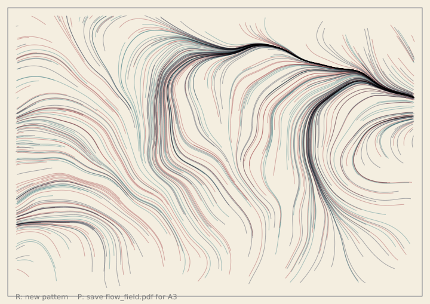

# Project 8: Flow-field print

Look at a river from a bridge, or at the grain in a plank of wood. The lines all run the same way,
and they bend together. A flow field makes lines like that. You will make hundreds of tiny walkers.
Each one follows a hidden map of noise and leaves a thin line. Then you will save the picture as a
vector PDF for an A3 print. You will learn about noise, vectors, layers, blend modes and PDF files.

## Run it



The full version is in the gallery. Run it with `python examples/gallery/projects/08_flow_field_print.py`.
The sliders under the canvas change the swirl, the number of lines and the colours. Press `R` for a
new pattern. Press `P` to save `flow_field.pdf`.

## How it works

**The map.** `f.noise(x, y)` gives a smooth number from 0 to 1. Points that are close together get
numbers that are close together. Multiply it by 720 and it is an angle, so every point on the page
has a direction, and neighbouring points have almost the same one. The scale is a small number, so
the map changes slowly. A bigger scale makes tighter swirls.

```py
def angle_at(x, y, scale):
    return f.noise(x * scale, y * scale) * 720
```

**The walkers.** Each walker has a place, held in an `f.Vector`. A step is a short arrow that points
the way the map says. `from_angle()` makes the arrow, and `add()` moves the walker along it.

```py
arrow = f.Vector.from_angle(angle_at(here.x, here.y, scale), STEP)
there = here + arrow
f.line(here.x, here.y, there.x, there.y)
```

**The trails layer.** Each frame, every walker takes three steps and draws them on a layer called
`"trails"`. The layer keeps its drawing, so each frame only adds new steps. The paper and the
frame are on the canvas under the layer. After about thirty frames the walkers have all stopped,
and the picture is done.

```py
with f.layer("trails"):
    f.blend_mode("multiply")
    for walker in walkers:
        ...                                # each walker draws its new steps
```

**Blend modes.** `"multiply"` mixes overlapping lines like ink on paper: where lines cross, the
colour gets darker. `"screen"` is the opposite, like light on a dark wall: where lines cross, it gets
brighter. The sketch uses `"multiply"` for light paper and `"screen"` for dark paper.

**The print.** The screen is about 720 pixels wide. An A3 page on its side is 1191 by 842 points.
`f.page_size("A3", landscape=True)` gives those numbers. To save, the sketch makes a picture that
size with `f.create_graphics()`, scales it up, and draws every walker again onto it. Then
`sheet.save("flow_field.pdf")` writes the PDF.

```py
page_w, page_h = f.page_size("A3", landscape=True)
sheet = f.create_graphics(page_w, page_h)
sheet.scale(page_w / W)                    # the print is bigger than the screen
...
sheet.save("flow_field.pdf")
```

**Keeping the PDF small.** A PDF stores lines as drawing instructions, so every line you draw
makes the file bigger. A walker takes about 100 steps, and 500 walkers would make 50 000 tiny lines.
Instead, each walker keeps the list of its points. When you save, each walker is drawn once as a
single line with `begin_shape()` and `vertex()`. That makes about one line for each walker. A print of 500 lines
is about 200 KB. A line also never has more than 140 points, whatever you change.

```py
sheet.begin_shape()
for x, y in walker["points"]:
    sheet.vertex(x, y)
sheet.end_shape()
```

## Stage 1: make it work

Two hundred walkers, one noise map, and no sliders. The walkers draw on a layer, so you see the
lines build up.

```python
import funground as f

walkers = []


def setup():
    f.size(480, 320)
    f.noise_seed(1)
    f.random_seed(1)
    for _ in range(200):
        walkers.append(f.Vector(f.random(480), f.random(320)))


def draw():
    f.background(244, 238, 224)
    with f.layer("trails"):
        f.stroke(24, 36, 64, 90)
        for walker in walkers:
            angle = f.noise(walker.x * 0.003, walker.y * 0.003) * 720
            step = f.Vector.from_angle(angle, 4)
            f.line(walker.x, walker.y, walker.x + step.x, walker.y + step.y)
            walker.add(step)


f.run()
```

Run it. The lines grow until they leave the page. Change `0.003` to `0.008`: the swirls get tighter.
Change `720` to `360`: the lines bend less.

## Stage 2: make it yours

**Stop at the edge.** Give each walker a number of steps left, and stop it when it leaves the page.
Save each walker's points in a list. You need them for the print.

```py
walker = {"pos": f.Vector(x, y), "points": [(x, y)], "left": int(f.random(60, 130))}
if not inside(there):
    walker["left"] = 0
```

**Sliders.** Make them in `setup()`, and read them in `draw()`. When a slider changes, start again:
wipe the layer with `f.clear()` and make new walkers.

```py
noise_scale = f.create_slider(1, 8, 3, step=0.5, label="noise scale")
line_count = f.create_slider(100, 1200, 500, step=50, label="lines")
palette = f.create_slider(1, 4, 1, step=1, label="palette")
```

**Palettes.** A palette is a paper colour, three line colours and a blend mode. The slider picks
one from a list.

```py
PALETTES = [
    ("Ink", (244, 238, 224), [(24, 36, 64, 90), (150, 40, 50, 90), (30, 110, 120, 90)], "multiply"),
    ("Night", (14, 18, 34), [(255, 190, 90, 80), (240, 90, 120, 80), (110, 190, 255, 80)], "screen"),
]
```

**R for a new pattern.** The seed makes each pattern repeatable. R adds one to it, and starts again.

```py
def key_pressed():
    global seed
    if f.key in ("r", "R"):
        seed += 1
        new_walkers()
```

**P to save.** The same function runs from the key and from a button. The button is made once, in
`setup()`.

```py
save_button = f.create_button("save PDF")
if save_button.clicked():
    save_print()
```

## Stage 3: make it shine

The full version is in the gallery: `examples/gallery/projects/08_flow_field_print.py`. It has four
palettes: two with dark ink on light paper, and two with bright light on dark paper. Each uses the
right blend mode. The sliders change the swirl, the number of lines and the palette. Walkers stop when
they reach the frame. A thin frame and a line of help sit in the margin. When you save, a note in the margin tells you
the file is written. The PDF is a real A3 page with every walker as one line, so you can print it
large and it stays sharp. The first screen is always the same.

## Challenge cards

- **Can you** make the lines start from the middle and spread out?
- **Can you** colour each line from the noise at its start, and not at random?
- **Can you** make the line thicker where the field turns quickly?
- **Can you** add a fifth palette in your own colours?
- **Can you** print on A4 and not A3? Change one word, then check the size of the file.
- **Can you** add a second field that is added to the first, and see what the lines do?

**Back to:** [18. Projects](../18_projects.md). Related chapters:
[11. Randomness and noise](../11_randomness_and_noise.md) (`noise`),
[12. Useful maths](../12_useful_maths.md) (`Vector`),
[9. Paths, clipping and pictures](../09_paths_and_clipping.md) (layers and pictures),
[5. Fill, stroke and lines](../05_fill_stroke_lines.md) (blend modes) and
[13. Saving your work](../13_saving_your_work.md) (PDF).
