# funground Quick Reference

**Version 0.1.0.dev0** — a small visual-programming library. `import funground as f; print(f.__version__)`
prints `0.1.0.dev0`.

This reference lists every public name in funground. Every function has a
one-line description; every section ends with one complete sketch, and the picture above that sketch
was produced by running it (`examples/reference/`, regenerated by `python tools/make_reference_images.py`).
The example code is free to copy and use in any way, with no conditions (CC0, `examples/LICENSE`).

**Contents:** [1 The basic idea](#1-the-basic-idea) · [2 Coordinates and drawing](#2-coordinates-and-drawing) ·
[3 Colours, fill, stroke and text](#3-colours-fill-stroke-and-text) · [4 Animation](#4-animation-and-changing-variables) ·
[5 Mouse, keyboard and helpers](#5-mouse-keyboard-and-useful-helpers) · [6 Saving a picture](#6-saving-a-picture) ·
[7 Transforms and the state stack](#7-transforms-and-the-state-stack) · [8 Shapes, paths and clipping](#8-shapes-paths-and-clipping) ·
[9 Cheat sheet](#9-one-page-cheat-sheet) · [10 Named colours and fixed names](#10-named-colours-and-other-fixed-names) ·
[What changed since v0.5](#what-changed-since-v05)

---

## 1. The basic idea

Import funground as `f`, define a one-time `setup()`, define a repeating `draw()`, then call `f.run()`.

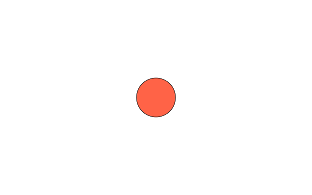

```python
import funground as f


def setup():
    f.size(640, 400)                 # runs once: make the window


def draw():
    f.background("white")            # runs again and again, up to 60 times a second
    f.fill("tomato")
    f.circle(320, 200, 80)


f.run()                              # finds setup() and draw() in this file and starts
```

**What happens**

- `setup()` runs once. It is normally where you create the window with `f.size(...)`.
- `draw()` runs again and again, up to the selected frame rate. Put drawing commands — and animation
  changes — here.
- `f.run()` starts the sketch. It finds the standardised `setup()` and `draw()` functions in your file,
  so you do not pass them as arguments. `setup()` is optional; `draw()` is required.
- There is still no `update()` callback. If an object moves, update its variables inside `draw()`.

**Window setup and running**

| Call | What it does | Example |
|---|---|---|
| `f.size(width, height)` | Create or resize the window. | `f.size(640, 400)` |
| `f.size(..., title="...")` | Set the window title. | `f.size(640, 400, title="Bounce")` |
| `f.size(..., fps=30)` | Choose the target frames per second (default 60). | `f.size(640, 400, fps=30)` |
| `f.run()` | Run `setup()` once, then `draw()` repeatedly. | `f.run()` |
| `f.run(fps=30)` | The same, overriding the frame rate. | `f.run(fps=30)` |
| `f.run(max_frames=100)` | stop by itself after that many frames — for tests, scripts and headless runs. | `f.run(max_frames=100)` |
| `f.show()` | **Scripts:** open a window on what you have drawn and wait until it is closed (or Escape). Needs `f.size()` first. Returns at once headless. | `f.show()` |
| `f.new_page()` | **Scripts:** end this page and start a blank one of the same size. The transform starts afresh; colours and other settings carry over. | `f.new_page()` |
| `f.new_page(width, height)`, `f.new_page("A4")` | The same, with a size in points, or a page name: `"A3"`, `"A4"`, `"A5"`, `"B5"`, `"Letter"`, `"Legal"`, `"Tabloid"`, `"Square"` (add `"Landscape"` to turn it). `f.save("x.pdf")` then writes every page; PNG and SVG write `x_1.png`, `x_2.png`, …; `f.show()` turns pages with the arrow keys. | `f.new_page("A5")` |
| `f.page_count()` | How many pages the document has so far. | `f.page_count()` |
| `f.page_size(name, landscape=False)` | The `(width, height)` of a named page, in points. | `f.size(*f.page_size("A4"))` |
| `f.stop()` | Ask the main loop to stop after the current `draw()`. | `if f.frame_count > 600: f.stop()` |
| `f.width`, `f.height` | Current window size. Live values, exactly what you passed to `f.size()`. | `f.circle(f.width / 2, f.height / 2, 80)` |

The window closes with the close button, the Escape key or `f.stop()`. If `setup()` never calls
`f.size()`, `f.run()` opens a 640×480 window for you.

**A file can also be a script.** With no `setup()`, no `draw()` and no `f.run()`, write the drawing at
the top level: `f.size(w, h)` makes a canvas with no window, `f.save("a.png")` writes a file at once,
and `f.show()` opens a window to look at it. A file is one style or the other — see chapter 2 of the
[User Guide](../guide/02_the_sketch.md).

**Running without a window.** Set the environment variable `FUNGROUND_HEADLESS=1` and the same sketch
runs with no window at all — `f.save()` still writes files, `f.mouse_x` is 0 and no key is ever down.
Combine it with `max_frames` to make pictures from a script (this is how the images in this document
are made).

---

## 2. Coordinates and drawing

The origin `(0, 0)` is the top-left corner. `x` increases to the right and `y` increases downward.
Coordinates are in logical pixels: on a high-DPI screen the window is drawn crisply at the screen's
real resolution, but `f.width` is still the number you asked for.

```python
# useful positions
left = 0
right = f.width
top = 0
bottom = f.height
center_x = f.width / 2
center_y = f.height / 2
```

**Shape functions**

| Call | What it does | Example |
|---|---|---|
| `f.circle(x, y, diameter)` | Circle centred at (x, y). The last argument is the **diameter**, not the radius. | `f.circle(100, 80, 40)` |
| `f.ellipse(x, y, width, height)` | Ellipse centred at (x, y). | `f.ellipse(220, 80, 100, 50)` |
| `f.rect(x, y, width, height, *radii)` | Rectangle whose (x, y) is the **top-left** corner. Add one radius to round all corners, or four radii (top-left, top-right, bottom-right, bottom-left), as in p5. Radii cannot be negative; big ones are cut to half the shorter side. | `f.rect(40, 160, 120, 60, 12)` |
| `f.rect_mode(mode)` | How `rect` and `square` read their numbers: `"corner"` (default), `"corners"` (two opposite corners), `"center"`, `"radius"` (centre, then half-sizes). Saved by `push`/`pop`. | `f.rect_mode("center")` |
| `f.ellipse_mode(mode)` | How `ellipse`, `circle` and `arc` read their numbers: `"center"` (default), `"radius"`, `"corner"` (top-left of the box), `"corners"`. Saved by `push`/`pop`. | `f.ellipse_mode("corner")` |
| `f.image_mode(mode)` | How `image` reads its numbers: `"corner"` (default), `"center"`, `"corners"` (needs a width and height: the opposite corner). Saved by `push`/`pop`. | `f.image_mode("center")` |
| `f.line(x1, y1, x2, y2)` | Line from one point to another. | `f.line(220, 160, 340, 220)` |
| `f.point(x, y)` | A dot in the stroke colour, about `stroke_width` across. | `f.point(400, 100)` |
| `f.square(x, y, size, *radii)` | Square whose (x, y) is the **top-left** corner. Takes corner radii like `rect`. | `f.square(40, 40, 60, 10)` |
| `f.triangle(x1, y1, x2, y2, x3, y3)` | Filled triangle through three corners. | `f.triangle(10, 90, 90, 90, 50, 10)` |
| `f.quad(x1, y1, … x4, y4)` | Four-sided shape through four corners in order. | `f.quad(20, 20, 80, 20, 80, 80, 20, 80)` |
| `f.polygon(points)` | Closed shape through a list of `(x, y)` points. | `f.polygon([(0, 0), (50, 20), (20, 60)])` |
| `f.arc(x, y, w, h, start, stop, mode="open")` | Part of an ellipse centred at (x, y); angles in **degrees**, clockwise from the right. Modes `"open"`, `"chord"`, `"pie"`. | `f.arc(100, 100, 80, 80, 0, 270, "pie")` |
| `f.background(color)` / `f.background(r, g, b)` | Fill the whole window with one colour; numbers may be separate arguments (ignores fill, stroke, transforms and clips). | `f.background("white")` |
| `f.clear()` | Make every pixel transparent; a saved PNG keeps the transparency (the window shows it black). | `f.clear()` |

*Changed since Playground 0.5:* fractional coordinates such as `f.circle(500.5, 80.25, 40)` are honoured and every
edge is anti-aliased, so shapes have smooth edges instead of stair-steps. Drawing before `f.size()` is
an error that names `f.size`.

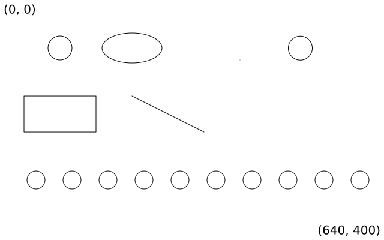

```python
import funground as f


def setup():
    f.size(640, 400)


def draw():
    f.background("white")

    # The origin (0, 0) is the top-left corner: x grows to the right, y downwards.
    f.fill("black")
    corner = f"({f.width}, {f.height})"
    f.text("(0, 0)", 6, 4)
    f.text(corner, f.width - f.text_width(corner) - 6, f.height - 28)

    f.fill("white")
    f.stroke("black")
    f.circle(100, 80, 40)            # x, y, diameter
    f.ellipse(220, 80, 100, 50)      # centre x, centre y, width, height
    f.rect(40, 160, 120, 60)         # top-left x, y, width, height
    f.line(220, 160, 340, 220)       # x1, y1, x2, y2
    f.point(400, 100)                # a dot in the stroke colour

    # Fractional positions are honoured and every edge is anti-aliased (v0.6).
    f.circle(500.5, 80.25, 40)

    # Drawing many things with for
    for x in range(60, 601, 60):
        f.circle(x, 300, 30)


f.run()
```

**A decision with `if`**

```python
if f.mouse_x < f.width / 2:
    f.fill("tomato")
else:
    f.fill("skyblue")
f.circle(f.mouse_x, f.mouse_y, 40)
```

---

## 3. Colours, fill, stroke and text

The recommended beginner forms are named colours, RGB tuples and hexadecimal strings. funground
understands every colour form v0.5 did and parses it itself, so a name renders identically on every
platform and every renderer. The complete named-colour appendix is at the end of this guide.

```python
f.background("white")          # named colour
f.fill((255, 0, 0))            # RGB tuple: red, green, blue, each 0-255
f.fill("#F05A45")              # hex string
f.fill((0, 0, 255, 90))        # RGBA: the fourth value is the opacity, 0-255
f.fill("#FF000060")            # hex with alpha
```

*Changed since Playground 0.5:* **alpha is honoured.** `(0, 0, 255, 64)` draws translucent blue (v0.5 silently
dropped the fourth value). Lists and `"0xRRGGBB"` are still accepted. A packed integer is no
longer a colour: a single number is a grey (see below).

**Fill and outline**

| Call | What it does | Example |
|---|---|---|
| `f.color_mode(mode, max1=None, max2=None, max3=None, max_alpha=None)` | How numbers are read as a colour: `"rgb"` (default, 255), `"hsb"` or `"hsl"` (360, 100, 100, opacity 0–1). One range sets all four; three keep the opacity range; each mode remembers its own. Names, hex and colour objects are not affected. | `f.color_mode("rgb", 1)` |
| `f.hsb(h, s, b, a=255)` / `f.hsl(h, s, l, a=255)` | Colour by hue: hue 0–360 (wraps), the rest 0–100. Always these ranges, whatever the colour mode. | `f.fill(f.hsb(200, 80, 90))` |
| `f.color(value)` / `f.color(r, g, b, a)` | A colour you can read: `.red .green .blue .alpha .hue .saturation .brightness .lightness`. | `f.color("tomato").hue` |
| `f.lerp_color(c1, c2, t)` | Mix two colours; 0 gives c1, 1 gives c2. | `f.lerp_color("red", "blue", 0.5)` |
| `f.linear_gradient(x1, y1, x2, y2, colors, stops=None)` | colours blended along a line; use it in `fill`, `stroke` or `background`. | `f.fill(f.linear_gradient(0, 0, 200, 0, ["red", "blue"]))` |
| `f.radial_gradient(x, y, radius, colors, stops=None)` | colours blended outward from a centre. | `f.background(f.radial_gradient(320, 200, 300, ["white", "navy"]))` |
| `f.blend_mode(mode)` | how new drawing mixes with the canvas: `"normal"`, `"multiply"`, `"screen"`, `"add"`, `"difference"`, … | `f.blend_mode("multiply")` |
| `f.opacity(amount)` | everything drawn after is see-through; 0 invisible, 255 solid. | `f.opacity(128)` |
| `f.shadow(x, y, blur=5, color=...)` / `f.no_shadow()` | a soft shadow under everything drawn after. | `f.shadow(4, 6, blur=8)` |
| `f.fill(color)` / `f.fill(r, g, b)` | Set the inside colour of later shapes. Numbers may be separate arguments or one tuple. | `f.fill("gold")` |
| `f.no_fill()` | Do not fill later shapes. | `f.no_fill()` |
| `f.stroke(color)` / `f.stroke(grey)` | Set the outline / line colour. Numbers may be separate arguments or one tuple. | `f.stroke("black")` |
| `f.no_stroke()` | Do not draw outlines or lines. | `f.no_stroke()` |
| `f.stroke_width(pixels)` | Set outline and line thickness. Minimum is 1. | `f.stroke_width(3)` |
| `f.stroke_cap(cap)` | Line ends: `"round"` (default), `"square"` (extends past the end), `"butt"` (stops flat). | `f.stroke_cap("butt")` |
| `f.stroke_join(join)` | Corners: `"round"` (default), `"miter"`, `"bevel"`. | `f.stroke_join("miter")` |
| `f.miter_limit(n)` | How far a miter corner may stick out (default 10). | `f.miter_limit(4)` |
| `f.stroke_dash(pattern, offset=0)` / `f.no_dash()` | Dashed outlines; one length or a list of dash/gap lengths. | `f.stroke_dash([12, 4])` |
| `f.no_smooth()` / `f.smooth()` | Hard pixel edges (pixel art) / smooth edges again. A sketch setting, not undone by `pop()`. | `f.no_smooth()` |

Defaults: fill white, stroke black, width 1. Shapes are filled first and outlined on top.

*Changed since Playground 0.5:* **strokes are centred on the edge** — half of the stroke lies outside the shape's
geometry and half inside, as in p5, SVG and PDF (v0.5 painted the whole stroke inside). At the default
width of 1 you will not notice; at `stroke_width(20)` a `rect(440, 60, 100, 100)` covers 430…550.

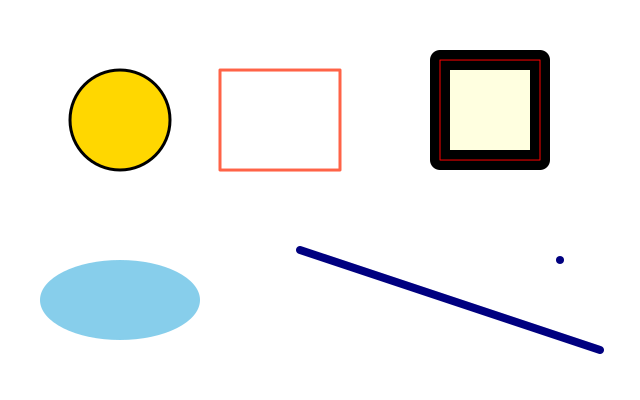

```python
import funground as f


def setup():
    f.size(640, 400)


def draw():
    f.background("white")

    f.fill("gold")                   # inside colour of later shapes
    f.stroke("black")                # outline / line colour
    f.stroke_width(3)                # outline thickness, minimum 1
    f.circle(120, 120, 100)

    f.no_fill()                      # outline only
    f.stroke("tomato")
    f.rect(220, 70, 120, 100)

    f.fill("skyblue")
    f.no_stroke()                    # fill only
    f.ellipse(120, 300, 160, 80)

    f.stroke("navy")
    f.stroke_width(8)
    f.line(300, 250, 600, 350)       # lines and points use the stroke only
    f.point(560, 260)                # a dot about stroke_width across

    # Strokes are centred on the edge (v0.6): half of this 20-pixel band lies
    # outside the 100x100 square and half inside. The thin red rect is the geometry.
    f.fill("lightyellow")
    f.stroke("black")
    f.stroke_width(20)
    f.rect(440, 60, 100, 100)
    f.no_fill()
    f.stroke("red")
    f.stroke_width(1)
    f.rect(440, 60, 100, 100)


f.run()
```

**Colour forms, all together**

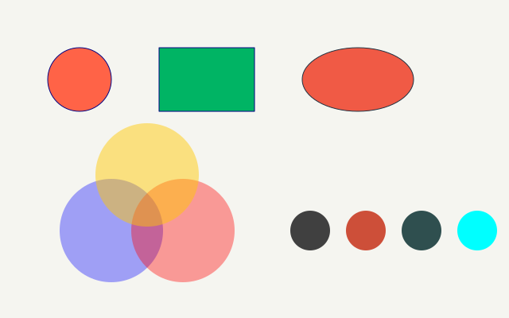

```python
import funground as f


def setup():
    f.size(640, 400)


def draw():
    f.background((245, 245, 240))    # an RGB tuple, each value 0-255

    f.fill("tomato")                 # a named colour (see the appendix)
    f.stroke("navy")
    f.circle(100, 100, 80)

    f.fill((0, 180, 100))            # RGB
    f.rect(200, 60, 120, 80)

    f.fill("#F05A45")                # hex string
    f.stroke("#203040")
    f.ellipse(450, 100, 140, 80)

    # Alpha is honoured (v0.6): a fourth value 0-255, or "#RRGGBBAA".
    f.no_stroke()
    f.fill((0, 0, 255, 90))
    f.circle(140, 290, 130)
    f.fill("#FF000060")
    f.circle(230, 290, 130)
    f.fill((255, 200, 0, 120))
    f.circle(185, 220, 130)

    # Every pygame-ce colour name works, on every platform (capitals and spaces are ignored).
    for i, name in enumerate(["gray25", "tomato3", "darkslategrey", "aqua"]):
        f.fill(name)
        f.circle(390 + i * 70, 290, 50)


f.run()
```

**Text**

| Call | What it does | Example |
|---|---|---|
| `f.text_size(size)` | Set the size used by later text: **an em of `size` pixels** (default 20). | `f.text_size(28)` |
| `f.text(message, x, y)` | Draw text with its top-left corner at (x, y). Any object: `str()` is applied. | `f.text("Hello", 30, 40)` |
| `f.text(..., color=...)` | Choose a colour just for this text. Otherwise text uses the fill, then the stroke, then white. | `f.text(f.frame_count, 30, 80, color="navy")` |
| `f.text_width(message)` | how wide `message` will be at the current size, in pixels — to centre or right-align it. | `f.text(msg, (f.width - f.text_width(msg)) / 2, y)` |
| `f.text_align(horizontal, vertical=None)` | which point of the text `(x, y)` is: `"left"`/`"center"`/`"right"`, then `"top"`/`"center"`/`"baseline"`/`"bottom"`. Default left, top. | `f.text_align("center", "center")` |
| `f.text_ascent()` / `f.text_descent()` | how far letters reach above / below the baseline at the current size. | `f.text_ascent()` |
| `f.text_leading(n)` | distance between lines of text, in pixels; `None` = automatic (1.25 × size). A `"\n"` in `f.text()` starts a new line. | `f.text("two\nlines", 20, 20)` |
| `f.text_box(message, x, y, width, height=None)` | wrap text inside a box; returns the text that did not fit, to flow into the next box. | `rest = f.text_box(story, 20, 60, 280, 300)` |
| `f.text_path(message, x, y)` | the outlines of `f.text(message, x, y)` as a new path, set with the current font, style, size, alignment and leading. Cut it, outline it, fill it or clip with it. It has no colour and is not moved by the current transform until you draw it. | `f.draw_path(f.text_path("Hi", 20, 20))` |
| `f.text_to_points(message, x, y, spacing=5)` | a list of `(x, y)` points along the outlines of `f.text_path(message, x, y)`, one every `spacing` pixels (above 0). Each outline starts at its first point; curves are measured along the curve. An empty message gives `[]`. Draws nothing. | `for x, y in f.text_to_points("hi", 20, 20, 6): f.circle(x, y, 3)` |
| `f.current_font()` | the font text is set in now, as a font object (the built-in font too). Ask it `font.family()`, `font.style()`, `font.variations()` (axis tag to `(minimum, default, maximum)`; `{}` if not variable), `font.features()` (sorted list of OpenType tags) and `font.contains(text)` (true when every character has a glyph; a space counts, a new line is ignored). | `f.current_font().contains("é")` |
| `f.load_font(path)` | load a `.ttf`/`.otf` font file; pass the result to `f.text_font()`. A relative path is looked for next to the sketch file first, then the current folder. | `mono = f.load_font("fonts/DejaVuSansMono.ttf")` |
| `f.text_font(font, size=None)` | use `font` (from `f.load_font()`, a path, or `None`) for later text; `None` returns to the built-in family. | `f.text_font(mono)` / `f.text_font(None)` |
| `f.text_tracking(pixels)` | add this many pixels of space after every letter (the last one too); negative tightens. Changes `f.text_width()`, alignment, `f.text_box()` and `f.text_path()`. Default 0. | `f.text_tracking(4)` |
| `f.text_features(**features)` | turn OpenType features on or off by their four-letter names. Calls add to each other; no arguments goes back to the font's defaults. | `f.text_features(liga=False)` |
| `f.font_variations(**axes)` | set a variable font's axes by name. An axis the font lacks is ignored, so it is harmless with a static font. No arguments goes back to the defaults. | `f.font_variations(wght=700)` |
| `f.FormattedString()` | text made of runs, each with its own look. `fs.append(text, font=None, size=None, style=None, color=None, tracking=None, features=None, variations=None)` adds a run and returns `fs`. A setting you leave out follows the drawing state when the text is drawn. `str(fs)`, `len(fs)` and `fs + other` work. Pass it to `f.text`, `f.text_box`, `f.text_width` and `f.text_path`; `f.text_box` returns the overflow as a FormattedString. | `fs = f.FormattedString().append("Hi ").append("there", style="bold", color="red")` |
| `f.text_style(style)` | choose one of the built-in family's four styles: `"normal"`, `"bold"`, `"italic"`, `"bold_italic"`. Ignored once a font is loaded, but remembered for when it is not. | `f.text_style("bold")` |

*Changed since Playground 0.5:* text is drawn with the bundled **DejaVu Sans** font on every platform, and
**`text_size(n)` is an n-pixel em** — the CSS / p5 convention. Capital letters
come out about three-quarters of `n`, and text renders about 1.4× larger than v0.5 did for the same
number; `text_size(20)` is still the default. `text_width()` measures exactly the distance `text()`
advances and does not change under `scale()`.

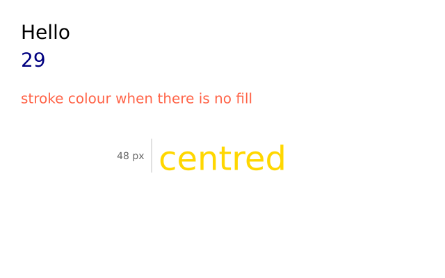

```python
import funground as f


def setup():
    f.size(640, 400)


def draw():
    f.background("white")

    f.text_size(28)                  # a 28-pixel em (v0.6); the font is DejaVu Sans
    f.fill("black")
    f.text("Hello", 30, 30)          # (x, y) is the top-left of the text
    f.text(f.frame_count, 30, 70, color="navy")   # any object: str() is applied

    f.text_size(20)
    f.no_fill()
    f.stroke("tomato")
    f.text("stroke colour when there is no fill", 30, 130)

    # text_width() measures a message at the current size, e.g. to centre it.
    f.text_size(48)
    f.fill("gold")
    message = "centred"
    x = (f.width - f.text_width(message)) / 2
    f.text(message, x, 200)

    # The size is the em: text_size(48) reserves 48 pixels of line height;
    # capital letters come out about three-quarters of that.
    f.stroke("silver")
    f.stroke_width(1)
    f.line(x - 10, 200, x - 10, 248)
    f.text_size(14)
    f.fill("gray40")
    f.text("48 px", x - 60, 216)


f.run()
```

---

## 4. Animation and changing variables

Because `draw()` repeats, changing a variable a little each frame creates motion.

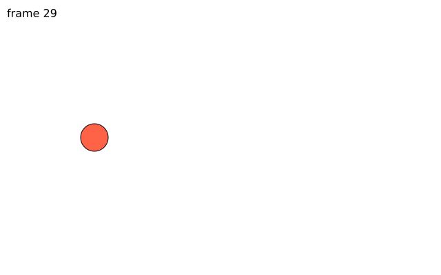

```python
import funground as f

x = 50
speed = 3


def setup():
    f.size(640, 400)


def draw():
    global x, speed                  # draw() assigns to them, so Python needs this line

    f.background("white")            # clears the previous frame; leave it out for trails
    f.fill("tomato")
    f.circle(x, f.height / 2, 40)

    x += speed                       # a little each frame is motion
    if x > f.width - 20 or x < 20:   # bounce off the sides
        speed = -speed

    f.fill("black")
    f.text_size(16)
    f.text(f"frame {f.frame_count}", 10, 10)
    if f.frame_count > 1000:
        f.stop()                     # ask the loop to end after this draw()


f.run()
```

**Why `global x`?** `x` is created outside `draw()`. Because `draw()` assigns a new value to it,
Python requires `global x` inside the function.

**Clear the old frame.** Calling `f.background(...)` near the start of `draw()` clears the previous
frame. Leave it out if you intentionally want trails.

**Useful animation values**

| Value | What it is | Example |
|---|---|---|
| `f.frame_count` | Completed frames since the sketch started; 0 during the first `draw()`. | `f.rotate(f.frame_count * 3)` |
| `f.delta_time` | Seconds taken by the previous frame (0.0 in the first). For time-based motion. | `x += 120 * f.delta_time  # ~120 px per second` |
| `f.stop()` | Ask the main loop to stop. | `if x > f.width: f.stop()` |
| `f.run(max_frames=n)` | Stop automatically after `n` frames. | `f.run(max_frames=300)` |
| `f.no_loop()` / `f.loop()` / `f.redraw()` / `f.is_looping()` | Stop drawing every frame (draw still runs once) / resume / draw once more / check. | `f.no_loop()` |
| `f.exit()` | End the sketch (same as `f.stop()`). | `f.exit()` |
| `f.millis()` / `f.frame_rate()` | Milliseconds since start / frames per second achieved. | `f.millis()` |
| `f.second()` `f.minute()` `f.hour()` `f.day()` `f.month()` `f.year()` | The clock and date. | `f.hour()` |

**Moving at the same speed on any computer.** `f.delta_time` makes motion depend on time, not on
how many frames the computer manages:

```python
import funground as f

x = 0


def setup():
    f.size(640, 400)


def draw():
    global x
    f.background("white")
    f.circle(x, f.height / 2, 40)
    x += 120 * f.delta_time          # 120 pixels per second, at 30 fps or 144 fps alike
    if x > f.width:
        x = 0


f.run()
```

Styles you set at the top of the file or in `setup()` persist; a style or transform changed inside a
`with f.saved_state():` block (section 7) is undone at the end of the block.

---

## 5. Mouse, keyboard and useful helpers

Mouse values are updated automatically before each call to `draw()`.

| Value | What it is | Example |
|---|---|---|
| `f.mouse_x` | Current mouse x-coordinate. | `f.circle(f.mouse_x, f.mouse_y, 30)` |
| `f.mouse_y` | Current mouse y-coordinate. | |
| `f.is_mouse_pressed` | `True` while any of the first three mouse buttons is held. | `if f.mouse_pressed: f.fill("tomato")` |
| `f.pmouse_x`, `f.pmouse_y` | Where the mouse was in the previous frame. | `f.line(f.pmouse_x, f.pmouse_y, f.mouse_x, f.mouse_y)` |
| `f.mouse_button` | The last button pressed: `"left"`, `"center"`, `"right"` (or `None`). | `if f.mouse_button == "right": ...` |
| `f.is_key_pressed` | `True` while any key is held. | `if f.is_key_pressed: ...` |
| `f.key` / `f.key_code` | The last key: a character (`"a"`, `" "`) or a name (`"left"`, `"enter"`) / its code. | `if f.key == "r": ...` |
| `def mouse_pressed():` … | **Callbacks** you define, called when input happens: `mouse_pressed`, `mouse_released`, `mouse_clicked`, `mouse_moved`, `mouse_dragged`, `mouse_wheel(delta)`, `key_pressed`, `key_released`, `key_typed`. | `def key_pressed(): f.redraw()` |

**Keyboard.** `f.key_down(key)` is `True` while a key is held. It recognises `"left"`, `"right"`,
`"up"`, `"down"`, `"space"`, `"enter"`, `"escape"` and single-character keys such as `"a"` or `"7"`
(case does not matter). Escape also closes the sketch; an unknown name is a `ValueError`.

| Call | What it does | Example |
|---|---|---|
| `f.key_down(key)` | Is this key held right now? | `if f.key_down("left"): x -= 3` |

**Controls.** Sliders, checkboxes and buttons sit in a panel *below* the canvas, one row each, in the
order you made them. Make them in `setup()` (or at the top of the file), keep them in variables, and read
them in `draw()`. The panel is not part of the picture: it is not in `f.width` / `f.height`, `f.mouse_y`,
saves or `f.get()`, and clicks on it do not reach `mouse_pressed()` and friends. Making a control inside
`draw()`, or in a script (a file that ends with `f.show()`), is a `RuntimeError`. Without a window the
controls keep their values, and setting them still works.

| Call | What it does | Example |
|---|---|---|
| `f.create_slider(low, high, value=None, step=None, label=None)` | a slider from `low` to `high`; it starts at `value` (default `low`). With `step`, it moves in whole steps from `low`. `low >= high` or `step <= 0` is a `ValueError`. | `size = f.create_slider(10, 100, 40, step=5, label="size")` |
| `slider.value()` / `slider.value(v)` | Read the value / set it (kept between `low` and `high`, rounded to `step`). | `f.circle(200, 150, size.value())` |
| `f.create_checkbox(label, checked=False)` | a tick box. | `grid = f.create_checkbox("grid")` |
| `box.checked()` / `box.checked(True)` | Read / set. | `if grid.checked(): draw_grid()` |
| `f.create_button(label)` | a button. | `reset = f.create_button("reset")` |
| `button.clicked()` | `True` once for each click since it was last asked. | `if reset.clicked(): points.clear()` |

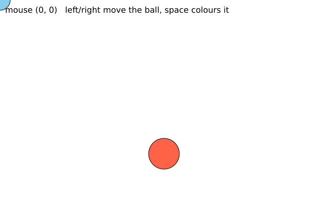

*(The picture was made headless, so the mouse sits at (0, 0) and no key is down.)*

```python
import funground as f

x = 320


def setup():
    f.size(640, 400)


def draw():
    global x

    f.background("white")

    # Mouse: live values, read once before each draw().
    if f.is_mouse_pressed:
        f.fill("tomato")
    else:
        f.fill("skyblue")
    f.circle(f.mouse_x, f.mouse_y, 40)

    # Keyboard: key_down() is True while the key is held.
    if f.key_down("left"):
        x -= 3
    if f.key_down("right"):
        x += 3
    if f.key_down("space"):
        f.fill("gold")
    else:
        f.fill("tomato")
    f.circle(x, 300, 60)

    f.fill("black")
    f.text_size(16)
    f.text(f"mouse ({f.mouse_x}, {f.mouse_y})   left/right move the ball, space colours it", 10, 10)


f.run()
```

**Math / utility helpers**

| Call | What it does | Example |
|---|---|---|
| `f.random(high)` | Random floating-point number from 0 up to `high`. | `x = f.random(f.width)` |
| `f.random(low, high)` | Random floating-point number between `low` and `high`. | `d = f.random(10, 40)` |
| `f.random_seed(seed)` | make `f.random()` repeatable — the same seed gives the same sequence. Never touches Python's own `random` module. | `f.random_seed(7)` |
| `f.constrain(value, low, high)` | Keep a value inside a minimum and maximum. | `x = f.constrain(x, 20, f.width - 20)` |
| `f.distance(x1, y1, x2, y2)` | Straight-line distance between two points. | `d = f.distance(x, y, f.mouse_x, f.mouse_y)` |
| `f.map_range(v, a1, b1, a2, b2, clamp=False)` | Re-scale `v` from one range to another. | `f.map_range(f.mouse_x, 0, f.width, 0, 255)` |
| `f.lerp(a, b, t)` / `f.norm(v, a, b)` | Part of the way from `a` to `b` / where `v` sits between them (0–1). | `f.lerp(0, 100, 0.25)` |
| `f.mag(x, y)` | Length of the arrow (x, y). | `f.mag(3, 4)` |
| `f.random_gaussian(mean=0, sd=1)` | Bell-curve random number. | `f.random_gaussian(200, 30)` |
| `f.random_choice(items)` | One item picked at random. | `f.random_choice(["red", "gold"])` |
| `f.noise(x, y=0, z=0)` | Smooth random value 0–1; nearby inputs give nearby values. | `f.noise(x * 0.01)` |
| `f.noise_seed(n)` | Repeatable noise (same values as p5.js's `noiseSeed`). | `f.noise_seed(1)` |
| `f.noise_detail(octaves, falloff=None)` | Layers of detail (default 4); fewer is smoother and faster. | `f.noise_detail(2)` |
| `f.Vector(x, y)` | An x and y kept together. `v.add(w)`, `v.mult(n)`, `v.limit(n)`, `v.normalize()`, `v.rotate(deg)` change `v`, as in p5.js; `v + w` makes a new one. `v.mag()`, `v.heading()` (degrees), `v.dist(w)`. | `velocity.add(gravity)` |
| `f.radians(degrees)` | degrees → radians, for `math.sin` / `math.cos`. | `math.sin(f.radians(45))` |
| `f.degrees(radians)` | radians → degrees, e.g. to feed `rotate()`. | `f.rotate(f.degrees(math.atan2(dy, dx)))` |

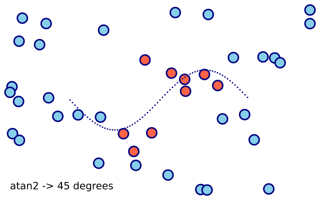

```python
import math

import funground as f


def setup():
    f.size(640, 400)


def draw():
    f.background("white")
    f.random_seed(7)                 # same seed, same numbers: the dots stay put

    for _ in range(40):
        x = f.constrain(f.random(f.width), 20, f.width - 20)      # keep inside the window
        y = f.constrain(f.random(f.height), 20, f.height - 20)
        if f.distance(x, y, f.width / 2, f.height / 2) < 120:
            f.fill("tomato")
        else:
            f.fill("skyblue")
        f.circle(x, y, 20)

    # radians() and degrees() convert for math.sin / math.cos
    # (rotate() itself takes degrees, so they are only needed for trigonometry).
    f.stroke("navy")
    f.stroke_width(3)
    for deg in range(0, 360, 5):
        f.point(140 + deg, 200 + 60 * math.sin(f.radians(deg)))
    f.fill("black")
    f.text(f"atan2 -> {f.degrees(math.atan2(1, 1)):.0f} degrees", 20, 360)


f.run()
```

---

## 6. Saving a picture

| Call | What it does | Example |
|---|---|---|
| `f.save(path)` | Write the current frame to a file when the frame is complete. `.png` saves pixels; `.pdf` and `.svg` save a true vector drawing of the same frame. | `f.save("my_sketch.png")` |
| `f.save_gif(path, seconds)` | animated sketch: record the next `seconds` (from the next frame) into a GIF that loops; each frame lasts 1 / frame rate. `path` must end in `.gif`. Needs Pillow (`funground[extras]`) or ffmpeg. Called while recording, or in a script: an error | `f.save_gif("spin.gif", 2)` |
| `f.save_movie(path, seconds)` | the same, into an H.264 MP4 (`.mp4`). Needs ffmpeg on the PATH; odd sizes are padded by one pixel | `f.save_movie("spin.mp4", 2)` |
| `f.frame_duration(seconds)` | script: how long this page and the pages after it are shown in a GIF or MP4; the start is 0.1; 0 or less is an error. `f.save("x.gif")` / `f.save("x.mp4")` then writes every page as a frame (all the same size) | `f.frame_duration(0.2)` |
| `f.save_frames(pattern, count)` | save this frame and the next ones, `count` in all; `####` in the name becomes 0001, 0002, … | `f.save_frames("frames/####.png", 60)` |
| `f.resize_canvas(w, h)` | change the canvas size while running. | `f.resize_canvas(800, 600)` |
| `f.full_screen()` | fill the screen (instead of `f.size`); `f.width`/`f.height` become the screen size. In a script: the screen size, shown full screen by `f.show()`. | `f.full_screen()` |
| `f.cursor(kind)` / `f.no_cursor()` | the mouse pointer: `"arrow"`, `"cross"`, `"hand"`, `"move"`, `"text"`, `"wait"`; or hide it. | `f.cursor("hand")` |

- Call it anywhere inside `draw()`; the file holds everything that frame drew, including what comes
  after the call. Any other extension is a `ValueError` naming the three choices.
- A `.png` is written at the screen's real resolution (on a 2× display, a 640×400 window gives a
  1280×800 file). `.pdf` and `.svg` use logical pixels as points.
- Text in a PDF is real text: you can select, search and copy it. In an SVG it is drawn as shapes.
- To save just one frame from a script: `if f.frame_count == 0: f.save("first.pdf")`, or run with
  `f.run(max_frames=1)` and `FUNGROUND_HEADLESS=1` for no window at all.

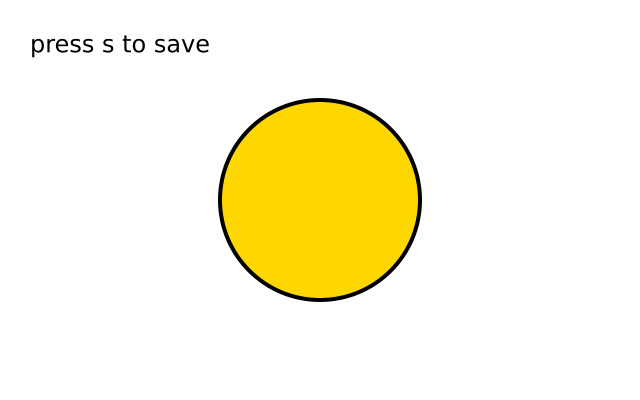

```python
import funground as f


def setup():
    f.size(640, 400)


def draw():
    f.background("white")
    f.fill("gold")
    f.stroke("black")
    f.stroke_width(4)
    f.circle(320, 200, 200)
    f.fill("black")
    f.text_size(24)
    f.text("press s to save", 30, 30)

    # save() writes this frame once it is complete:
    # .png is pixels, .pdf and .svg are vector drawings of the same frame.
    if f.key_down("s"):
        f.save("my_sketch.png")
        f.save("my_sketch.pdf")


f.run()
```

---

## 7. Transforms and the state stack

A transform changes where — and how big, and how turned — everything drawn **afterwards**
appears. Transforms add up, and they apply to shapes, text, paths and clips alike.

| Call | What it does | Example |
|---|---|---|
| `f.translate(dx, dy)` | Move the origin: everything drawn afterwards is shifted by (dx, dy). | `f.translate(f.width / 2, f.height / 2)` |
| `f.rotate(degrees)` | Turn later drawing about the current origin. **Degrees**; 90 is a quarter turn clockwise on screen. | `f.rotate(45)` |
| `f.scale(s)` | Grow (`s > 1`) or shrink (`s < 1`) later drawing about the origin. `scale(0)` is an error. | `f.scale(2)` |
| `f.shear_x(degrees)` / `f.shear_y(degrees)` | Slant later drawing sideways / up and down. | `f.shear_x(20)` |
| `f.apply_matrix(a, b, c, d, e, f)` | Multiply in x' = a·x + c·y + e, y' = b·x + d·y + f. | `f.apply_matrix(1, 0, 0.5, 1, 0, 0)` |
| `f.reset_matrix()` | Forget all transforms until the enclosing `pop()`. | `f.reset_matrix()` |
| `f.scale(sx, sy)` | Scale by different amounts sideways and up-and-down. | `f.scale(2, 1)  # stretch sideways` |
| `f.push()` | Save the current transform **and** style (fill, stroke, stroke width, text size). | `f.push()` |
| `f.pop()` | Restore what the last `push()` saved — everything. | `f.pop()` |
| `with f.saved_state():` | `push()` on entry, `pop()` on exit, even if the block raises an error. | `with f.saved_state(): f.rotate(30); f.rect(0, 0, 80, 40)` |

**Rules worth knowing**

- Order matters: `translate(100, 50)` then `rotate(30)` turns about (100, 50); `rotate(30)` then
  `translate(100, 50)` rotates the translation too. Think "move the paper, then draw".
- The stack is reset at the start of every `draw()`, so a transform never leaks into the next frame.
  A style set outside a `push()` persists as it always did.
- `push()` without a matching `pop()` at the end of `draw()` is not an error: funground pops it for
  you and prints a `FungroundWarning` naming the count. A `pop()` with nothing to pop warns and is ignored.
- `f.background()` ignores transforms and always fills the whole window.
- `f.radians()` and `f.degrees()` (section 5) convert when you need `math.sin` / `math.cos`.

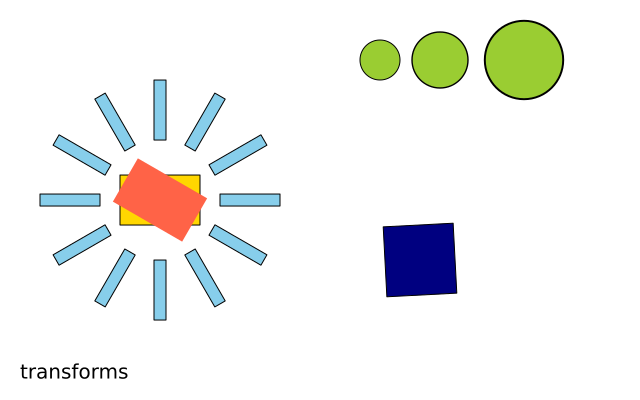

```python
import funground as f


def setup():
    f.size(640, 400)


def draw():
    f.background("white")

    # translate() moves the origin: (0, 0) is now at (160, 200) on screen.
    f.translate(160, 200)
    f.fill("gold")
    f.stroke("black")
    f.rect(-40, -25, 80, 50)

    # push() remembers the transform AND the style; pop() brings both back.
    f.push()
    f.rotate(30)                     # degrees, clockwise on screen
    f.fill("tomato")
    f.no_stroke()
    f.rect(-40, -25, 80, 50)
    f.pop()                          # gold fill, black stroke, no rotation again

    # Transforms are cumulative: each rotate() adds to the one before.
    with f.saved_state():                  # push on entry, pop on exit, even after an error
        f.fill("skyblue")
        for _ in range(12):
            f.rect(60, -6, 60, 12)
            f.rotate(30)

    # scale() grows or shrinks later drawing; scale(2, 1) would stretch sideways.
    with f.saved_state():
        f.translate(220, -140)       # relative to the moved origin: (380, 60) on screen
        f.fill("yellowgreen")
        for _ in range(3):
            f.circle(0, 0, 40)
            f.translate(60, 0)
            f.scale(1.4)

    with f.saved_state():
        f.translate(260, 60)
        f.rotate(f.frame_count * 3)  # a little further every frame: it spins
        f.fill("navy")
        f.rect(-35, -35, 70, 70)

    # Every block above was undone, so this is placed from the origin set on line 11.
    f.text("transforms", -140, 160, "black")


f.run()
```

---

## 8. Shapes, paths and clipping

Two ways to draw your own outlines: list the corners one by one, or build a path object
you can draw again and again.

**Shapes from corners**

| Call | What it does | Example |
|---|---|---|
| `f.begin_shape()` | Start a shape; list its corners next. | `f.begin_shape()` |
| `f.vertex(x, y)` | Add a corner (the first one starts the shape). | `f.vertex(100, 20)` |
| `f.bezier_vertex(cx1, cy1, cx2, cy2, x, y)` | Add a Bézier curve segment: two control points, then the end point. | `f.bezier_vertex(20, 0, 180, 0, 180, 80)` |
| `f.quadratic_vertex(cx, cy, x, y)` | Add a quadratic curve segment: one control point, then the end point. | `f.quadratic_vertex(100, 0, 180, 80)` |
| `f.curve_vertex(x, y)` | A point of a smooth curve *through* the points; the first and last only steer it (at least four in a row). | `f.curve_vertex(40, 60)` |
| `f.curve_tightness(t)` | 0 smooth (default) … 1 straight lines, for `curve_vertex`/`curve`. | `f.curve_tightness(0.5)` |
| `f.begin_contour()` / `f.end_contour()` | A hole inside the shape being built. | `f.begin_contour(); …; f.end_contour()` |
| `f.bezier(x1, y1, cx1, cy1, cx2, cy2, x2, y2)` | One Bézier curve (stroked only). | `f.bezier(20, 80, 20, 0, 180, 0, 180, 80)` |
| `f.curve(x1, y1, x2, y2, x3, y3, x4, y4)` | One smooth curve from point 2 to point 3 (stroked only). | `f.curve(0, 100, 40, 40, 160, 40, 200, 100)` |
| `f.bezier_point(a, b, c, d, t)` / `f.bezier_tangent(...)` / `f.curve_point(...)` / `f.curve_tangent(...)` | A coordinate (or slope) along a curve at `t` from 0 to 1; call once for x and once for y. | `x = f.bezier_point(20, 20, 180, 180, 0.5)` |
| `f.end_shape()` | Draw the shape open: it is **stroked, never filled**. | `f.end_shape()` |
| `f.end_shape(close=True)` | Join the last corner to the first, then fill and stroke it. | `f.end_shape(close=True)` |

**Reusable paths**

| Call | What it does | Example |
|---|---|---|
| `f.path()` | A new, empty path builder. Chain the calls below; each returns the builder. | `tri = f.path().move_to(0, 0).line_to(40, 0).line_to(20, -30).close()` |
| `.move_to(x, y)` | Start a sub-path at (x, y) without drawing. Every path begins with one. | |
| `.line_to(x, y)` | Straight segment to (x, y). | |
| `.curve_to(cx1, cy1, cx2, cy2, x, y)` | Cubic Bézier: two control points, then the end point. | |
| `.quad_to(cx, cy, x, y)` | Quadratic Bézier: one control point, then the end point. | |
| `.close()` | Join back to where the sub-path started. Only closed paths are filled. | |
| `.rect(x, y, w, h, *radii)` | Add a closed rectangle; (x, y) is its top-left corner. Takes one or four corner radii like `f.rect`. Not changed by `rect_mode`. | `f.path().rect(10, 10, 80, 50, 8)` |
| `.ellipse(x, y, w, h)` | Add a closed ellipse centred on (x, y), width `w`, height `h`. Not changed by `ellipse_mode`. | `f.path().ellipse(50, 50, 80, 40)` |
| `.circle(x, y, d)` | Add a closed circle centred on (x, y), diameter `d`. | `f.path().circle(50, 50, 40)` |
| `.polygon(points)` | Add a closed shape through a list of `(x, y)` corners (3 or more). | `f.path().polygon([(0, 0), (40, 0), (20, 30)])` |
| `a.union(b)`, `a \| b` | a new path covering everything `a` or `b` covers. `a` and `b` are not changed. Only closed shapes count; each is read with the non-zero rule. | `both = ring \| star` |
| `a.intersection(b)`, `a & b` | a new path covering only what both cover. | `lens = ring & star` |
| `a.difference(b)`, `a - b` | a new path covering what `a` covers, minus what `b` covers. | `bite = ring - star` |
| `a.xor(b)`, `a ^ b` | a new path covering what exactly one of them covers. | `either = ring ^ star` |
| `a.remove_overlap()` | a new path with the same area and one clean outline, no overlapping parts. | `clean = crossing.remove_overlap()` |
| `a.expand_stroke(width, cap="round", join="round", miter_limit=10, dash=None)` | a new closed path covering what a stroke of that width would paint. Cap and join names as `stroke_cap` and `stroke_join`; `dash` is a list as in `stroke_dash`. Open lines work too. Width 0 or less, or an unknown name, is an error. | `band = line.expand_stroke(12, dash=[20, 8])` |
| `a.bounds()` | `(x, y, w, h)` of the path's exact extent (curves measured tightly), or `None` if it is empty. | `x, y, w, h = shape.bounds()` |
| `a.contains(x, y)` | `True` when the point is inside what the path fills (non-zero rule). | `shape.contains(mouse_x, mouse_y)` |
| `a.translate(dx, dy)` | a new path moved by `(dx, dy)`. | `shape.translate(50, 0)` |
| `a.scale(sx, sy=None)` | a new path scaled about the origin; one number scales both ways. | `shape.scale(2)` |
| `a.rotate(degrees, cx=0, cy=0)` | a new path turned clockwise on screen about `(cx, cy)`. | `shape.rotate(45, 100, 100)` |
| `a.copy()` | An independent builder with the same path. | `twin = shape.copy()` |
| `f.draw_path(path)` | Fill (if closed) and stroke a path with the current style, under the current transform. | `f.draw_path(tri)` |
| `f.clip(path)` | Limit **later** drawing to the inside of `path` until the enclosing `pop()` / end of the `with f.saved_state():` block. | `with f.saved_state(): f.clip(tri); ...` |
| `f.no_clip()` | Remove clipping until the enclosing `pop()` / end of the block, which brings the previous clip back. | `with f.saved_state(): f.no_clip(); ...` |

**Off-screen pictures**

| Call | What it does | Example |
|---|---|---|
| `f.create_graphics(w, h)` | an off-screen picture, `w` x `h`, transparent to start. It has the same drawing commands as `f.` (fill, circle, text, transforms, clip, ...), but its own state, transform and pixels; nothing about it resets between frames. | `trail = f.create_graphics(200, 100)` |
| `f.image(picture, x, y, w=None, h=None, sx=None, sy=None, sw=None, sh=None)` | draw *picture* at (x, y), stretched to `w` x `h` (default: its own size), as it is at this moment. Give `sx, sy, sw, sh` (all four) to draw only that part of the picture, in its own pixels, into the box; a part reaching outside the picture is clipped and keeps its place. `sw` and `sh` must be above 0. | `f.image(trail, 0, 0)`, `f.image(photo, 0, 0, 200, 150, 40, 30, 100, 75)` |
| `f.tint(color)` / `f.no_tint()` | colour every picture drawn after it. Takes any colour form `f.fill()` takes (not a gradient). Red, green and blue of each pixel are multiplied by the tint's, and its alpha is multiplied in: `f.tint(255, 128)` draws pictures half see-through. Shapes and text are not tinted. Saved by `push`/`pop`. | `f.tint("gold")` |
| `f.load_image(path)` | read an image file (PNG, JPEG, GIF, BMP, TGA) and return a picture; draw it with `f.image()`. A relative path is looked for next to the sketch file first, then in the current folder. Phone photos are turned the right way up; transparency is kept. `pic.width` and `pic.height` are the image's size in pixels. You can draw on it like any picture. | `photo = f.load_image("photo.jpg")` |
| `f.load_svg(path)` | read an SVG file and return a picture of its shapes, so it stays sharp at any size and stays vector in a saved PDF or SVG. The size is the file's `width` and `height` (CSS units, 96 to the inch), or its `viewBox`. Reads paths, `rect`, `circle`, `ellipse`, `line`, `polyline`, `polygon`, groups, `<use>`, transforms, fill and stroke colours with opacity, stroke width, caps, joins, dashes and `fill-rule`. A gradient or pattern uses its first colour; `<text>`, images, filters, masks and animation are ignored. A relative path is looked for next to the sketch file first, then in the current folder. | `badge = f.load_svg("badge.svg")` |
| `f.svg_paths(path)` | the shapes of an SVG file as a list of `f.path()` paths, one per shape, in the file's own coordinates. Use them for booleans, clips or your own colours. Missing file: `FileNotFoundError`; not an SVG file: `ValueError`. | `shapes = f.svg_paths("badge.svg")` |
| `f.get(x, y)` | the colour at one pixel, as a colour object (`.red`, `.green`, `.blue`, `.alpha`), as drawn so far, this frame included. Outside the canvas: transparent black. `x`, `y` are rounded down. On a high-resolution screen it reads the top-left real pixel of a logical one. | `c = f.get(10, 20)` |
| `f.get(x, y, w, h)` | a new picture copied from that rectangle of the canvas (parts outside are see-through). A picture has `g.get(...)` too. | `part = f.get(0, 0, 50, 50)` |
| `f.set(x, y, color)` | make one pixel exactly that colour. Any colour form `f.fill()` takes. Ignores fill, stroke, transform, clip, tint, opacity and blend mode. Outside the canvas: nothing. A picture has `g.set(...)` too. | `f.set(10, 20, "red")` |
| `f.load_pixels()` | copy the canvas into `f.pixels`. | `f.load_pixels()` |
| `f.pixels` | a `bytearray` with red, green, blue, alpha (0 to 255, not premultiplied) for every pixel, row by row from the top left. The pixel at (`x`, `y`) starts at index `(y * f.width + x) * 4`. `None` before `f.load_pixels()`. Change the numbers in place; a Python loop over a whole 640 x 400 canvas takes seconds. | `f.pixels[(y * f.width + x) * 4] = 255` |
| `f.update_pixels()` | write `f.pixels` back onto the canvas, like a `f.set()` of every pixel. An error before `f.load_pixels()`. A picture has `g.load_pixels()`, `g.pixels` and `g.update_pixels()`. | `f.update_pixels()` |
| `g.copy()` | a new picture with the same pixels and drawing history. Changing one never changes the other. | `small = photo.copy()` |
| `g.resize(w, h)` | change the picture to `w` x `h` pixels, in place, scaled smoothly. A 0 for one side keeps the shape; both 0, or a negative number, is an error. The drawing history is dropped. | `small.resize(100, 0)` |
| `g.mask(other)` | multiply the picture's alpha by the alpha of picture `other` (scaled to this size first). The history is dropped. | `photo.mask(hole)` |
| `f.filter(kind, value=None)` | change everything drawn so far, in place. Kinds: `"threshold"` (0 to 1, default 0.5), `"gray"`, `"opaque"`, `"invert"`, `"blur"` (radius in pixels, default 1), `"posterize"` (2 to 255 levels, required), `"erode"`, `"dilate"`. Alpha is kept, except by `"opaque"`. An unknown kind or a value out of range is a `ValueError`. A picture has `g.filter(...)` too. `"posterize"`, `"erode"` and `"dilate"` are faster with `pip install funground[extras]`; the result is the same. | `f.filter("blur", 3)` |

**Rules worth knowing**

- Shapes and paths use the fill and stroke in force when they are drawn: fill first, stroke on top,
  strokes centred. A shape or path that is not closed is only ever stroked; setting a fill is not an error.
- The fill rule is **non-zero winding**: a self-crossing outline such as a five-pointed star is filled
  right through its centre.
- `clip()` treats its path as closed, follows the current transform, and is lifted by `pop()` — so put
  it inside `with f.saved_state():`. `f.background()` ignores the clip.
- Mistakes are caught where they happen: `vertex()` or `end_shape()` without `begin_shape()`,
  `begin_shape()` twice, or `bezier_vertex()` before the first `vertex()` are `RuntimeError`s, and a
  shape still open when `draw()` ends is dropped with a `FungroundWarning`.

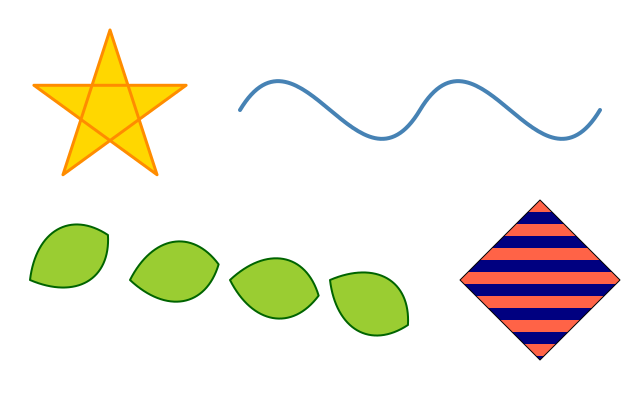

```python
import math

import funground as f


def setup():
    f.size(640, 400)


def draw():
    f.background("white")

    # A shape from its corners: begin_shape(), a vertex() per corner, end_shape().
    # close=True joins the last corner to the first and fills the shape.
    f.fill("gold")
    f.stroke("darkorange")
    f.stroke_width(3)
    f.begin_shape()
    for i in range(5):
        a = f.radians(-90 + i * 144)           # a pentagram: every second corner
        f.vertex(110 + 80 * math.cos(a), 110 + 80 * math.sin(a))
    f.end_shape(close=True)                    # it crosses itself and is filled right through

    # An open shape is stroked, never filled. bezier_vertex() takes two control
    # points, then the point the curve ends at.
    f.no_fill()
    f.stroke("steelblue")
    f.stroke_width(4)
    f.begin_shape()
    f.vertex(240, 110)
    f.bezier_vertex(300, 10, 360, 210, 420, 110)
    f.bezier_vertex(480, 10, 540, 210, 600, 110)
    f.end_shape()

    # f.path() builds a reusable path: move_to, line_to, curve_to, quad_to, close.
    leaf = f.path().move_to(0, 0).curve_to(30, -40, 70, -40, 90, 0).curve_to(70, 40, 30, 40, 0, 0).close()
    f.fill("yellowgreen")
    f.stroke("darkgreen")
    f.stroke_width(2)
    for i in range(4):
        with f.saved_state():
            f.translate(30 + i * 100, 280)
            f.rotate(-30 + i * 20)
            f.draw_path(leaf)                  # filled (it is closed) then stroked

    # clip(path) limits later drawing to the inside of the path until the
    # enclosing pop() / the end of the with f.saved_state() block.
    window = f.path().move_to(540, 200).line_to(620, 280).line_to(540, 360).line_to(460, 280).close()
    with f.saved_state():
        f.clip(window)
        f.no_stroke()
        for i in range(14):
            f.fill("tomato" if i % 2 == 0 else "navy")
            f.rect(450, 200 + i * 12, 180, 12)  # wider than the window: cropped
    f.no_fill()
    f.stroke("black")
    f.stroke_width(1)
    f.draw_path(window)                        # the outline, once the clip is lifted


f.run()
```

### Sound

| Call | What it does | Example |
|---|---|---|
| `f.load_sound(path)` | read a WAV, OGG or MP3 file and return a sound. A relative path is looked for next to the sketch file first, then in the current folder. With no sound device (or `FUNGROUND_HEADLESS=1`) it plays silently and keeps time. A missing file is a `FileNotFoundError` naming both places; a file that is not sound is a `ValueError`. | `beep = f.load_sound("beep.wav")` |
| `sound.play()` / `sound.loop()` | play from the start (or from where `pause()` left it); `loop()` plays over and over. Playing a sound that is already playing starts it again. | `beep.play()` |
| `sound.pause()` / `sound.stop()` | `pause()` stops and keeps the place; `stop()` stops and goes back to the start. | `beep.stop()` |
| `sound.set_volume(v)` | the loudness, 0 (silent) to 1 (full). Outside that is a `ValueError`. | `beep.set_volume(0.5)` |
| `sound.is_playing()` / `sound.duration()` | whether it is playing (false once a sound that is not looping reaches its end), and its length in seconds. | `if beep.is_playing(): ...` |
| `sound.current_time()` / `sound.get_volume()` | how many seconds into the sound it is now, and its volume from 0 to 1. | `f.text(round(tune.current_time(), 1), 20, 20)` |
| `sound.level()` | how loud the sound is now, 0 to 1 (the root mean square of the last 1/30 second). 0 when not playing. | `f.circle(x, y, 20 + 80 * beep.level())` |
| `sound.spectrum(bands=32)` | a list of `bands` numbers from 0 to 1, low pitch to high, spaced evenly in pitch from 40 Hz to 16 kHz. A full-strength tone gives about 1 in its band. All zeros when not playing. `bands` must be 1 to 256. | `for i, v in enumerate(beep.spectrum(16)): ...` |

The place in the sound follows the sketch's clock, not the speakers, so these give the same answers
with or without a sound device. Sounds add nothing to the picture, to saved files or to the IR.

---

## 9. One-page cheat sheet

The public student-facing API. Everything is reached as `f.<name>`.

| SETUP / RUN | |
|---|---|
| `f.size(w, h)` | Create/resize window. |
| `f.size(w, h, title="...")` | Window title. |
| `f.size(w, h, fps=60)` | Target frame rate. |
| `f.run()` | Run `setup()` once, then `draw()` repeatedly. |
| `f.run(fps=30)` / `f.run(max_frames=n)` | Frame rate; stop after n frames. |
| `f.stop()` | Stop the sketch loop. |
| `f.save("file.png")` | Save this frame: `.png`, `.pdf` or `.svg`. |

| DRAWING | |
|---|---|
| `f.background(color)` | Clear/fill the whole window. |
| `f.circle(x, y, d)` | Centred circle (diameter). |
| `f.ellipse(x, y, w, h)` | Centred ellipse. |
| `f.rect(x, y, w, h)` | Top-left rectangle. Add a radius (or four) to round the corners. |
| `f.rect_mode(m)`, `f.ellipse_mode(m)`, `f.image_mode(m)` | Place by corner, corners, centre or radius. |
| `f.line(x1, y1, x2, y2)` | Line. |
| `f.point(x, y)` | Dot in the stroke colour. |
| `f.square(x, y, s)` / `f.triangle(...)` / `f.quad(...)` / `f.polygon(points)` | More shapes. |
| `f.arc(x, y, w, h, start, stop, mode)` | Part of an ellipse (degrees, clockwise). |
| `f.clear()` | Transparent canvas. |
| `f.text(msg, x, y)` / `f.text(msg, x, y, color=...)` | Draw text, top-left at (x, y). |

| STYLE | |
|---|---|
| `f.fill(color)` / `f.no_fill()` | Set / disable fill. |
| `f.stroke(color)` / `f.no_stroke()` | Set / disable line and outline colour. |
| `f.stroke_width(n)` | Stroke thickness (centred on the edge). |
| `f.stroke_cap/stroke_join/stroke_dash/no_dash` | Line ends, corners, dashes. |
| `f.no_smooth()` / `f.smooth()` | Pixel-sharp / smooth edges. |
| `f.text_size(n)` | Text size: an n-pixel em. |
| `f.text_width(msg)` | Width the text will take, in pixels. |

| TRANSFORMS AND STATE | |
|---|---|
| `f.translate(dx, dy)` | Move the origin. |
| `f.rotate(degrees)` | Turn later drawing (clockwise). |
| `f.scale(s)` / `f.scale(sx, sy)` | Grow or shrink later drawing. |
| `f.push()` / `f.pop()` | Save / restore transform **and** style. |
| `with f.saved_state():` | push on entry, pop on exit. |

| SHAPES, PATHS, CLIPPING | |
|---|---|
| `f.begin_shape()` … `f.vertex(x, y)` … `f.end_shape(close=False)` | A shape from its corners; `close=True` fills it. |
| `f.bezier_vertex(...)` / `f.quadratic_vertex(...)` / `f.curve_vertex(x, y)` | Curves inside a shape; `begin_contour`/`end_contour` for holes. |
| `f.bezier(...)` / `f.curve(...)` | One curve in a call. |
| `f.path()` | Builder: `.move_to .line_to .curve_to .quad_to .close`. |
| `f.draw_path(path)` | Fill (if closed) and stroke a path. |
| `f.clip(path)` | Draw only inside `path` until the enclosing `pop()`. |
| `f.no_clip()` | Stop clipping until the enclosing `pop()`. |

| LIVE VALUES | |
|---|---|
| `f.width` / `f.height` | Window dimensions. |
| `f.mouse_x` / `f.mouse_y` | Mouse position. |
| `f.is_mouse_pressed` / `f.is_key_pressed` | Any mouse button / key held. |
| `f.pmouse_x` `f.pmouse_y` `f.mouse_button` `f.key` `f.key_code` | Previous mouse, last button, last key. |
| `def mouse_pressed():` etc. | Input callbacks (see section 5). |
| `f.frame_count` | Frames completed. |
| `f.delta_time` | Seconds for previous frame. |

| INPUT | |
|---|---|
| `f.key_down("left")` | Named key held? |
| `f.key_down("a")` | Single-character key held? |

| HELPERS | |
|---|---|
| `f.random(high)` / `f.random(low, high)` | Random float. |
| `f.random_seed(seed)` | Repeatable `f.random()`. |
| `f.constrain(v, lo, hi)` | Clamp value to range. |
| `f.distance(x1, y1, x2, y2)` | Distance between points. |
| `f.radians(deg)` / `f.degrees(rad)` | Angle conversion for `math`. |

| COLOUR FORMS | |
|---|---|
| `"tomato"` | Named colour (appendix). |
| `(255, 80, 70)` / `(255, 80, 70, 128)` | RGB / RGBA tuple, 0–255. |
| `"#FF5046"` / `"#FF504680"` | Hex string, with or without alpha. |

| CALLBACKS | |
|---|---|
| `setup()` | Optional; called once. |
| `draw()` | Required; called repeatedly. |
| `update()` | Not provided. |

| METADATA | |
|---|---|
| `f.__version__` | `"0.1.0.dev0"`. |

**Remember:** use `f.` before funground functions and live values: `f.circle(...)`, `f.width`,
`f.mouse_x`, `f.run()`. Python variables such as `x` remain ordinary Python variables.

---

## 10. Named colours and other fixed names

For students the three most useful colour forms are a named string, an RGB tuple and a `#RRGGBB`
hex string.

```python
f.fill("tomato")              # named colour
f.fill((255, 99, 71))         # RGB
f.fill("#FF6347")             # HEX
```

**Named colours.** funground bundles the pygame-ce colour-name table, so every name in the v0.5
appendix still works and renders the same on every platform and renderer. Capitals and spaces are ignored
(`"Tomato"`, `"light blue"` work), though the appendix shows the lowercase spelling. The appendix — colours grouped by visual family with their RGB and HEX equivalents — is
**unchanged; see pages 8–19 of the v0.5 Quick Reference**
(`Playground_v0.5_Quick_Reference_Color_Organized.pdf`).

**Other colour values accepted**

| Form | Meaning |
|---|---|
| `(R, G, B)` | Three integers 0–255. |
| `(R, G, B, A)` | RGBA; `A` is the opacity, 0 (invisible) to 255 (solid). *Honoured (Playground 0.5 dropped it).* |
| `[R, G, B]` / `[R, G, B, A]` | Lists work too. |
| `N` / `N, A` / `(N, A)` | One number is a grey; two are a grey and its opacity. Read on the colour mode's third range and opacity range. `f.fill(128, 100)` |
| `f.fill(R, G, B)` / `f.fill(R, G, B, A)` | `fill`, `stroke` and `background` also take the numbers as separate arguments, exactly like one tuple. A name, hex string, colour or gradient is one argument only: `f.fill("red", 100)` is an error. | `f.background(30, 30, 60)` |
| `"#RRGGBB"` / `"#RRGGBBAA"` | HTML-style hex, with or without alpha. |
| `"0xRRGGBB"` / `"0xRRGGBBAA"` | Alternative hex string form. |

**Constants and live values.** There are no uppercase constants such as `RED`, `LEFT` or `CENTER`.
Colours and keys are strings. These module values are live state, not constants: `f.width`,
`f.height`, `f.mouse_x`, `f.mouse_y`, `f.is_mouse_pressed`, `f.pmouse_x`, `f.pmouse_y`, `f.mouse_button`, `f.key`, `f.key_code`, `f.is_key_pressed`, `f.frame_count`, `f.delta_time`.
`f.__version__` reports `"0.1.0.dev0"`.

**Fixed key-name strings.** `f.key_down(...)` recognises `"left"`, `"right"`, `"up"`, `"down"`,
`"space"`, `"enter"`, `"escape"`, and any single-character key such as `"a"` or `"7"`.

**Font.** Text is set in DejaVu Sans, which ships inside funground, unless you load a font of your own
with `f.load_font()` and `f.text_font()`.

**Warnings.** funground never stops a lesson for an unbalanced `push()` or an unfinished shape: it
repairs the frame and prints a `FungroundWarning` that says what it did.

---

## What changed since v0.5

| Area | Playground 0.5 | funground 0.1 |
|---|---|---|
| Version | `f.__version__ == "0.5.0"` | `"0.1.0.dev0"` |
| Edges | Coordinates rounded to whole pixels | Fractional coordinates honoured; edges anti-aliased |
| Alpha | Fourth colour value silently dropped | Honoured: translucent fills and strokes |
| Strokes | Painted inside the shape's edge | Centred on the edge |
| Text | pygame's default font; `text_size(20)` ≈ 13-pixel capitals | DejaVu Sans on every platform; `text_size(n)` is an n-pixel em; `text_width()` |
| Running | — | `f.run(max_frames=n)`; `FUNGROUND_HEADLESS=1` runs without a window |
| Random | — | `f.random_seed(seed)` |
| Saving | — | `f.save()` to PNG, PDF or SVG |
| Transforms | — | `translate`, `rotate` (degrees), `scale`, `push`/`pop`, `with f.saved_state():`, `radians`/`degrees` |
| Shapes | — | `square`, `triangle`, `quad`, `polygon`, `arc`, `clear`; `begin_shape`/`vertex`/`bezier_vertex`/`quadratic_vertex`/`curve_vertex`/contours/`end_shape`, `bezier`, `curve`, `f.path()`, `draw_path`, `clip`, `no_clip` |
| Off-screen graphics | — | `create_graphics`, `image`, `load_image`, `load_svg`, `svg_paths` |
| Sound | — | `load_sound`; `play`, `loop`, `stop`, `pause`, `set_volume`, `is_playing`, `duration`, `current_time`, `get_volume`, `level`, `spectrum` on the sound |
| Controls | — | `create_slider`, `create_checkbox`, `create_button`, in a panel below the canvas |
| High-DPI | Window bitmap-stretched (blurry) | Drawn crisply at the screen's resolution; coordinates unchanged |

Everything a v0.5 sketch called still exists with the same arguments; the only visible differences are
the softer edges, centred strokes, honoured alpha and larger text listed above.
